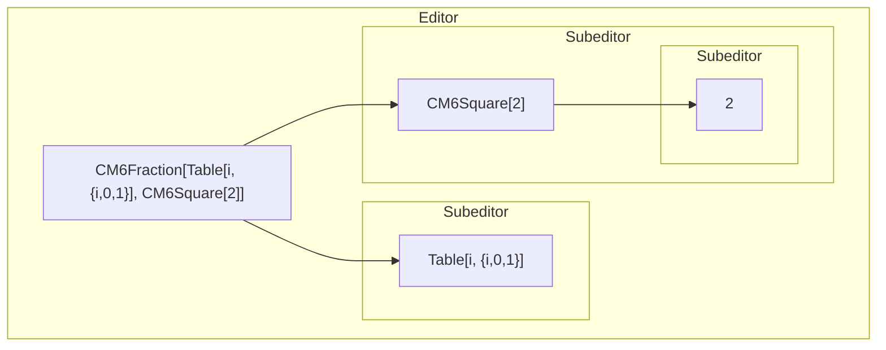
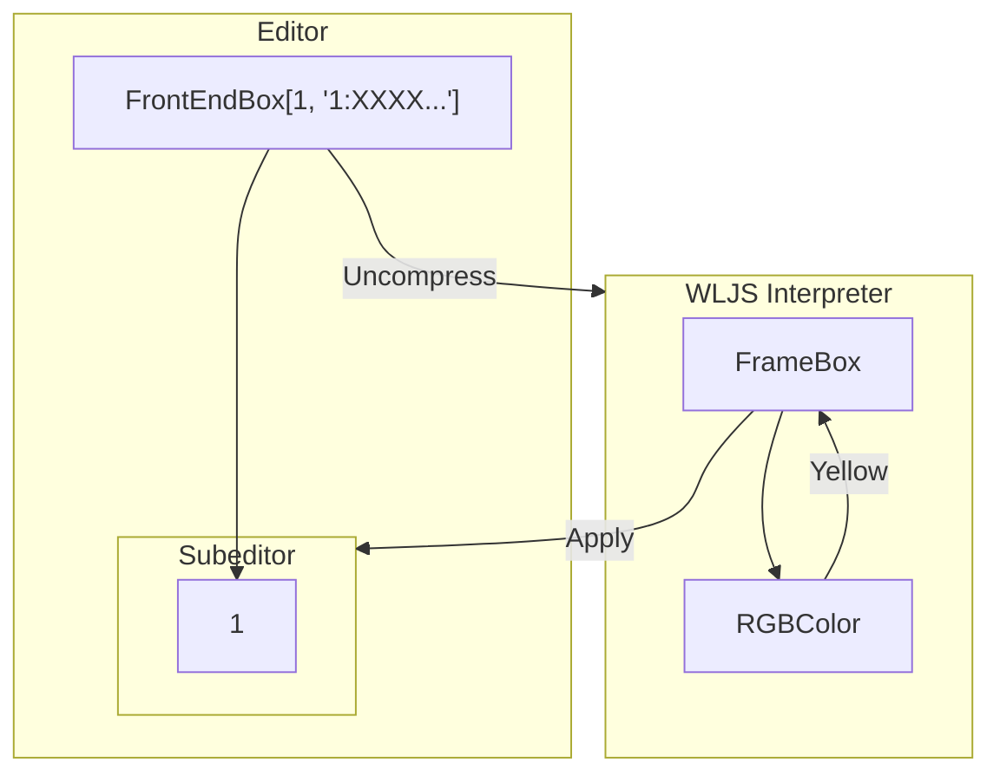

You can think about it as a visual syntax sugar, which is simillar to what one can see in VSCode, when one edits a CSS colors, the corresponding color picker popsup allowing user to deal with color wheel instead of HEX color code.

Frontend editor uses CodeMirror 6 and exensevely utilizes the power of [Decorations](https://codemirror.net/examples/decoration/)

>The DOM structure inside a CodeMirror editor is managed by the editor itself. Inside the `cm-content` element, any attempt to add attributes or change the structure of nodes will usually just lead to the editor immediately resetting the content back to what it used to be.

This is one of the key-features of CM6 editor, allowing us to make a hybrid of _WYSIWYG_ and plain code editor. Here this feature is used to the limits.

## Uneditable | Replacing decorations
All interactive objects like `Graphics`, `Plotly` are exactly this line of code

```mathematica
FrontEndExecutable["uid"]
```

An editor looks for this particular combination of characters and replace it (only visually!) with a DOM element, where the content is put. `uid` is a reference to a [[Frontend objects]], that will be loaded to the browser from the frontend and be executed in-place.

You can copy and paste it, and it will create a separate instance of it.

An editor threats it as if it was a single character

### Greek Symbols
🚧  Still not working perfectly
То type it, using ESC button in CodeMirror

```mathematica
ESCa -> \[Alpha]
```

### Arrows
Is automatically replaced by a unicode arrow symbol inside `span` wrapper

```mathematica
->
```

## Editable | Two-ways binded widgets
*Widgets are released an a separate package [publically available](https://www.npmjs.com/package/priceless-mathematica) on NPM as @priceless-mathematica as well as a syntax highlighter*

This is something much more advanced than [[#Uneditable Replacing decorations]], where you can interact with it and the inner content will immediately be updated.

The typical user-case for this is Mathematica's typesetting for matrixes, fractions, square roots and etc. For example to type fraction, you can select a piece of a code and press `Ctrl+/`

```mathematica
CM6Fraction[what you selected, blank field]
```

An editor is looking for this patterns applies [[#Uneditable Replacing decorations]] to it, however inside the widget it spawns two new CM6 editors for the enumenator and denumenator separated by a horisontal line. In a more complicated case like

```mathematica
CM6Fraction[Table[i, {i,0,1}], CM6Square[2]]
```

it has to actually parse an inner expression and separate each argument



Then in this package a minimal Wolfram Parser was implemented, that counts brackets and performs rough-analysis. The situation becomes more complicated, when we need to navigate between the editors using arrows, therefore they also have interconnections

![[Guide/Figs/test.png]]

This is still not perfect, only "the most essential" patterns are implemented, parenthesis are not adjustable (this requires some post processing with lookahead feature)

To maintain the compatibillity with Mathematica's typesettings, hotkeys are created in the sma fashion and the following rules are applied

```mathematica
{
	SqrtBox -> CM6Sqrt, 
	FractionBox -> CM6Fraction, 
	GridBox -> CM6Grid, 
	SubscriptBox -> CM6Subscript, 
	SuperscriptBox -> CM6Superscript
}
```

It also works backwards allowing to replicate the Mathematica's behaviour.

### FrameBox, StyleBox... | Custom decorations

If one needs something more flexible and complex, than just mathematical typesetting, an attempt to bring to live to `StyleBox`, `FrameBox` and etc was made. In principle it can all be just [[Frontend Object]] aka [[#Uneditable Replacing decorations]] with an editor inside, however image the following case

```mathematica
Table[If[PrimeQ[i], Framed[i, Background -> LightYellow], i], {i, 1, 100}]
```

that highlights numbers, whica are prime. Each call would cause a frontend object to be created and each time is is going to be unique. To release this overehead from the frontend a new object [[Making Frontend Views for symbols#Editable Boxes]] is introduced

```mathematica
FrontEndBox[expr, "compressed decorations"]
```

which is a swiss knife for

```mathematica
Unprotect[FrameBox]

FrameBox[x_, opts__] := FrontEndBox[x, ToString[Compress[FrontEndOnly[FrameBox[opts]]], InputForm]]

Unprotect[StyleBox]

StyleBox[x_, opts__] := FrontEndBox[x, ToString[Compress[FrontEndOnly[StyleBox[opts]]], InputForm]]

Unprotect[TemplateBox]

TemplateBox[x_, opts__] := FrontEndBox[x, ToString[Compress[FrontEndOnly[TemplateBox[opts]]], InputForm]]

Normal[FrontEndBox[expr_, view_]] ^:= expr
```

Basically we provide to the editor an expression, that comes with a corresponding rules or recipy to decorate it using pure Wolfram Language.

💡 Let's have a look at the example
```mathematica
Framed[1, Background -> Yellow]
```
it becomes
```mathematica
FrontEndBox[1, "1:XXXX..."]
```
where 
```mathematica
"1:XXXX..." = Compress[FrameBox[Background->Yellow]]
```

Then, our editor can directly interprete (see how -  [[WLJS Interpreter]]) the content of the decoration and apply in to the subeditor with an expression `1` like this



In principle that's how any styling can be done. The inner Subeditor allows to update the content underneath as well. 

🚧  For now  `TemplateBox` is still under development, that can result in a very buggy representation of some build-in boxes like `Now` or other wrapper.

