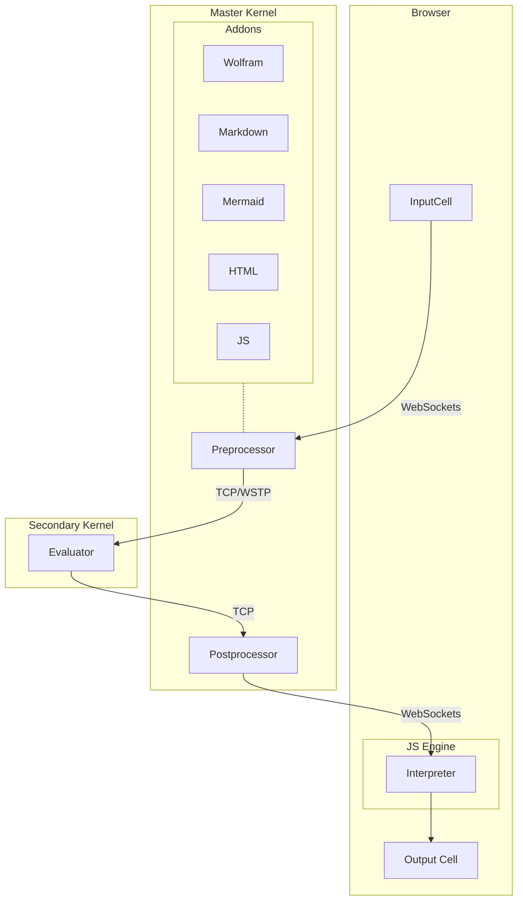
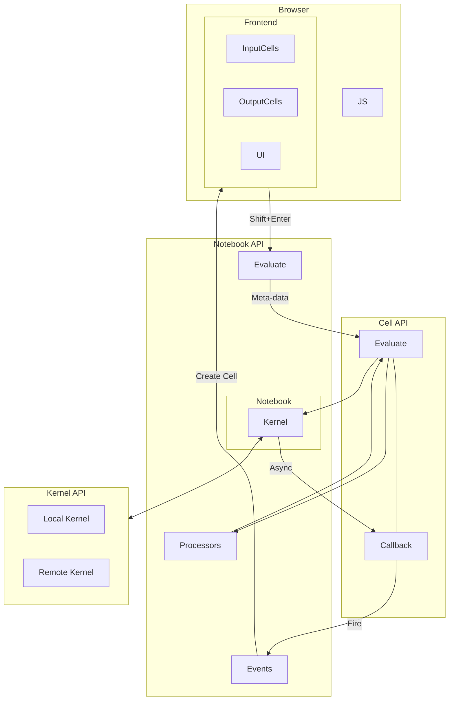
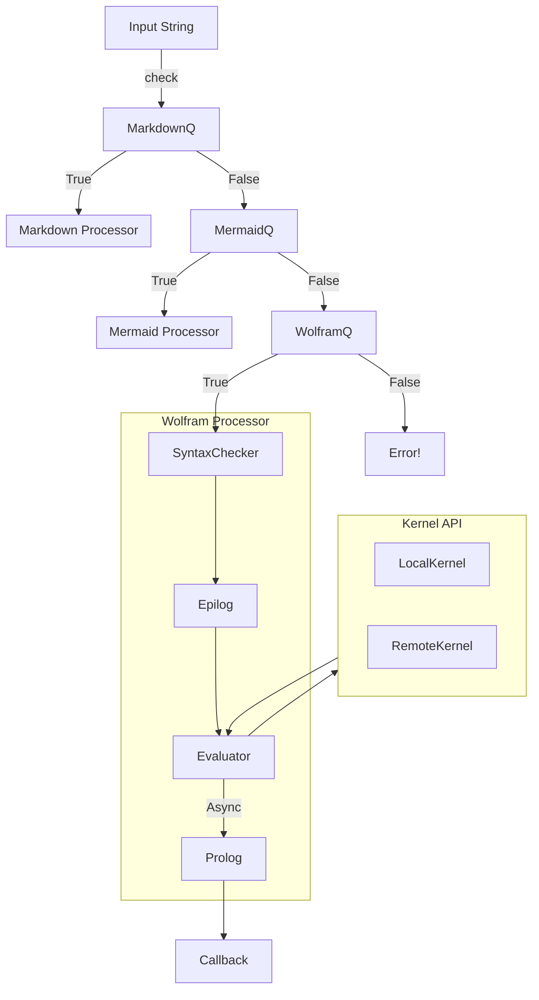
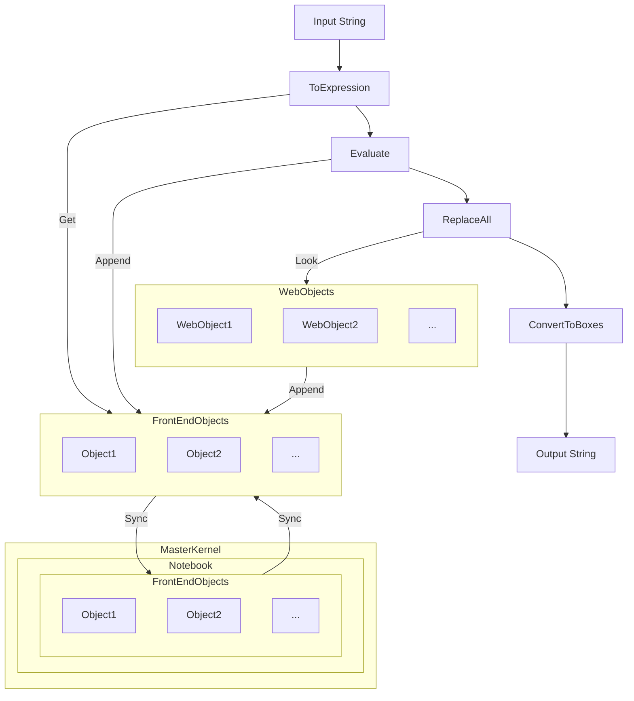
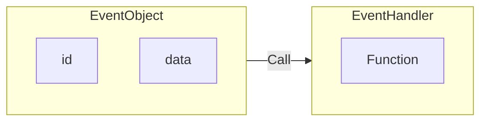
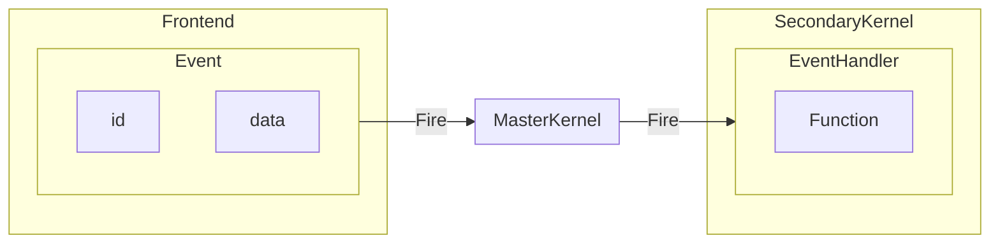
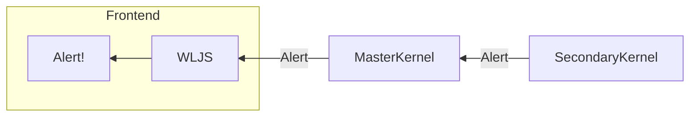

## Static evaluation

#### Editor in the browser
When you open an editor and __start typing__, the following happends
1. each character is send to a server and updates the cell (autosaving)
2. editor tries to figure out the language or a cell type 
3. considering (2) it changes the highlighting and autocomplete / other plugins

In this sence your input cell is __an ultimate tool__.

![[ezgif.com-video-to-gif-4.gif]]

To specify the type it uses a prefix in the first line of the cell

```markdown
.md
# Hello
```

it can be anything `**.**` the behavior is defined by so-called `Addons` [[Writting Plugins]] to the frontend.

Then whatever you typed, you should press `Shift-Enter` to make magic happend

### 1. WL Processing
JS sends the data via websockets to the server and sets the status of the cell to  `working`



#### Processing on Master Kernel
Firstly the preprocessing happends on the first master-kernel. 

All cells operations are performed via `Kernel/Cells` module under `Kernel/Notebook` wrapper



It applies all available processors to the input expression listed in `jsfn'Processors` . This is an example with Markdown language

```mathematica
{
	MarkdownQ -> <|"SyntaxChecker"->(True&), "Epilog"->(#&), "Prolog"->(#&), "Evaluator"->MarkdownProcessor |>,
}
```

The pipeline for `Processors` is following



Here evaluator function (`WolframProcessor`) can decide if it returns the result immediately or send to the evaluation to the secondary kernel with a callback included. Also it determines the final output cell subtype (wolfram, html, mermaid) see [[#Default cell types]] to be interpreted by the frontend running in the browser.

#### Evaluation on the secondary kernel | Kernel API
The expression arrives in a form of string and then converts to the Wolfram Expression with a held head. See `Kernel/Evaluator`

To support fully [[Frontend Object]] it replace them with an actual wolfram expressions. If it is not available on the kernel it makes a query to the master kernel and download them.

All non-native boxes, decorations (see [[Decorations#Editable Two-ways binded widgets]]) are replaced with the corresponding Wolfram Expressions.

The result evaluates normally. However if it encounters the creation function for [[Frontend Object]] or registered Frontend Objects (see [[Writting WebObject]]) like `Graphics`, `Plotly` it replaces them with `FrontEndExecutable` and stores the compressed to JSON data for them into the local storage to be shared lately with the master kernel and a notebook.

On the very last stage it converts the result to sort of `Boxes` (see [[Decorations#Editable Two-ways binded widgets]]).

If the resulting string is too long, then instead of a string it returns a pointer to the corresponding data to prevent frontend overloading



The result, created frontend objects, the cell type are shared via provided callback function with a master kernel. As well as syncs updated or created [[Frontend Object]] s.

### 2. JS Processing
Once the message is decoded by the frontend in your browser, it creates a cell and fetches the corresponding handler to display the result in a cell. 

For example, here the handler function for `markdown`

```js
class MarkdownCell {
	dispose() {}
	constructor(parent, data) {
		//parse markdown code and draw it to DOM element
		parent.element.innerHTML = marked.parse(data);
		return this;
	}
}
```

After that the user can see the content. It also takes care about syntax highlighting and anything else. This process is boosted by the server side rendering, i.e. the server also provides DOM template for the cell wrapper, controls, buttons (as much as possible) to release an extra load from the client.

Any action with a cell must be aprooved by the server via Notebook API functions. If you remove the cell or add a new one the client waits the server's reply for it. Therefore it makes sure that the data is synced perfectly.

### Default cell types
There are a few built-in cell types available for the user

#### Wolfram Language
Works out of the box and has all features as an input cell
```mathematica
1+1
2
```

#### Markdown
Provides Markdown language with LaTeX support and WSP template engine
```markdown
.md
# Hello World!
- 1
- 2
```


WSP template engine allows to use Wolfram Language to process the text like PHP (see [more here](https://github.com/JerryI/tinyweb-mathematica)). For example, to create a list in Markdown one can do
```md
.md
# A list of items
<?wsp Table[ ?>
- <?wsp i ?>th element
<?wsp , {i,1,5}] ?>
```
it will produce
```md
# A list of items
- 1th element
- 2th element
- 3th element
- 4th element
- 5th element
```

#### HTML
You can also write plain HTML with WSP templates as well
```html
.html
<h1>Hello World</h1>
```


#### Mermaid
Draw beautiful diagrams by code (WSP is supported)
```bash
```shell
.mermaid
pie title NETFLIX
         "Time spent looking for movie" : 90
         "Time spent watching it" : 10
```


##### Image/File viewer/editor
It is questinable if it a good idea to implement it in the following syntax. The prefix itself defines the urls and the type of the processor. 

However, for now you can drop any image available in the folder of your notebook
```shell
randompic.png
```


to print the content of any file
```
filename.txt
```

to create or to write to a file
```
filename.txt
Hello World
```


##### SVG Art
This feature was added mostly for fun. If you like to draw using symbols, you should definitely try a new creating - [SVGBob](https://github.com/ivanceras/svgbob). Written in Rust and packed as a WASM module
```shell
.svgbob
--------->
```


### Writting your own processor | Editor
🚧  To be written

## Dynamic evaluation
To support dynamics and two-ways data binding it relies on the event-based evaluation. For each asynchronious evaluation on the secondary kernel via Kernel API

- an event has to be fired by the frontend (browser)
- a direct request must be send by the frontend

### Event system
It uses a very simplified event system, where an event object has an id and the data inside. Each event object can be assigned only to the one handler



in the code anywhere one can use
```mathematica
event = EventObject[<|"id"->"uid"|>]
EventBind[event, Function[data,
	Print["Fired!"];
	Print[data]
]]
```
to fire an event one need to evaluate
```mathematica
EmittedEvent["uid", "Hello world"]
```

The trick is that one can subsitute anything inbetween 



on JS side (frontend) it looks like
```js
server.emitt('uid', data)
```

A silder, a button, an animation on the frontend __are a just event-generators__ with a fancy view boxes (see [[Making Frontend Views for symbols]]).

#### A direct request by the frontend to the secondary kernel
On JS side it is possible to evaluate any arbitary function on the secodnary kernel by calling
```js
server.talkKernel('Print["Hi!"]')
```

#### How to reply back?
To make fire the chain backwards we rely on the direct communication between frontend and the secondary kernel. Secondary kernel is always aware, to which notebook it is connected. Then to execute any frontend function (see [[Frontend functions]]) one can call

```mathematica
SendToFrontEnd[ Alert["Hello World"] ];
```

ie.



One can transfer any arbitary symbolic or non-symbolic data to it and even perform [[Heterogenesis computation]] there. With some syntax sugar it provides a nice interface to interact with [[Frontend objects]].

### Promises
The given examples above are focused on the async evaluation and etc. But what if we need get some data from the master or secondary kernel and then, perform some calculations using that?

it uses `NotebookPromise` api together with JS's `promise` in a way like
```js
server.ask('1+1').then((result)=>{
	alert(result)
})

//or for thesecondary kernel
server.askKernel('1+1').then((result)=>{
	alert(result)
})
```

it allows you to write efficient async code with synchronous communication.