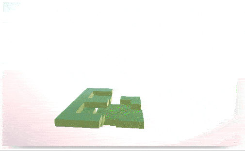

.png)


To add new elements to a plot / graph there is no need in full reevaluation of a cell or using dynamic binding. Since the context of executing is stored together with an object, one can simply evaluate (in-place) the needed expression.
<!--truncate-->


Let's have a look at the following example

```mathematica
Plot[Sin[x], {x,0,Pi}, Epilog->{MetaMarker["myplot"]}]
```

Here it results in `Graphics` expressions with a bunch of `Line` lying inside, while `Epilog` option just puts the given expression into the end of the same `Graphics` object.


You can think about `MetaMarker` as if it was `<div id="">` or class, that allows you to identify that particular object in the given context.

After than one can simply execute an expression by using the following expression

```mathematica
FrontSubmit[{
	RGBColor[1,0,1], 
	Line[{{0,0},{0.4,1}}]
}, MetaMarker["myplot"]] 
```

:::info
Using `FrontSubmit` together with the second argument given as `MetaMarker` will result in evaluation of the expression on frontend in the context and local memory of the marked excutable object.
:::

As a result, the graph will show a new feature


This does not depend on `Graphics` object, it can be anything in principle.

## Voxel cellular automaton
For example, let us create an empty 3D canvas

```mathematica
Graphics3D[{Cuboid[{1,1,0}], MetaMarker["marker"]},  "Lighting"->None, "Lightmap"->"https://raw.githubusercontent.com/JerryI/Mathematica-ThreeJS-graphics-engine/master/assets/PureSky.hdr", "ViewProjection"->"Perspective"]
```

Then using build-in cellular automaton, we can visualize it lively in 3D using simple `Cuboid` shapes with different colors

```mathematica
size = {10,10};
board = CellularAutomaton[{6, {2, 1}, {1, 1}}, {{{1}}, 0}, 50]//First;
size = board//Dimensions

z = 20;

iterate := (
 board = CellularAutomaton[{6, {2, 1}, {1, 1}}, board];

 Table[
  If[board[[i+size[[1]]/2 // Floor,j+size[[2]]/2 // Floor]] > 0, 
    With[{cube = Cuboid[{i,j,z}, {i+1,j+1,z+0.8}], color = {1+i/100,1+i/100,(z+10)/10}},
    
      FrontSubmit[{ RGBColor@color, cube}, MetaMarker["marker"]];
      Pause[0.02];
      
    ]
  ];
 , {i, -size[[1]]/2//Floor, size[[1]]/2//Floor}, {j, -size[[2]]/2//Floor, size[[2]]/2//Floor}];
 z = z - 0.8;
);
```

If a cell is 1, then it will be a cube on that place. By calling

```mathematica
Do[iterate //Quiet;, {i,1,10}];
```

One can observe in real time the following



The full code is presented below


You can also download this notebook via a link
- [VoxelAutomata.wln](VoxelAutomata.wln)

Thank you for reading! See you