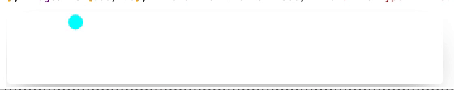
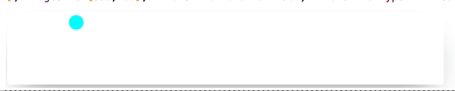

To describe the idea of a new tool better, it is good to start from the initial problem. 


The data transfer via `ExpressionJSON` representation over the WebSocket protocol adds a significant latency. What if we want to implement __real-time visualization with a least  $\sim 30FPS$ ?__

<!--truncate-->

## Interpolation
A standard library [wljs-graphics-d3](https://github.com/JerryI/wljs-graphics-d3) based on D3.js provides a decent transition mechanism, that makes a nice animated transitions from the old dataset to a new one perfectly in-sync with browser's refresh rate.

Let us have a look at the example __with no interpolation involved__

```mathematica
p = {-1,0};
Graphics[{PointSize[0.1], Point[{p} // Offload]}, "TransitionDuration"->0.1]
```

By updating the position 

```mathematica
Do[
  p = {x, Cos[10 x]}; 
  
  (* simulate load *)
  Pause[0.2];
, {x,-1,1,0.1}]
```

we will see the following


To __enable the interpolation__ specify `TransitionDuration`

```mathematica
Graphics[{Cyan, PointSize[0.1],Point[{p} // Offload]}, ImageSize->{600,100}, "TransitionDuration"->300, "TransitionType"->"Linear"]
```

Now the transition time overlaps with our `Pause[0.2]` time period, that results in a kinda smooth behaviour. 


This approach might work well in a case, __when there is only one object to animate__.

## Event-based approach

Having a fixed time delay and a loop in general __is a waste of resources__, especially when it comes to many independent animations. 

One can assign all animations to the framerate of the browser, however doing that in a one directional way will introduce some issues, if the calculation time temporary exceeds the given time-window for render.

Since we anyway are using [Interpolation](#Interpolation), one can use its local time-scale to call the next animation frame to be calculated (or data points will be updated).

Assuming *$t_{calc} \approx t_{transition}$ then we introduce a threshold value (0-1) that specifies, when the event of recalculating the position fires with respect to the duration of transition animation

*threshold = 0.9*

*threshold = 0.5*

*threshold = 0.1*


The good thing about it is that 
:::info
A new transition will not occur if the calculation has not finished. 
:::

A threshold and transition duration values can be adjusted to get the maximum smoothness and performance based on the network conditions and CPU load.

### Implementation
One need to have an access to the transition process happening at the particular graphics element? Why not just

```mathematica
EventHandler[Point[p // Offload], "transition"->calc] ???
```

Here is why.

For the perspective of Javascript D3.js library used in frontend, when one calls

*regular evaluation*
```mathematica
Point[p // Offload]
```
```javascript
> d3.Selection<SVGElement, unknown, HTMLElement, any>
```

*update method*
```mathematica
Point[p // Offload]
```
```javascript
> d3.Transition<GElement extends BaseType, Datum, PElement extends BaseType, PDatum>
```

Here one could attach to the returned object via

```javascript
(object) => {
	let state = false;
	object.tween(uid, function (d) {
		return function (t) {
			if (t >= threshold && !state) {
				server.emitt(uid, `True`);
				state = true;
			}
		}
	}))
}
```

You have to attach it every-time when a transition occur, since each time this is a new object.

However, there is a problem

:::info
Dynamic binding happens only between containers (virtual or real), i.e. `p` and `Point` expressions

```mathematica
OurHandler[Point[p // Offload]] // Graphics
```

The upper expression `Point` scopes all variables. When `p` updates, `OurHandler` or `Graphics` expression __will not be evaluated__!
:::

It means, that in general `EventHandler` method, where the event-binding is executed from outside to inside works well for the static evaluation, but events generated during dynamic updates will not be captured!

__We need to bind from inside__

```mathematica
Point[MiddlewareHandler[p // Offload, "end"->calc]] // Graphics
```

Now the whole expression `Point` including all its guts will be evaluated during the dynamic updates of any inner expressions.

With some tweaked added to the WLJS Interpreter, I (@JerryI) managed to make it work properly as intended. 

### How to use
There is only one event type has been implemented by now.

```mathematica
Point[MiddlewareHandler[data // Offload, "end"->calc, "Threshold"->0.5]] // Graphics
```

or

```mathematica
Line[MiddlewareHandler[data // Offload, "end"->calc, "Threshold"->0.5]]
```

or even for the transformations

```mathematica
Translate[MiddlewareHandler[Point[{0,0}], "end"->calc], data // Offload]
```

where

```mathematica
calc[garbage_] := data = recalculate[data];
```

:::tip
Place `MiddlewareHandler` inside any expression, of which you want to track the transition process. It acts as `Identity` operator, i.e. allows safely wrapping around any other expression. 
:::

:::info
`MiddlewareHandler` fires the first (zero) event just when it has been created
:::

## Making 2D Game
Now we can use this trick for any projectiles in game animations! Each created object will be handled by its own `MiddlewareHandler`


Download notebook
- [Baster.wln](Baster.wln)
