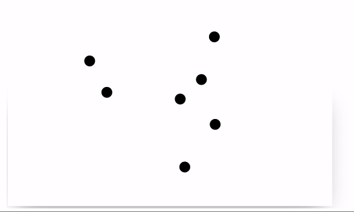

Here we will try to recreate a simple example of the interactive plot, where bouncing dots are created using mouse clicks on an empty canvas.
<!--truncate-->

## Mathematica's version

Originally it was designed for Wolfram Mathematica by Wolfram Research group. Let us have a look at the original core first

```mathematica
Framed@DynamicModule[{points = {}, vel = {}}, 
  EventHandler[
  
   Graphics[{PointSize[0.1], 
	   Point[Dynamic[{vel, points} = animate[vel, points]; points]]}
	, PlotRange -> {{-1, 1}, {-1, 1}}], 
   
   "MouseDown" :> ({points, vel} = 
      addPoint[MousePosition["Graphics"], points, vel])
  ]
]
```

It uses `DynamicModule` to localize dynamic variables and a set of two functions `animate` to recalculate new positions and `addPoint`.

[Download Notebook](Balls.nb)

## WLJS Frontend version

To recreate this using WLJS Frontend we need to change the way how dynamics is processed. Firstly, we need an event-listener object to get the place where a user clicked

```mathematica
Graphics[{
	RGBColor[1,1,1],
	EventHandler[Rectangle[{-10,10},{10,-10}], {"click"->addPoint}],
	RGBColor[0,0,0], PointSize[0.1],
	Point[points // Offload]
}]
```

Here it creates a white rectangle in the background to add event-listener for clicks. And a global variable `points` is bounded to `Point` expression using `Offload`.

:::danger
`EventHandler` expression does not fully correspond to the one used in Wolfram Mathematica
:::

:::info
Dynamic binding is possible only using global variables.
:::

Then, we need an function, that adds dots to an array

```mathematica
points = {{0,0}};
vel = {RandomReal[{-1,1}]};

addPoint[xy_] := (points = Append[points, xy]; vel = Append[vel, RandomReal[{-1,1},2]]);
```

Now it should add new dots, when we click on a canvas


One thing is missing - animation. One need to update `points` symbol with a new positions and etc. The corresponding function will be

```mathematica
points = {{0,0}};
vel = {RandomReal[{-1,1}]};

addPoint[xy_] := (points = Append[points, xy]; vel = Append[vel, RandomReal[{-1,1},2]]);

animate[i_] := points = MapIndexed[(If[Max[#1//Abs] > 1.2, vel[[#2//First]] = - vel[[#2//First]]]; #1 + 0.1 vel[[#2//First]])&, points];
```

Instead of using timers, one can assign the an event handler to the transition animation, which is provided by [wljs-graphics-d3](https://github.com/JerryI/wljs-graphics-d3) library. 
:::info
IO operations between the frontend and a server cannot run at full speed giving 60FPS, therefore the data is interpolated using the time-constant provided by the option to the `Graphics` expression called `"TransitionDuration"`.
:::

To capture the transitions we need a `MiddlewareHandler`

```mathematica
Point[MiddlewareHandler[points//Offload, "end"->animate, "Threshold"->0.2]]
```

It stands in between the drawing function and an updatable symbol. Threshold value specifies when the event `animate` will be fired, i.e. `1` means after the transition and anything less means, that it will be fired a bit early. It is used to compensate the latency of the network making the animation smoother. 

Here the full code


Links
- [Download Notebook](Balls.wln)

Thanks for reading! See you next time
