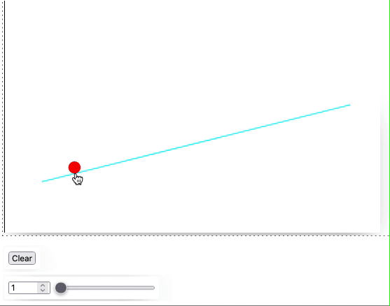

Here we will try to recreate a simple example of the interactive curves fitting based on `Fit` function provided by Wolfram Mathematica.
<!--truncate-->

## WLJS Frontend version

For the demonstration one can input the data points by clicking on an empty canvas

```mathematica
RGBColor[1,1,1],
  EventHandler[Rectangle[{-10,10}, {10,-10}], {"click"->Function[xy, 
    points = Append[points, xy]; 
    fit = lineFit[points]
]}],
...
```

An event listener is attached to the rectangle at the background. Each time user clicks on it, it will append a new point to the array and recalculate fitter curve using defined `lineFit` function.

To draw our points and fitted curve, we need one line of a code

```mathematica
PointSize[0.1],
  Red, Point[points//Offload], Cyan, Line[fit//Offload]
```

Then, let us define the fitting function

```mathematica
fit = {};
points = {};
order = 1;

lineFit[points_] := With[{o = Table[CM6Superscript[x, i], {i, 0, order}]},
  With[{f = Fit[points, o, x]}, 
    Table[{x, f}, {x, -1,1, 0.025}]
  ]
]
```

Basically,  it is done. However one can make it more interesting if we consider a control slider for changing the order of a curve as well as a clear button

*in a new cell*
```mathematica
Function[data, points = {}; fit = {};] // InputButton["Clear"]
Function[data, order = data; fit = lineFit[points]] // InputRange[1, 5, 1]
```

:::info
A shortcut to assign a `handler` function to an event-object 
```mathematica
handler // EventObject[...]
```
is an equivalent of
```mathematica
EventHandler[EventObject[...], handler]
```
:::

Here the full code


Links
- [Download Notebook](CurvesFit.wln)

Thanks for reading! See you next time
