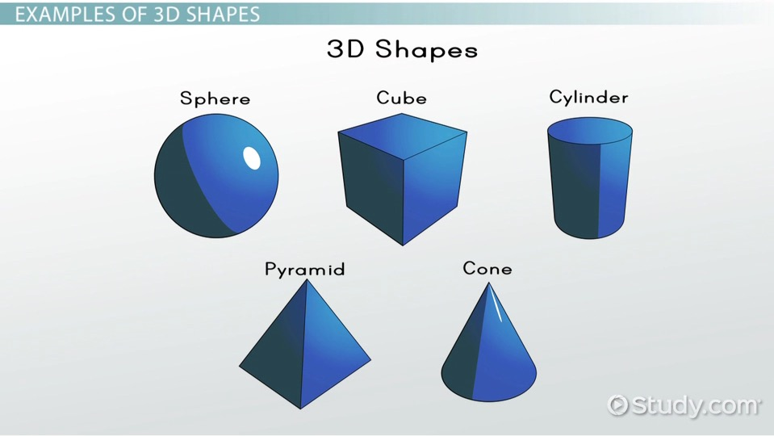
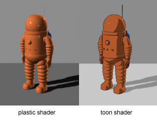
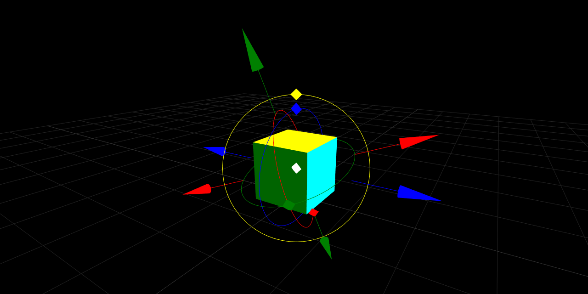
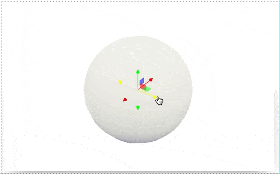

Every feature I introduce comes from the practicing on real-life cases. Recently I had an urge to make a nice figure for the Physical Review B paper.

In this post: __shadows__, __light-sources__, __toon-shading__, __transformation control__...

<!--truncate-->


<Component>
https://cdn.statically.io/gh/JerryI/Mathematica-ThreeJS-graphics-engine/master/dist/kernel.js
</Component>

## Shadows
Firstly, to depict a crystallographic structure is not a big deal. Using materials.project one can obtain `.cif` file and easily parse it using Wolfram Language. With a bit of a crystallography knowledge one can show ions as sphere with arbitrary colors and sizer for your taste 


Ok, definitely, we __do not need spheres to cast shadows__...
Ah, by the way, some new features comes

:::info
```mathematica
Shadows[True]
```
Allows group of objects to cast shadows or receive them from the `PointLight`, `SpotLight`, `HemisphereLight` sources of light in the scene
:::

## Light sources
To define some custom light-source

:::info
```mathematica
PointLight[RGBColor[], intensity_:1, ..., "Position"->{x,y,z}]
```
Adds point light source ([see THREE.js](https://threejs.org/docs/#api/en/lights/PointLight))
:::

:::info
```mathematica
SpotLight[RGBColor[], intensity_:1, ..., "Position"->{x,y,z}, "Target"->{0,0,0}]
```
Adds spot light source ([see THREE.js](https://threejs.org/docs/#api/en/lights/SpotLight))
:::

:::info
```mathematica
HemisphereLight[SkyColor_RGBColor, GroundColor_RGBColor, intensity_:1]
```
Adds hemisphere light source ([see THREE.js](https://threejs.org/docs/#api/en/lights/HemisphereLight))
:::

The position and target object support dynamic updates, i.e. one can do
```mathematica
PointLight["Position"->(pos // Offload)]
```

:::tip
To have more control over the lighting, disable the default one in the scene
```mathematica
Graphics3D[..., Lighting->None]
```
:::

Let me continue with a figure. __No shadows__ and __only point-light source__


Now it's much better, however this old-school 3D look for me feels a bit off being printed next to sets of 2D plots.  

## MeshMaterials
Vector graphics has a minimal set of colors, I am looking for something like this one

<div style={{textAlign: 'center'}}>



*image from [CAHSEE - Properties of Shapes: Help and Review](https://study.com/academy/topic/cahsee-properties-of-shapes-help-and-review.html)*

</div>

Well, how one can archive that? It reminds me something

<div style={{textAlign: 'center'}}>



*image from [Cell shading](https://en.wikipedia.org/wiki/Cel_shading)*

</div>

Browsing through the materials on THREE.js docs, [I found one](https://threejs.org/docs/#api/en/materials/MeshToonMaterial) I was looking for and quickly applied that one


Here we go! Let me introduce you `MeshMaterials`

:::info
Use `MeshMaterial[]` for a group of object to specify the material for the geometry. By the default, all objects have `MeshPhysicalMaterial[]`. 

```mathematica
MeshMaterial[MeshPhysicalMaterial[]]
MeshMaterial[MeshToonMaterial[]]
MeshMaterial[MeshPhongMaterial[]]
MeshMaterial[MeshLambertMaterial[]]
```
:::

Well, I am not satisfied yet. 

## Transformation controls
Positioning the light is pain. At least there is a dynamic binding, i.e. no need in re-evaluating a cell every-time. I wish, one could drag a light source like in Blender or any other 3D software.

As usual, everything [was invented before](https://threejs.org/examples/#misc_controls_transform), one only needs to adapt and integrate the given technology



The next logical step will be - implement it as a `EventHandler`, like `drag` or `click` listeners attached to an SVG element in `Graphics`

:::info
To assign a draggable event handler used in 3D, apply handler for `transform` property
```mathematica
EventHandler[Sphere[], {"transform"->handler}]
```
`handler` function accepts an association with a current position of a dragged object
```mathematica
<|"position"->{x,y,z}|>
```
:::

To help with dragging an in-built gizmos will appear on-top of the attached object. Now it looks like this




Now one can finally feel the freedom of positioning the light sources in the scene to achieve the best look


Probably it won't work in the preview here in the post. To see it in action have a look at the thumbnail of this blog post or evaluate those three rows of a single cell in your notebook.

Now I could finally overlay it with some notes and finished the look of a printed version


Thanks for reading! See you soon 