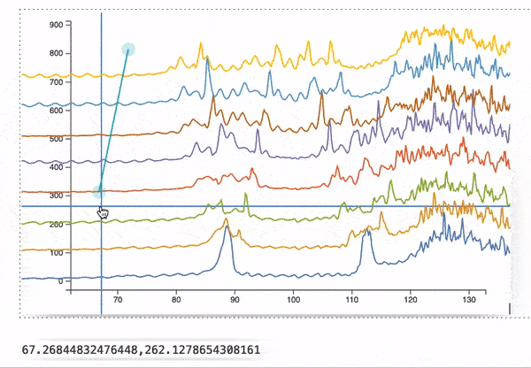

Now regular `Graphics` expressions has panning/zooming features. Use `Controls->True` as an option 

```mathematica
Plot[x, {x,0,10}];
Insert[%, Controls->True, {2,-1}]
```

Unfortunately, it is not possible to extend option values for the regular functions `Plot` and etc.