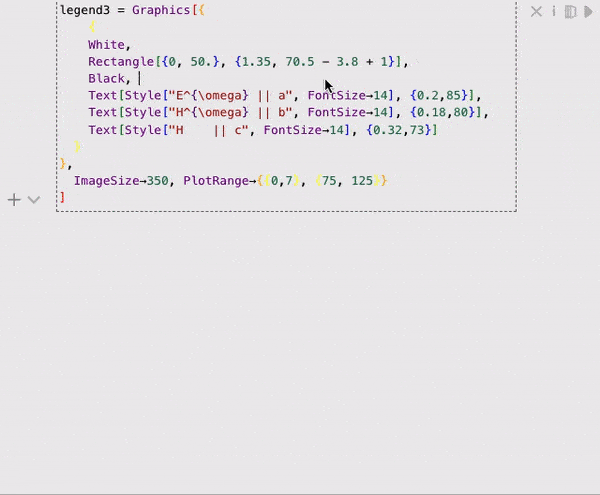
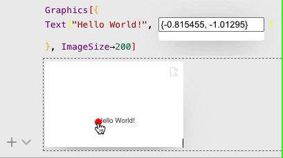

Have you ever have spent minutes or even hours trying to find a proper position of an element by changing the value in a code iteration by iteration?

There is a way of making a compromise between visual and code editing by injecting the first one into the last. Let's call it __in-code visual editing__ 



<!--truncate-->

Or in a bit simpler cases


Here above is two examples of such thing created using Dynamics and tricks with `FrontEndObjects`. The idea is
1. Evaluate in-place a special function with initial coordinates placed at the position of an argument needed to be adjusted visually (`Text[.., pos]`, `Rectangle[pos1, ...]` ane etc)
2. Place a dynamic field into an input cell, that shown the current position.
3. On-evaluate the dynamic field must be replaced with `Offload` expression, that contains a sort of a gizmo for user's mouse and a dynamically generated variable linked to the dynamic field shown in the input cell

Sounds complicated. Let's tear it down

### Dynamic field
This is easy to do it as a separate thing

```mathematica
var = {0,0} // ToString;
TextView[var // Offload] // CreateFrontEndObject
```

then, if one change a variable `var` it will be updated dynamically
```mathematica
var = {1.0, 0} // ToString;
```

Here, as a maintainer (@JerryI) I would suggest a component apparoach and scope our dynamic variables using `Module` or more controllable version that leaks on purpose `LeakyModule`

```mathematica
handler[var_] := With[{},
	var = RandomReal[{-1,1}, 2] // ToString;
	controller /: Set[controller[], data_] := var = data // ToString; 
]
SetAttribute[handler, HoldFirst];

LeakyModule[{var},
	handler[var];
	TextView[var // Offload] // CreateFrontEndObject 
]
```

and then, one can *control* it via

```mathematica
controller[] = RandomReal[{-1,1}, 2];
```

___Just an idea___...

### A Gizmo
How to add a gizmo to a `Graphics` object and allow user to control it? We need only two expressions `EventHandler` and graphics object itself that will represent a gizmo graphically, i.e.

```mathematica
gizmo[var_, text_] := With[{v = var // Evaluate},
	{
		PointSize[0.05], Red, 
		EventHandler[
			Point[v], 
			{
				"drag"->Function[xy, var = xy; text = xy // ToString]
			}
		]
	}
]

SetAttributes[gizmo, HoldAll]
```

### Combining together
Now let us combine a dynamic variable together with a gizmo
#### OBJECT component
In general for the original expression, to which we provide an interactive input, one need to do something like this

```mathematica
gizmo[variable, text]; Offload[variable]
```
Right? Ok, now in the context

```mathematica
Text[
	"Hello World!",
	(* our placeholder *)
	gizmo[variable, text]; Offload[variable]
	(* end of our placeholder *)
]
```

Kinda...

One need to make sure, that the result of `gizmo` will be evaluated somewhere inside our `Graphics` canvas on frontend's side (aka WLJS) and at the same time only `variable` must appear to be a returned result

```mathematica
Text[
	"Hello World!",
	(* our placeholder *)
	With[{g = gizmo[variable, text]},
		Offload[g; variable]
	]
	(* end of our placeholder *)
]
```

And then, to prevent unwanted dynamic updates on `gizmo`, use

```mathematica
Text[
	"Hello World!",
	(* our placeholder *)
	With[{g = gizmo[variable, text]},
		Offload[Static[g]; variable]
	]
	(* end of our placeholder *)
]
```

:::tip
To prevent `update` method to be called on some expressions on the frontend (WLJS), use `Static` wrapper on them.
:::

The last step is to scope the dynamic variable

```mathematica
Text[
	"Hello World!",
	LeakyModule[{variable = {0,0}, text = ""},
		(* our placeholder *)
		With[{g = gizmo[variable, text]},
			Offload[Static[g]; variable]
		]
		(* end of our placeholder *)
	]
]
```

#### View component with OBJECT component
Now we need to combine it with [Dynamic field](#Dynamic%20field) somehow, i.e.

```mathematica
Text[
	"Hello World!",
	LeakyModule[{variable = {0,0}, text = ""},
		(* VIEW: our placeholder *)
		TextView[text // Offload] // CreateFrontEndObject
		(* VIEW: end of our placeholder *)

		---

		(* OBJECT: our placeholder *)
		With[{g = gizmo[variable, text]},
			Offload[Static[g]; variable]
		]
		(* OBJECT: end of our placeholder *)
	]
]
```

This mean, we would have to sublimate the *view* part with an *object* part, when the expression was under evaluation. This is possible, and see how

> This must be included into DOCS for sure

### Different copies of `FrontEndExecutable`
Each time you evaluate `Graphics` or whatever frontend object, it creates two copies of its representation: one is stored on frontend kernel (master Wolfram Kernel), which is shared with a browser (WLJS), while there is other *private* copy of it on the secondary Wolfram Kernel.

When Wolfram Kernel encounters a `FrontEndExecutable` during the evaluation, it uses (if available) its private copy, and if not it downloads the shared one into the private storage. The trick we going to do is __to provide different copies of the same object__, which are populated via the content of *view* and *object* respectively

```mathematica
Magic := With[{uid = CreateUUID[]},
	With[{o = CreateFrontEndObject[TextView["Hello World"], uid]},
		(* a trick to sublimate a private copy *)
		CreateFrontEndObject["Cucumbers", uid, "Type"->"Private"];
		o
	]
]
```

Try this example
```mathematica
Magic
```
evaluate in place and, then, evaluate the result as a cell.


### Final combo
Taking everything into account, one can finally make it work

```mathematica
gizmo[var_, text_] := With[{v = var // Evaluate},
	{
		PointSize[0.05], Red, 
		EventHandler[
			Point[v], 
			{
				"drag"->Function[xy, var = xy; text = xy // ToString]
			}
		]
	}
]

SetAttributes[gizmo, HoldAll]

PointerAssist[init_:{0,0}] := With[{uid = CreateUUID[]},
	LeakyModule[{variable = {0,0}, text = "{0,0}"},
		With[{fe = CreateFrontEndObject[TextView[text // Offload], uid]},

    		(* private *)
    		CreateFrontEndObject[With[{g = gizmo[variable, text]},
    			Offload[Static[g]; variable]
    		], uid, "Type"->"Private"];

            (* public *)
            fe
        ]
	]
]
```

Then let us apply it on our earlier example

```mathematica
Graphics[{Text["Hello World!", PointerAssist[{0,0}] ]  }]
```



Thanks for reading. See you next time!