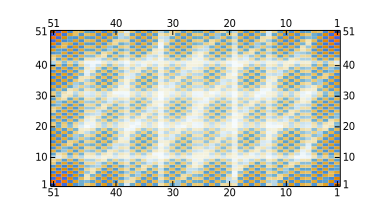

```mathematica
MatrixPlot[
 Fourier[Table[
   UnitStep[i, 4 - i] UnitStep[j, 7 - j], {i, -25, 25}, {j, -25, 
    25}]]]
```
It means, `MatrixPlot` as well as `Rasterize` can work properly finally

<!--truncate-->


## Raster

`MatrixPlot` produces `Graphics` with `Raster` inside. However, similar function `ArrayPlot` __won't work properly__ since it doesn't provide the `PlotRange` option.

In my implementation of `Graphics` it cannot guess what the plot range would be. Therefore you have to manually provide it. For example

```mathematica
Graphics[{
	Raster[Table[{x, y, x, y}, {x, .1, 1, .1}, {y, .1, 1, .1}]]}
	, PlotRange->{{0.1,10}, {0.1,10}
}]
```


Here `PlotRange` is necessary, otherwise it will be set to `{-1,1}`.

## Image
This is actually a separate entity, that uses HTML5 canvas
> despite this fact, you can still easily embed it into `Graphics` using `Inset` wrapper


Please see __Reference__ section in the frontend docs for more information. See Ya!