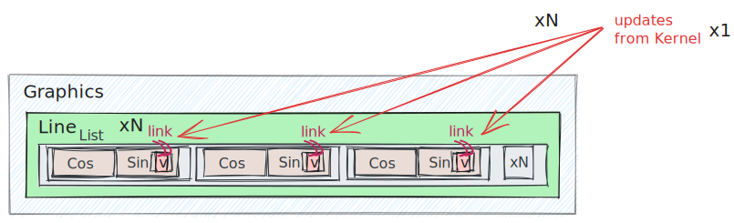
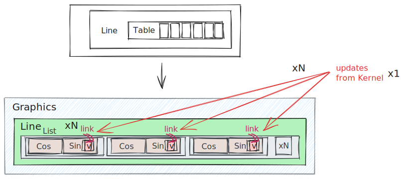
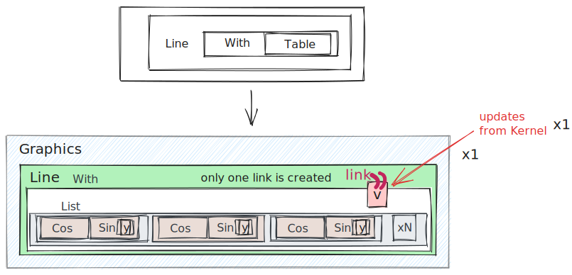
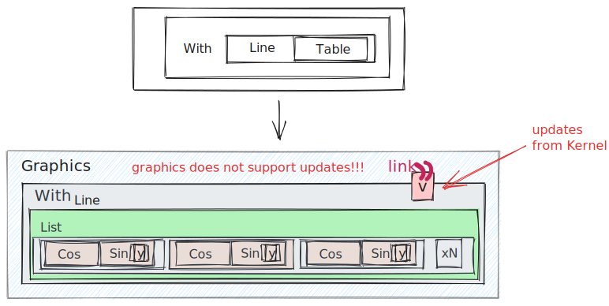

## Performance tips
You can explicitly choose what will be interpreted on the frontend or backend. We have a few possibilities for our function inside `Line` expression

### All load to backend
For this one need to change code to

```mathematica
Function[data, lines = With[{y = data}, Table[{Cos[x], Sin[y x]}, {x,0,2Pi, 0.01}]]] // slider

EmittedEvent[slider, 1];
```

The last line manually fires an event to initialize symbol `lines`. Then for the output we can write

```mathematica
Graphics[{Cyan, Line[lines // Offload]}]
```

One can illustrate this binding as on a picture below


The benefits of this approach
:::note
Suitable for heavy calculations, high-load on network transport - large latency
:::

### Gradually involving frontend
One can move an entire `Table` to the browser's side. Let's discard our changes we made to

```mathematica
Function[data, v = data] // slider
```

##### Naive approach 1
The obvious solution for output could be

```mathematica
Graphics[{Cyan, Line[
	Table[{Cos[x], Sin[Offload[v] x]}, {x,0,2$Pi$, 0.01}]
]}]
```

That will be __a horrible solution__ 👎🏼  



Imagine, each time `Table` iterator `x` goes through the range of values, it creates a sublist of `Sin` and `Cos` functions, that contains dynamic variable `v`.  Then you end up with many instances of `v`. 

:::danger
```mathematica
Line[Table[Expression[Offload[symbol]], {i, 10}]]
```
Creates `10` instances of `symbol`. `Line` function will be called __10__ times on each update of `symbol`!
:::

:::danger
Do not put dynamic symbols inside large `Table`. Try to minimize the number of its copies made.
:::

##### Naive approach 2
Ok lets try to improve a bit

```mathematica
Graphics[{Cyan, Line[
	Table[{Cos[x], Sin[v x]}, {x,0,2$Pi$, 0.01}] // Offload
]}]
```

This is also __horrible__ 👎🏼  Symbol `Table` does the same thing being executed on __browser's side as well__



##### Optimized version
One can minimize the number of instances to just 1 using `With`, as it was shown in the example above

```mathematica
Graphics[{Cyan, Line[
	With[{y = v}, 
		Table[{Cos[x], Sin[y x]}, {x,0,2$Pi$, 0.01}]
	] // Offload
  ]
}]
```

This __will save up a lot of resources__ 👍🏼 



:::tip
```mathematica
Line[With[{y = symbol}, Table[Expression[y], {i, 10}]]]
```
Creates only 1 instance of `symbol`. A `Line` function will be called __1__ time per update of a `symbol`.
:::

:::tip
```mathematica
Line[symbol//Offload], ... Line[symbol//Offload]
```
This is ok, each `Line` is bounded to its own `symbol` instance. Therefore on update of `symbol`, each `Line` expression will be reevaluated once.
:::

### Possible pitfall with `With`
There might be temptation to wrap `Line` expression inside `With` as well, like that

```mathematica
Graphics[{Cyan, With[{y = v}, 
	Line[
		Table[{Cos[x], Sin[y x]}, {x,0,2$Pi$, 0.01}]
	]
] // Offload}]
```

__This will not work at all__ 👎🏼 because the binding will occur between `Graphics` and `v` objects



Think about an onion from Shrek movie.

You can download the notebook via following link below
- __[SliderExample](../../Tutorial/files/SliderExample.wln)__