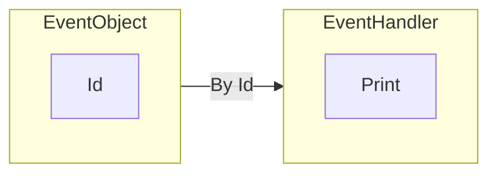
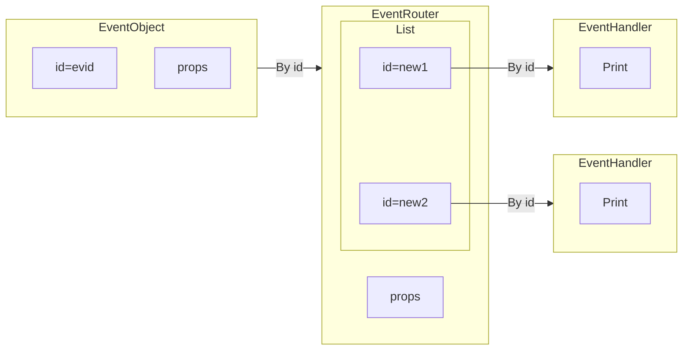
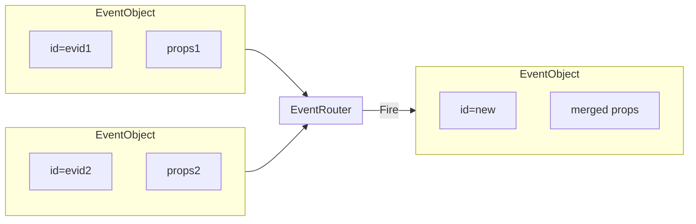

As a short summary - where you can use event-handlers 

- on `Graphics2D` elements to listen users interactions 
	- `drag`, `click`, `zoom`, `mousemove`
- on `Graphics3D` elements
	- `transform`
- on socket object (`CSocketObject` only)
- on any `EventObject` or its string equivalent 

An event-driven approach was inspired by Javascript language, where one can subscribe to any changes of any objects. Here it was expanded in a way to utilize the full power of pattern matching features of Wolfram Language.
## Thumb rule
__One event-object__ - __one handler__ function

```mathematica
ev = EventObject[<|"Id"->"evid"|>]
EventHandler[ev, Print]
```

i.e.


And then to fire 
```mathematica
EventFire[ev, "Hello World!"];
```
In order to remove handler from event object use
```mathematica
Delete[ev]
```
or more universal
```mathematica
EventRemove[ev]
```
where it deletes a handler function, but not an `EventObject`.

:::tip
To assign more event handlers, you need to __clone an event object__ or use different pattern on the same event object (see [Pattern matching](#Pattern%20matching)).
:::

### String equivalent
The actual binding is done only by `"Id"` field, therefore, one can omit `EventObject` head
```mathematica
ev = "evid";
EventHandler[ev, Print]
```
is the same as
```mathematica
ev = EventObject[<|"Id"->"evid"|>]
EventHandler[ev, Print]
```

## Pattern matching
In general an event entity can carry an additional information using Wolfram Language Patterns. It can distribute messages across different handler functions based on type of event fired (or its topic lets say). Using regular syntax for replacing patterns with `Rule` and `RuleDelayed` one can write a much more detailed handler function

```mathematica
EventHandler["evid", {
	"Topic" -> Function[data,
		Echo["Topic::"];
		Echo[data];
	],
	any_String :> Function[data,
		Echo[StringJoin[any, "::"]];
		Echo[data];
	]	
}];
```

And to fire an event on a specific pattern - add extra argument to the middle of a sequence
```mathematica
EventFire["evid", "Topic", "Hi!"];
EventFire["evid", "Whatever", "Hi!"];
```
However, it is not limited to `String`

```mathematica
EventHandler["evid", {
	_Abrakadabra -> Function[Null,
		Echo["Got it!"];
	],
	
	_ -> Function[Null,
		Echo["Wrong one"];
	]
}];

EventFire["evid", Abrakadabra[], Null]
```

One should note, that effectively those are the same records
```mathematica
EventHandler[ev, Print]
EventHandler[ev, {_ -> Print}]
```
while
```mathematica
EventFire[ev, data]
EventFire[ev, "Default", data]
```
are also the same.

## Cloning events
In the previous examples we had only one handler function per pattern. If you want more, there is a way to clone an `EventObject` or its string equivalent 

```mathematica
ev = EventObject[<|"Id"->"evid"|>]
(* first handler *)
EventHandler[ev, Print]; 

(* second handler *)
{ /* highlight-start */ }
cloned = EventClone[ev];
{ /* highlight-end */ }
EventHandler[cloned, Print];
```

What it does, it creates something like an event router subscribed to the original event-object, a router, then, is populated by the two new event-objects



Anything you do with `cloned` event will not affect the original entitiy

```mathematica
Delete[cloned] or EventRemove[cloned]
```

:::info
Cloned object inherits all properties (i.e. initial data), that the original object has.
:::

:::tip
If you are sure, that two `EventHandler` function does not intersect with their patterns attached to the same event-object, there is no need in cloning, i.e.

```mathematica
EventHandler[ev, {
	"Pattern 1" -> func1
}];
EventHandler[ev, {
	"Pattern 2" -> func2
}];

EventFire[ev, ..., data];
```

is valid. Patterns will be merged.
:::

## Return value
Each handling function can return some value back, that again carries extra information

```mathematica
EventHandler[ev, Function[Null,
	Now
]];

EventFire[ev, Null] // Echo
```

an `Echo` from the last line will print current date. The same can be done with a chain of cloned events, i.e.

```mathematica
EventHandler[ev, Function[Null,
	Now
]];
EventHandler[ev // EventClone, Function[Null,
	Now
]];
EventHandler[ev // EventClone, Function[Null,
	Now
]];

EventFire[ev, Null] // Echo
```

The returned value will be a list of three semi-identical dates.

:::tip
Use return values to provide [Promise](Reference/Misc/Promise.md) objects, when one or more of your chained handlers asks the side, which fired a chain, to wait for some deferred event be happen (see [`Then`](Reference/Misc/Promise.md#`Then`)). 
:::

## Merging
For example you want to update the state of something based on two events, that may happen independently, then use

```mathematica
ev1 = EventObject[<|"Id"->"evid1"|>]
ev2 = EventObject[<|"Id"->"evid2"|>]

joined = Join[ev1, ev2]
```

:::tip
You do not have to clone your events before joining them, since it does it automatically keeping all other connections intact
:::


## Properties
There is a possibility to carry an additional keys wrapped inside `EventObject`. By its nature this is not a classical object in the sense of OOP, since the handler function has no access to the their properties and only `Id`  field is stored in global a memory. 
### Inheritable
There is a property `"Initial"`, that specifies the initial value of the data shipped when the event is fired, when you apply `Join` or `EventClone` the final initial conditions will be merged from the different event objects or just copied

```mathematica
ev1 = EventObject[<|"Id"->"ev1", "Initial"-><|"x"->1|>|>]
ev2 = EventObject[<|"Id"->"ev1", "Initial"-><|"y"->2|>|>]

Join[ev1, ev2]
```

the result will be

```mathematica
EventObject[<|"Id"->"generatedId", "Initial"-><|"x"->1, "y"->2|>|>]
```

What also makes field `"Initial"` so special is that it can be automatically substituted to `EventFire` method, when no other data is provided

```mathematica
EventFire[ev]
```

is effectively 

```mathematica
EventFire[ev, ev[[1]]["Initial"]]
```

### Non-inheritable
A very useful property, that comes handy when making GUI elements `"View"`

```mathematica
EventObject[<|"Id"->"evid", "View"->Graphics3D[Sphere[]]|>]
```

it acts only when the object is printed to the output cell or displayed on a page (see [`WLJS`](Reference/WLX/WLJS.md#`WLJS`)), then, we will see `Graphics3D` output instead of  `EventObject`.

### Integration with server / client via WebSockets
A framework of [WLJSTransport](Reference/Misc/WLJSTransport.md) redirects calls from Javascript code to event system as well. A global `server` object provides a corresponding method

```js
server.kernel.emitt('evid', 'message')
//or
server.kernel.emitt('evid', 'message', 'pattern')
```

and on server's side one can do as usual

```mathematica
EventHandler["evid", Print]
```

