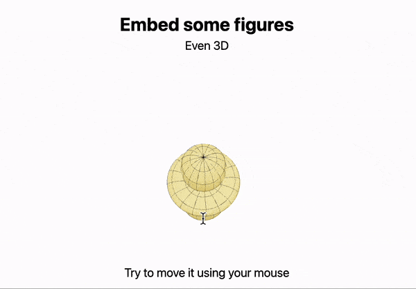

# Basics

:::info
You can use pure __Markdown__, __HTML__, __CSS__ or [WLX](../../Cell%20types/WLX.md) languages while making slides
:::

This is provided by [wljs-revealjs](https://github.com/JerryI/wljs-revealjs), that integrates an amazing framework [RevealJS](https://revealjs.com) and [WLX](../../Cell%20types/WLX.md) language to provide components approach on making presentations as well as adding interactivity to them and basically all features of frontend's cells.

The aim of this approach is to simplify the process of making slides, decouple the content from its appearance and embrace the power of data-driven slides. 

If you know the basics of Markdown it is already enough to do a lot

```md
.slide

# Title

Content
```

Slides can be separated in two ways
- using `---` __in the same cell__

```md
.slide

# Slide 1

---

# Slide 2
```

which is super simple, however becomes unreadable on larger slides.

- using __separated cells__

```md
.slide

# Slide 1
```

```md
.slide

# Slide 2
```

and then merge them using `.slides` extension

```md
.slides

Could the the final slide. All previous slides will be added before.
```

:::info
The position of `.slides` cell in the notebook does not play any role.
:::

:::tip
Use projector feature


to show slides in a separate window
:::

## Layout
It is not opinionated on how you organize the content on the slide. By the default all titles marked as `#`, `##` etc are centered and obtain standard `h1`, `h2` ... HTML tags. All paragraphs are wrapped with `p` behind the scenes.

If you need two columns, use HTML and any available method to make columns. For instance using `flex` 

```jsx
.slide

# Title

<div style="display: flex">
  <div style="width: 50%">

## Subtitle 1

And some content
    
  </div>
  <div style="width: 50%">

## Subtitle 2

And some content
    
  </div>
</div>
```

:::tip
To use Markdown in HTML, please, add line breaks before and after
:::

The result looks like this


### Using WLX
Of course one can make a helper function for it

```jsx
.wlx
Columns[Col1_, Col2_] := With[{},
	<div style="display: flex">
		<div style="width: 50%"><Col1/></div>
		<div style="width: 50%"><Col2/></div>
	</div>						 
]
```

and then

```jsx
.slide

# Title

<Columns>
  <div>
	
## Subtitle 1

And some content
    
  </div>
  <div>

## Subtitle 2

And some content

  </div>
</Columns>
```

The result will be the same. Additional tags we used `div` are necessary to help WLX to differentiate between the first and the second arguments of `Columns` similar to how `li` and `ul` tags are used to make lists.

:::note
See advanced guide on components by the link [components](components.md)
:::

## Images
RevealJS uses standard Markdown notations for images

```md
.slide

# Title


```


You can drag and drop them from anywhere


Local files are also supported

```md
.slide


```

:::info
A web server will try to locate `example.png` in the directory where the notebook is located. If there is no file, it tries to use it as global path starting from the root folder of a system disk.
:::

Regular HTML `img` tag is supported as well. It comes handy if you need to set the size
```md
.slide


```

## Equations
This is provided by well-known KaTeX library. Use it as a normal LaTeX

```md
.slide

$m \\mathbf{a} = \\mathbf{F}$
```

:::warning
A single slash notation is reserved originally by WL Kernel, therefore you have to stick to double slashes `\\` 
:::

or a multiline

```md
.slide

$$
\\begin{bmatrix} 
m \\mathbf{a} = \\mathbf{F}
\\end{bmatrix}
$$
```

If you need to highlight WL code, or JS, or HTML - see [embed-wl](embed-wl.md). 

## Embedding PDF or websites
We have a full power of HTML. To embed a local PDF document from the folder of your notebook

```md
.slide

<embed width="800" height="500" src="antisymmetry.pdf"/>
```


or the whole website

```md
.slide

<iframe width="800" height="500" src="https://chat.openai.com"/>
```


and to make a __nicer corners__

```md
.slide

<iframe style="border: none; border-radius: 4px" width="800" height="500" src="https://chat.openai.com"/>
```


## Transitions and fragments
Revealing the content is an art. You can specify some fragments to appear later, or disappear or change the color. RevealJS uses HTML comments in the form

```html
<!-- .element: class="fragment ACTION" data-fragment-index="INDEX" -->
```

For example to reveal 1 by 1 in order

```md
.slide

# Slide

Fragment disapear <!-- .element: class="fragment fade-out" data-fragment-index="1" -->

Fragment appear <!-- .element: class="fragment" data-fragment-index="2" -->

Fragment changes the color <!-- .element: class="fragment highlight-red" data-fragment-index="3" -->
```


See more available transitions at [RevealJS](https://revealjs.com/fragments/).

:::note
Custom transitions are not supported, unless it is made using [Graphics](../../Reference/Graphics/Graphics.md) using [animations](animations.md) approach
:::

### Events
To capture the events from a slide (revealing the slide or revealing individual fragments) - use [SlideEventListener](../../Reference/Tools/Slides/SlideEventListener.md)

It attaches itself to the slide, where it has been placed

```jsx
.slide

# 1st Slide
Nothing

---

# 2nd Slide
A message pops up

Another message <!-- .element: class="fragment" data-fragment-index="1" -->

<SlideEventListener Id={"myEvent"}/>
```

Before evaluation, you should attach an event handler ([EventHandler](../../Reference/Events/EventHandler.md)) to it

```mathematica
EventHandler["myEvent", Print["Hey there!"]&]
EventHandler["myEvent-fragment-1", Print["Hey there from fragment!"]&]
```

The identifier of [SlideEventListener](../../Reference/Tools/Slides/SlideEventListener.md) acts as an event object. There are two patterns on how you can capture certain event

- `uid` - is fired when a slide has been revealed
- `uid-fragment-INDEX` - is fired when a fragment number `INDEX` has been revealed

:::info
To learn more about on how to utilize it for animations and etc, please, read [animations](animations.md) section.
:::

## WL expressions and data-driven slides
This is just a simple demonstration. Using [WLX](../../../../wlx/basics.md) one can directly write and execute any WL expressions on a slide

```md
.slide

# Using WLX
Allow you to do some cool stuff

Your local time is __<TextString><Now/></TextString>__
```


Or embed any graphics object

```mathematica
Figure = SphericalPlot3D[SphericalHarmonicY[2,0, t,p], {t, 0, Pi}, {p, 0, 2Pi}];
```

```jsx
.slide

# Embed some figures
Even 3D

<div style="text-align: center; display: inline-flex;">
  <Figure/>
</div>

Try to move it using your mouse
```



as well __as some figures plotted from a local `CSV` file__. In the example below we use random list of points to do some simple computations

```mathematica
pts = RandomReal[10, {100, 2}];
Figure = ListLinePlot[pts[[Last@FindShortestTour[pts]]], Epilog->{Point[pts]}]
```

```md
.slide

Compute and plot the shortest tour through 100 random points:

<Figure/>
```


For more advanced stuff see [animations](animations.md)

## Drawing board and pointer
Pointer is provided by a separate [plugin](https://github.com/burnpiro/reveal-pointer) used by RevealJS. To toggle it press `q` when the focus is on a slide


For a drawing board there is [another plugin](https://github.com/burnpiro/reveal-drawer) for the same author. The board is toggled by pressing `t` on a slide


To toggle a pen use `d` key. There is no cleaning method implemented, but you can help the author and [contribute](https://github.com/burnpiro/reveal-drawer) to the repo.