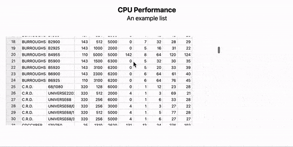

# Large tables of data

One can utilize component [InputTable](../../Reference/Inputs/InputTable.md), that originally stands for editing table, but can be used just to view them as well. The good thing about it that it supports __infinitely large tables__ since the actual content is loaded by parts (and unloads if no longer needed)

*statistics on CPU*
```mathematica
TB = ExampleData[{"Statistics", "CPUPerformance"}] // TableView // CreateFrontEndObject;
```

*slide*
```jsx
.slide

## CPU Performance
An example list

<br/><br/>
<TB/>
```

The expected result

