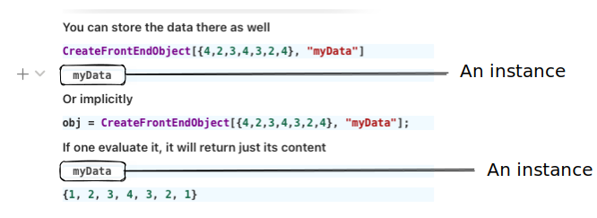

:::caution
This is a hardcore stuff, don't go here with a clear purpose
:::

Let us start from the simplest stuff

## Quick and Dirty
Create a new cell, then, define a function inside `core` [context](architecture.md)

```js
.js
core.MyFunction = async (args, env) => {
	const data = await interpretate(args[0], env);
	alert(data);
}
```

then, to call it directly use

```mathematica
MyFunction["Hello World!"] // FrontSubmit;
```

or in the cell's output

```mathematica
CreateFrontEndObject[MyFunction["Hello World!"]]
```

it should produce a pop-up message with a given text.

## Deeper look
Firstly one need to understand the way how it was called. There are a few different ways

- direct calls as it is
- indirect using containers (see [executables](executables.md))

The first one is rather straighforward, where basically most UI functions and core built-in functions are written.

### Simple direct call
As simple as that


A called function has no persistent memory (call and forget) except from the `env` variable, which can share the data with other functions from the subthree - see more in [architecture](architecture.md) (Meta Data). 

__Any defined functions must return javascript object or nothing__
While in the arguments `args` it is always Wolfram Expression, therefore use `interpretate` on them to convert anything into javascript data type.

For example, `env` comes very handy working with graphics

```js
core.RGBColor = async (args, env) => {
	const r = await interpretate(args[0], env);
	const g = await interpretate(args[1], env);
	const b = await interpretate(args[2], env);
	env.color = new whatever.Color(r, g, b);
};
```

where `core.RGBColor` can be called somewhere in the list

```mathematica
{Blue[], {Red[], Sphere[] (*i am red*)}, Cuboid[] (*i am blue*)} // Graphics3D
```

Then in the parent function

```js
core.Graphics3D = async (args, env) => {
	...
	var scene = {};
	await interpretate(args[0], {...env, scene});
	//go to subthree
	rendered.add(scene) //all objects are there!
}

core.Sphere = async (args, env) => {
	...
	env.scene.add(new sphere(color: env.color));
}
```

Therefore the desired data will anyway ended up in the scene. This is a power of pointers. 

##### 🎡 Example 1: Game of Life
To get more fun, let us firstly define some supporting structures

Create a new cell with the following code
```js
.js
//create js canvas
const canvas = document.createElement("canvas");
canvas.width = 400;
canvas.height = 400;

let context = canvas.getContext("2d");
context.fillStyle = "lightgray";
context.fillRect(0, 0, 500, 500);

//an array to store the previous state
let old = new Array(40);
for (let i = 0; i < old.length; i++) {
  old[i] = new Array(40).fill(0); 
}

//a function to draw on it
core.MyFunction = async (args, env) => {
  const data = await interpretate(args[0], env);

  //draw our boxes
  for(let i=0; i<40; ++i) {
    for (let j=0; j<40; ++j) {
      //old pixels will leave blue traces
      if (old[i][j] > 0) {
        context.fillStyle = "rgba(0,0,255,0.2)"; 
        context.fillRect(i*10 + 2, j*10 + 2, 6, 6);
      }
      //new pixels
      if (data[i][j] > 0) {
        context.fillStyle = "rgba(255,0,0,0.4)"; 
        context.fillRect(i*10 + 1, j*10 + 1, 8, 8);
      } else {
        context.fillStyle = "rgba(255,255,255,0.4)"; 
        context.fillRect(i*10 + 1, j*10 + 1, 8, 8);
      }
      
      //store the previous frame
      old[i][j] = data[i][j];
    }
  }
}

return canvas
```

This function will draw a 40x40 array of 1 and 0 pixels inside the page. Let ous try to it out on some typical cellular automata like Game of Life

```mathematica
gameOfLife = {224, {2, {{2, 2, 2}, {2, 1, 2}, {2, 2, 2}}}, {1, 1}};
board = RandomInteger[1, {40, 40}];
Do[
	board = CellularAutomaton[gameOfLife, board, {{0, 1}}] // Last;
	MyFunction[board] // FrontSubmit;
	Pause[0.1];
, {i,1,100}]
```

What it does is shown on the gif below, however you can try it by yourself by openning tutorials in the examples folder.

:::note
See more about JS cells in [Cell types](Cell%20types.md)
:::

Of course this is not the best example of making animations, better will be to let js run the animation on its own and wait for a new data or ask for a new data using system of events.

#### A remark about sub symbols | Methods
Sometimes a function or a three of them can be called as a reaction on some event. Then this information is stored in `env.method` - see also [symbols](../../../../interpreter/Advanced/symbols.md)

If there is an update of a data, i.e. `env.method = 'update'`, then interpreter will try to find a sub-symbols or a function (read more about how interpreter handles them [WLJS Interpreter](https://github.com/JerryI/wljs-interpreter)). 


Imagine if any defined function was a class declaration with a constructor (if no `env.method` is specified) and methods (subsymbols). For example

```js
core.MyFunction = (args, env) => {}

core.MyFunction.update = (args, env) => {}
core.MyFunction.destroy = (args, env) => {}
core.MyFunction.whatever = (args, env) => {}
```

Then, can we want to specify it during the evaluation of a symbol

```js
core.OurParentFunction = (args, env) => {
	const data = interpetate(args[0], {...env, method:'update');
	...
}
```

It is extremely useful, when it comes to the dynamic updates of some graph, plot. There is no need to replot everyhting, but figure out in a clear way how to update the data

```js
core.ListLinePlotly = (args, env) => {
	//create element...draw axes and etc...slow
	Plotly.newPlot(...);
}
core.ListLinePlotly.update = (args, env) => {
	//quickly redraw
	Plotly.restyle(...)
}
```

#### Contexes
To prevent the mess of duplicated function names and etc, you can specify the context or let's say library of symbols using

```js
var library = {};
library.name = "It is important to write a name"
interpretate.extendContext(library);

library.Symbol = (args, env) => {/*...*/}
```

The interpreter will check all available contextes and find the first match. However, you ==can prioritize the context== providing the information in `env` object

```js
core.GrantSymbol = (args, env) => {
	const data = interpretate(args, {...env, context: library});
	//...
}
```

 
### Executing inside a container | Frontend Object
This is a bit more advanced, since it stores the data inside the notebook and provides local memory for user - you can think about [FrontEndExecutable](../../Reference/Dynamics/Internals/FrontEndExecutable.md)  *as a sort of container or sandbox, where the code can be executed*


The expression inside the container is stored in JSON format in the notebook and is accessible on demand to a browser. Containerized execution provides much more flixibillity since each call creates a separate instance with its local memory.

For the convenience all extra features are provided in `env` variable. Let's have a look at it

```js
core.MyFunction = (args, env) => {
	env.local  = {} //pointer to the local memory of the instance
	env.global = {} //pointer to the global memory of the three
	env //sharable memory
}
```

Global memory is created at each widget creating in the editor (see [Decorations](../../Development/Decorations.md)) or on each WebSocket call, i.e. [FrontSubmit](../../Reference/Dynamics/FrontSubmit.md). 

Depending, where it is supposed to be executed, one can have an access to various page elements. For instance, if it is called from the editor it provides `env.element` - an access to DOM placeholder in the editor.

__Let's make an example that can demonstrate local memory usage__
##### 🎡 Example 2: Clocks

```js
.js
core.PlaceholderClock = async (args, env) => {
	//store the handler object in the local memory
	env.local.start = new Date();
	env.local.clock = setInterval(()=>{
		const d = (new Date() - env.local.start);
		env.element.innerHTML = d;
	}, 10);
}
//when our instance is about to be destoryed - clear timer
core.PlaceholderClock.destroy = async (args, env) => {
	window.clearInterval(env.local.clock);
	const passed = (new Date() - env.local.start);
	alert(passed+' passed');
}
```

Then we can execute in inside the container like any piece of data (see [Frontend objects](Frontend%20objects.md))

```mathematica
CreateFrontEndObject[PlaceholderClock[]]
```

Try to copy and paste them into the same or different cells (from the output cell)


This examples intersects with the section [Default methods](#Default%20methods), since it involves `destroy` subsymbol, which is fired when one deletes a widget from the editor.

It comes very handy, when, for example we are working with `Graphics3D`, where every 1/60 of a second a rendering function is called. Imagine, it would be a disaster if one deleted a widget, but the rendering function would still continue to work. Therefore `env.local` helps a lot

```js
core.Graphics3D.destroy = (args, env) => {
	cancelAnimationFrame(env.local.aid);
	//to cancel the animation
}
```

To know how to register your custom objects in the system, so you won't need to use `CreateFrontEndObject` and JS cells, please see plugins API guide [Basics](../../Development/Plugins/Basics.md)

#### Storage
The number of `FrontEndExcecutable` containers can be arbitrary large and execute the same wolfram language expression. Then their `uid`, i.e. that one, which `FrontEndExecutable["uid"]` is assigned to the storage object, is not unique anymore

Every time you to do something like creating a container or updating (see [FrontEndExecutable](../../Reference/Dynamics/Internals/FrontEndExecutable.md)) - you operate with the storage in the first place, but not executable instance.

The data obtained from the server will be stored in cache.

##### Garbage collector
The actual location is your notebook file in the section `Notebook[uid]["objects"]`, where the date of the latest access is stored as well. Then it can figure out, when the page was being loaded, which objects were not requested (in some timeout) and purge them from the notebook.

Each time you call in the cell, for example `Plot[x,{x,0,1}]` , this __automatically allocates a new object in the storage__, unless you specify an id.

#### Data binding | Nesting
The ideas for WLJS Frontend were inspired by an amazing project [Observable](https://observablehq.com/@jerryi) - JS notebook interface working in the browser, where the dynamics was polished perfectly.

:::tip
If you came here for `Dynamics` stuff, please consider [Offload](../../Reference/Dynamics/Offload.md) and see [Dynamics](../../Tutorial/Dynamics.md) sections. 
:::

Therefore, all frontend objects aka [FrontEndExecutable](../../Reference/Dynamics/Internals/FrontEndExecutable.md) are dynamic by the default. The change in one will cause the updates to ones, which depends on it. 


This behavior is achieved by storing the information about parent `FrontEndExecutable` instance and a child as well as all references from the instances to the storage. I.e. if there is a change of the data in the storage it will update all associated instances.

In general there are two main types of events that can happen and fire the evaluation using specific methods (see [Default methods](#Default%20methods) and [Interpreter](../../../../interpreter/intro.md))

- Editor's widget held Frontend object was destroyed (see [Decorations](../../Development/Decorations.md))
> fires the evaluation  of the whole three **from top to the bottom** using `destroy` method

- The data in storage was updated
> bubbles up from the corresponding frontend object to the nearest parent and fires the evaluation using `update` method from the given point to the bottom

:::info
This also counts for the [Virtual containers](#Virtual%20containers) as well
:::

__Example__
Let us define an object
```mathematica
CreateFrontEndObject[
	Table[i^2, {i,1,10}],
	"uid_2"
]
```

```mathematica
ListLinePlotly@FrontEndRef[FrontEndExecutable["uid_2"]]
```

to update - use

```mathematica
FrontEndExecutable["uid_2"] = RandomReal[{0,100}, 10];
```

:::note
[ListLinePlotly](../../Reference/Plotting/ListLinePlotly.md) is a registered function, on output the expression [CreateFrontEndObject](../../Reference/Dynamics/CreateFrontEndObject.md) is applied automatically.
:::

:::warning
This can be considered as a very low-level and deprecated method for making dynamics - please consider [Offload](../../Reference/Dynamics/Offload.md) instead
:::
##### Perfomance remark
However, one should take into account the performance issues. Since our `FrontEndExecutable["uid_2"]` will be replaced in the editor by the instance of this object, therefore it will also be updated (i.e. reevaluated) even if there is no parent of this node. 



It looks nice and clear to use this approach, since you can actually look at your object and it displays an `uid` of it. 

The fastest method will be

```mathematica
FrontEndRef["uid_2"] = RandomReal[{0,100}, 10];
```
where our editor will not create a widget with an instance inside (see more [Decorations](../../Development/Decorations.md)).

Or if you are nerd like me (maintainer @JerryI) and want full control, one can do it explicitly

```mathematica
SetFrontEndObject["uid_2", RandomReal[{0,100}, 10]] // FrontSubmit;
```

#### Default methods
In principle user can define its own methods (or subsymbols) and provide them in `env.method` as a string. The general infromation was already mentioned before in [A remark about sub symbols Methods](#A%20remark%20about%20sub%20symbols%20Methods).

For the containers *you should define two most important methods* for you functions
- `.destory` - when a widget was destoryed. It acts from top to bottom
- `.update` - when the data was changed. It bubbles up and goes from the nearest parent to bottom of the call-three

Otherwise if you even delete your widget from the editor (or just remove the cell) it wil cause an error. If you do not to mess with this, keep them empty

```js
core.MyFunction.update = async (args, env) => {}
core.MyFunction.destroy = async (args, env) => {}
```

#### Async
Since our containers are located in the storage, which might not be on the frontend (if one reloads a page), if you are working with a nested frontend objects, you should make your function to be async. [intro](../../../../interpreter/intro.md) might return a promise object instead of an actual data

```js
core.MyFunction = async (args, env) => {
	const data = await interpretate(args[0], env);
	...
}
```

Then whatever happens (the object you required is absent) it will wait until the frontend fetch the data and continue the execution of the function.

One should note that `async` gives a significant load to the JS runtime, when it is called frequently (in some reports of recursive benchmarks they claim ~30-70% perfomance drop).

#### 🚧 Persistent memory or shared memory

:::caution
*This feature is still in development* (a proposal)
:::

It might be useful if any instance of the same frontend object could have a permanent memory shared between all instances, since local memory `env.local` exists only for the individual instance, and global `env.global` only for individual call (see [Executing inside a container Frontend Object](#Executing%20inside%20a%20container%20Frontend%20Object)). Therefore there should be

```js
env.persistent = {}
//or
env.shared = {}
```

that belongs to the storage object and lies there forever.

Let's have a look at the example, where we can improove [Example 1: Game of Life](#Example%201:%20Game%20of%20Life) and make use of widgets and containers.

##### 🎡 Example 3: Game of Life (improvements)
Let us define our constructor 
```js
.js
//constructor
core.MyFunction = async (args, env) => {
  //just to make second object to be aware of the previous one
  const data = await interpretate(args[0], env);
  //create js canvas
  const canvas = document.createElement("canvas");
  canvas.width = 400;
  canvas.height = 400;

  let context = canvas.getContext("2d");
  context.fillStyle = "lightgray";
  context.fillRect(0, 0, 500, 500);

  //an array to store the previous state
  let old = new Array(40);
  for (let i = 0; i < old.length; i++) {
    old[i] = new Array(40).fill(0); 
  }

  env.element.appendChild(canvas);
  env.local.old = old;
  env.local.ctx = context;
}
```

here this line
```js
const data = await interpretate(args[0], env);
```
is very important, even if we wont use `data` variable, to make the call-three aware of the presence of our instance we need to call at least `await interpretate(args[0], env)`.

Now we can store all data in `env.local`, that belongs to our instance.

The next thing - a method, that allows us to update the canvas

```js
.js
core.MyFunction.update = async (args, env) => {
  //get a new data
  const data = await interpretate(args[0], env);
  //get the canvas from the local memeory
  const context = env.local.ctx;
  //draw our boxes
  for(let i=0; i<40; ++i) {
    for (let j=0; j<40; ++j) {
      //old pixels will leave blue traces
      if (env.local.old[i][j] > 0) {
        context.fillStyle = "rgba(0,0,255,0.2)"; 
        context.fillRect(i*10 + 2, j*10 + 2, 6, 6);
      }
      //new pixels
      if (data[i][j] > 0) {
        context.fillStyle = "rgba(255,0,0,0.4)"; 
        context.fillRect(i*10 + 1, j*10 + 1, 8, 8);
      } else {
        context.fillStyle = "rgba(255,255,255,0.4)"; 
        context.fillRect(i*10 + 1, j*10 + 1, 8, 8);
      }
    }
  }
  //store the previous frame
  env.local.old = data;
}
```

and the destructor

```js
.js
core.MyFunction.destroy = (args, env) => {}
```

Then we can use our function if it was `Graphics` or other object normally in the pure Wolfram Language cell. Since it is still unknown to the system, we need to create it explicitly

```mathematica
gameOfLife = {224, {2, {{2, 2, 2}, {2, 1, 2}, {2, 2, 2}}}, {1, 1}};
board = RandomInteger[1, {40, 40}];
(* create board : no output *)
CreateFrontEndObject[board, "board"];
(* create container for MyFunction *)
CreateFrontEndObject[MyFunction[FrontEndRef["board"]]]
```

```mathematica
> FrontEndExecutable["a very long random uid"]
```

The output will look like this


Now this is separate object, you can copy and paste it as a symbol! Try to integrate it (joke, but WL will allow you to do so) or put under the squre root.

As it was shown above as an argument we passed a second wll defined object `board` - which is a storage for our board, that we can update independently

```mathematica
Do[
  board = CellularAutomaton[gameOfLife, board, {{0, 1}}] // Last;
  FrontEndRef["board"] = board;
  Pause[0.1];
, {i,1,100}]
```

Then you will see a nice animation and each instance you copied will be updated as well

:::tip
One can do it a much easier way considering [Virtual containers](#Virtual%20containers) and [Offload](../../Reference/Dynamics/Offload.md)
:::

### Virtual containers
This one is even more tricky. However, there is a well-defined user-case for that. 

#### User-case example | The origins of the solution
Imagine our porblem with dynamics, if we need to update something, one need to write a method for the corresponding function

```js
core.ListLinePlotly.update = async (args, env) => {
	const data = await insterpretate(args[0], env) //JO new data!
    ...
}
```

However, what about the case, when everything is nested like 

```mathematica
CreateFrontEndObject[{0,0,0}, "coords"];
Sphere[FrontEndRef["coords"]] // Graphics3D
```

It will succesfully depic an image of a sphere in the center of the scene. But how to handle the change of coordinates of the sphere? Inside `g3d.Sphere` we have

```js
g3d.Sphere = async (args, env) => {
	const origin = await interpretate(args[0], env);
	...
	const geometry = new three.SphereGeometry(1, 20, 20);
	const sphere = new three.Mesh(geometry, material);
	sphere.position.set(...origin);
	env.mesh.add(sphere);
};
```

The only thing we need to do to update the position of the sphere in real time is

```js
sphere.position.set(...neworigin);
```

For that we need to remember a pointer to this object, i.e.

```js
g3d.Sphere = async (args, env) => {
	...
	env.local.sphere = sphere
};

g3d.Sphere.update = async (args, env) => {
	const neworigin = await interpretate(args[0], env);
	env.local.sphere.position.set(...neworigin);
};
```

Right? Well yes, but with one exception (__it looks ugly__)

```mathematica
CreateFrontEndObject[{0,0,0}, "coords"];
CreateFrontEndObject[Sphere[FrontEndRef["coords"]]] // FrontEndRef // Graphics3D
```

__To use local memory we need a container!__ Other wise the function has no idea about its previous state despite the fact that is was called using `update` method. 

#### User-case example | Simplification of dynamics
Using [CreateFrontEndObject](../../Reference/Dynamics/CreateFrontEndObject.md) all the time looks too complicated! Why not something like this?

```mathematica
ListLinePlotly[data // Offload]
```

```mathematica
data = RandomReal[{-1,1}, 10];
```

It is possible if we threat `data` on [WLJS Interpreter](../../../../interpreter/intro.md) as a container. Therefore it binds automatically to its parent and can poke it once an update event arrived.

:::info
See more about this [Dynamics](../../Tutorial/Dynamics.md) and [Offload](../../Reference/Dynamics/Offload.md)
:::

#### Virtual frontend objects | Virtual containers | Virtual functions
The idea is simple - make an additional attribute to the frontend function, that tells to the interpreter to create a __sort of instance__ for the function before evaluating it

```js
core.MyFunction.virtual = true
```

Then it mimics the behavior of [Executing inside a container Frontend Object](#Executing%20inside%20a%20container%20Frontend%20Object), but without creating a storage object and changind the call three


Interpreter changes the order of execution, when it find a virtual function
- creates an instance with local memory and a random `virtual-uid`
- executes a function inside it normally

Therefore __it is enough for the child frontend objects to catch `virtual_uid` and assign themself to it for updates and etc__.

However it solves our problem with `Graphics3D` dynamics flawlessly


:::note
As you can see, there is no explicitly mentioned `CreateFrontEnObject` for `Sphere`, but its JS representation has `.virtual = true` attribute.
:::

##### 🎡 Example 4: Game of Life (improvements 2)
Now using virtual containers one can do all stuff in a much easier way

```mathematica
gameOfLife = {224, {2, {{2, 2, 2}, {2, 1, 2}, {2, 2, 2}}}, {1, 1}};
board = RandomInteger[1, {40, 40}];
(* create container for MyFunction *)
CreateFrontEndObject[MyFunction[board // Offload]]
```

and to update

```mathematica
Do[
  board = CellularAutomaton[gameOfLife, board, {{0, 1}}] // Last;
  Pause[0.1];
, {i,1,100}]
```

Wolfram Kernel __tracks any changes of a symbol put inside `Offload` wrapper automatically__.

### Injection into the container's instance/env
Can be very handy if one want to modify 2D 3D scene without reevaluating anything. This is anyway a `env.scene` object, that it principle can be populated with new graphics in realtime. For that one need to attach to some particular instance of Frontend Object and evaluate inside it the desired expression with spheres and etc.

#### 🎡 Example with lines
Let us define some typical plot and apply a __meta-marker__ (see more [MetaMarker](../../Reference/Dynamics/MetaMarker.md) and [meta-markers](../../../../interpreter/Advanced/meta-markers.md)) on it

```mathematica
Plot[x, {x,0,1}, Epilog->{MetaMarker["label"]}]
```

This will generate `Graphics` object and place an invisible marker on it, which will store the instance `uid` of this frontend object.

Now we can apply a selector query and place a new expression (or lets say - evaluate in-place) inside the given container. For now only we have only frontend's side support

```mathematica
FrontSubmit[Line[{{0.2,0.6},{0.1,0.5}}], MetaMarker["label"]]
```

:::tip
Consider to read [FrontSubmit](../../Reference/Dynamics/FrontSubmit.md), [MetaMarker](../../Reference/Dynamics/MetaMarker.md) as well.
:::

