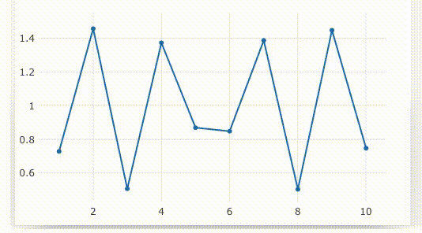
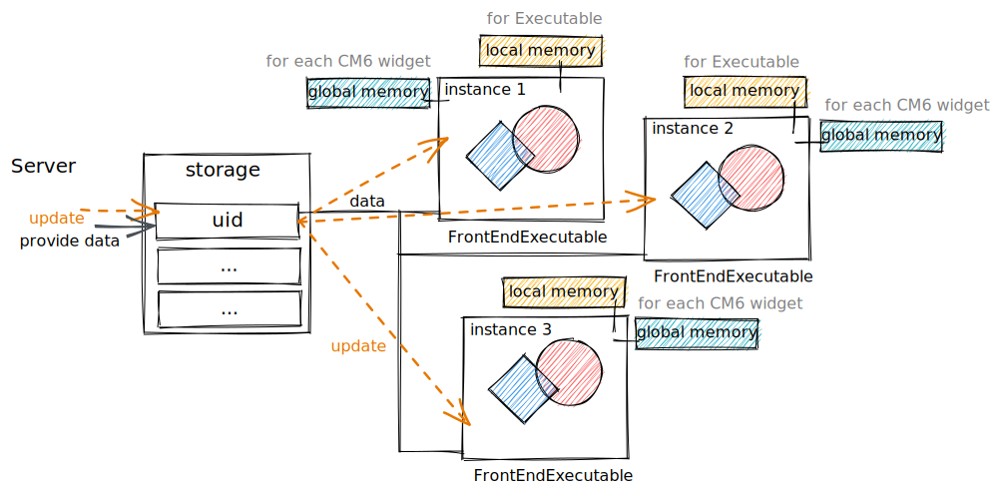

# Working with containers

:::caution
This is a hardcore stuff, don't go here with a clear purpose
:::


This is a native abstraction from WLJS Interpreter implemented to work with changing data more efficiently. It stores states, it does data-binding and many more...

:::info
Please see an explanation there [WLJS Containers](../../../../interpreter/Advanced/containers.md). That page is more focused on using WLJS as a standalone app running in a browser, however, here we are going to use it together with Wolfram Kernel and a frontend. 
:::

:::tip
The general rule is that all graphics and interactive objects __has to be executed inside a container__. Since it provides an identifier, local memory, stack trace to the expression, that was called and dedicated DOM element (not applicable for virtual types!!!)
:::

If we plot a graph using the data that changes with the time, it order to update the graph __without reevaluation__ one can find an instance of this executed plotting function and provide a new data to it.

## As a decoration
The direct representation of it is

```mathematica
FrontEndExecutable["uid"]
```

which is basically is an __uneditable decoration__ (see [Decorations](../../Development/Decorations.md))

See in action


CodeMirror 6 (the core of the cell's editor) finds this pattern and replace it with a corresponding frontend object as a [Decorations](../../Development/Decorations.md) and executes it immediately using [WLJS Interpreter](../../../../interpreter/intro.md). 

:::info
__Frontend object__ aka [FrontEndExecutable](../../Reference/Dynamics/Internals/FrontEndExecutable.md) is a normal [container](../../../../interpreter/Advanced/containers.md) with a storage ([ObjectHashMap](../../Reference/Javascript%20API/ObjectHashMap.md))
:::

For example, when you use `Graphics`, on output an expression will be converted to `Boxes` using [MakeBoxes](../../Reference/Decorations/MakeBoxes.md) procedure like that 

```mathematica
Graphics /: MakeBoxes[Graphics[args__], StandardForm] := With[{o = CreateFrontEndObject[Graphics[args]]},
	MakeBoxes[o, StandardForm]
]
```

that returns 

```mathematica
FrontEndExecutable["uid"]
```

where, `"uid"` is a pointer to the storage, with the corresponding WL expression stored inside notebook and accessible from the browser (client app).

 `EventObject` also uses quite similar approach see [EventObject](../../Reference/Events/EventObject.md) with [MakeBoxes](../../Reference/Decorations/MakeBoxes.md).

The stored expression has form of `ExpressionJSON` format, that can be executed by [WLJS Interpreter](../../../../interpreter/intro.md) running in the browser.

:::warning
In general, one has to write a Javascript representation of any expression, which appears inside the `FrontEndExecutable["uid"]`, otherwise frontend causes an exception. 

For the most cases [interpreter](../../../../interpreter/intro.md) has all `Plus`, `List`, `Tuples`, etc most used symbols implemented. If there is no such symbol it will import it from Wolfram Kernel as a dynamic variable (what [Offload](../../Reference/Dynamics/Offload.md) basically does). However, __it does work only for `OwnValues`!__
:::

## As a way to execute expressions on frontend
Using it together with `Offload`  forces Wolfram Kernel to send the expression as it is to the frontend (browser), where it will be executed entirely by WLJS [Interpreter](../../../../interpreter/intro.md).

Some of the expressions are meant to be executed on the frontend's side and does not have special `MakeBoxes` `UpValues` (as mentioned in [As a decoration](#As%20a%20decoration)). For example if you need to make a text-label, that changes depends on data

```mathematica
label = "";
TextView[label // Offload] // CreateFrontEndObject
```

and try to

```mathematica
label = RandomWord[];
```

One can push it very far. For example, this entire animation is created in this manner and no communication with Wolfram Kernel happens


:::caution
Please, do not use infinite `While` loops inside frontend expressions. There is no way, how it can be interrupted (apart from reloading a page). Even if you destroy a cell, it will continue to work in a background.
:::

The difference between `FrontSubmit` and `CreateFrontEndObject` is that the last __one provides a dedicated DOM element to draw (memory, identity and etc) and stores the data in a storage__, i.e. normal [container](../../../../interpreter/Advanced/containers.md). However, one can do it manually, see how - [wljs graphics](../../../../interpreter/Basics/graphics.md).

## As a data pointer
Wolfram JS Frontend mostly utilizes containers to store and execute data like `Graphics`, `List` which is bounded to the data on the server (Wolfram Kernel) in the first place. But nothing can limit us from using for more general cases. 

Each executable has its own unique identifier and can act as a reference

```mathematica
FrontEndExecutable["uid"]
```

In the code editor of Wolfram JS Frontend it will immediately cause an execution, when this symbol appears as a line of code. If you want to use them inside other expression, consider [FrontEndRef](../../Reference/Dynamics/Internals/FrontEndRef.md) instead

```mathematica
FrontEndRef["uid"]
```

that will block an editor from executing it in-place.

You can create them from Wolfram Kernel __as well as directly from the WLJS interpreter__ using following expression [CreateFrontEndObject](../../Reference/Dynamics/CreateFrontEndObject.md)

```mathematica
CreateFrontEndObject[
	Table[i^2, {i,1,10}],
	"uid"
];
```

You can check the data inside by just calling 

```mathematica
> FrontEndExecutable["uid"]
> {1,4,9,...}
```

:::info
In reality you will not `FrontEndExecutable` keyword in a cell, since an editor renders it automatically (see [Decorations](../../Development/Decorations.md))


To prevent rendering use `FrontEndRef["uid"]`
:::

Then, you can use it as a reference in some other executable object like

```mathematica
CreateFrontEndObject[FrontEndOnly[
	ListLinePlotly@FrontEndExecutable["uid"]
]]
```


:::tip
Use  `Offload` expression inside a frontend object to force Wolfram Kernel evaluation in the browser, i.e. in WLJS Interpreter. This is a modern way of doing that.
:::

or

```mathematica
CreateFrontEndObject[
	ListLinePlotly@FrontEndRef["uid"]
]
```

or even like this

```mathematica
CreateFrontEndObject[
	ListLinePlotly@FrontEndRef[FrontEndExecutable["uid"]]
]
```

and since `ListLinePlotly` has special `MakeBoxes` UpValues, so you can lift `CreateFrontEndObject` from it, Wolfram Kernel will apply it automatically.


:::info
All input UI elements like __sliders__, __buttons__ are [event-generators](../Events%20system/event-generators.md), that has a field `view`, on which `CreateFrontEndObject` is also applied automatically
:::

```mathematica
ListLinePlotly@FrontEndRef[FrontEndExecutable["uid"]]
```

See in action


Here we wrapped the given data into `FrontEndOnly`, that holds the expressions for WL and prevents evaluation on the server, leaving the code to be executed on the frontend. In the the latest example instead of `FrontEndOnly` we used `FrontEndRef`, that basically holds `FrontEndExecutable` and prevents it from the evaluation.

### Dynamic binding
:::tip
If you are looking for __just dynamic binding between variables and plotting functions, do not use `CreateFrontEndObject`__, __use simple dynamic variables__ wrapped in [Offload](../../Reference/Dynamics/Offload.md) - see tutorial [Dynamics](../../Tutorial/Dynamics.md)
:::

Let us have a look at two identical examples

##### Easy way
*first cell*
```mathematica
a = Table[i^2, {i, 1, 10}];
ListLinePlotly[Offload[a]]
```

*second cell*
```mathematica
a = Table[i, {i, 1, 10}];
```

After the evaluation you will see a transition of the same output of the first cell. I.e. the __symbols `a` and `ListLinePlotly` are bounded__.

:::info
A virtual container with `a` inside is bounded to the normal container, where `ListLinePlotly` is executed
:::

##### Hard way
*first cell*
```mathematica
CreateFrontEndObject[Table[i^2, {i, 1, 10}], "a"];
ListLinePlotly[FrontEndRef["a"]]
```

*second cell*
```mathematica
FrontEndRef["a"] = Table[i, {i, 1, 10}];
```

:::info
A normal container with `a` inside is bounded to the normal container, where `ListLinePlotly` is executed
:::

:::info
The information about `a` object is stored to the notebook. It is safe to export
:::

Therefore, all frontend objects aka `FrontEndExecutable` are dynamic by the default. The change in one will cause the updates to ones, which depends on it. This behaviuor is archived by collecting all calls of frontend functions and storing them to special handlers assigned to each frontend object. In principle we do not even need WL Kernel to update the content.

Now we can look deeper on how to mutate them

#### Direct update (the fastest)
Sends the data directly to the frontend leaving out the master kernel (see [[Evaluation]])

```mathematica
SetFrontEndObject["a",
	Table[i^3, {i,1,10}]
] // FrontSubmit;
```

or in the same fashion, but prettier 

```mathematica
SetFrontEndObject[FrontEndExecutable["a"],
	Table[i^3, {i,1,10}]
] // FrontSubmit;
```

or even better (WOW)

```mathematica
FrontEndExecutable["a"] = Table[i^3, {i,1,10}]
```

or if you do not want the editor to draw it

```mathematica
FrontEndRef["a"] = Table[i^3, {i,1,10}]
```



In principle one can send any command to be executed on the frontend using [FrontSubmit](../../Reference/Dynamics/FrontSubmit.md).

Let us have a look on another example below

*create data object*
```mathematica
CreateFrontEndObject[ Table[Sin[i]//N, {i,0,2Pi,0.1}] , "myObject"]
```

*create a visualizer for it*
```mathematica
CreateFrontEndObject[FrontEndOnly[
  ListLinePlotly[FrontEndExecutable["myObject"]]
], "visualiser"]
```

The last cell creates another frontend object `"visualiser"`, which depends on the `"myObject"`. [WLJS Interpreter](../../../../interpreter/intro.md) creates a straightforward "link" between them
$$myObject \rightarrow visualiser$$
where any changes to `"myObject"` will lead to internal reevaluation (on frontend's side!) of `FrontEndOnly` function and its content, i.e. call somewhere the following

*make changes directly*
```mathematica
Do[SetFrontEndObject[FrontEndExecutable["myObject"],

  Table[Sin[i*j]//N, {i,0, 2Pi, 0.1}]
  
] // FrontSubmit; Pause[0.3];, {j, 1,10}];
```

or with a bit of a syntax sugar available

```mathematica
Do[
	FrontEndExecutable["myObject"] = Table[Sin[i*j]//N, {i,0, 2Pi, 0.1}];
	Pause[0.3];
, {j, 10}];
```

After than you will see a nice animation of the output of second cell without actual reevaluation


One could argue that this is an actual reevaluation, which might be quite slow. However, during this process __an additional information to the whole stack of called functions is provided regarding a type of an update, i.e. restyling, data update, data append and etc__. Therefore, each WLJS function can optimize its behavior to gain performance - see section `Methods` in [WLJS Architecture](../../../../interpreter/Advanced/architecture.md)

We scratched only a top of the surface, the things you can do with it are quite bigger.

### Instancing
Each call of `FrontEndExecutable["uid"]` creates an instance of the corresponding object with its local memory (see more [Frontend functions](Frontend%20functions.md)). So by copying and pasting

```mathematica
FrontEndExecutable["myId"] FrontEndExecutable["myId"] FrontEndExecutable["myId"]
```

you will create separate objects connected to the same storage item with `uid` as an identifier.



Moreover

:::tip
You can have an access to those instances anytime using [MetaMarker](../../Reference/Dynamics/MetaMarker.md)
:::