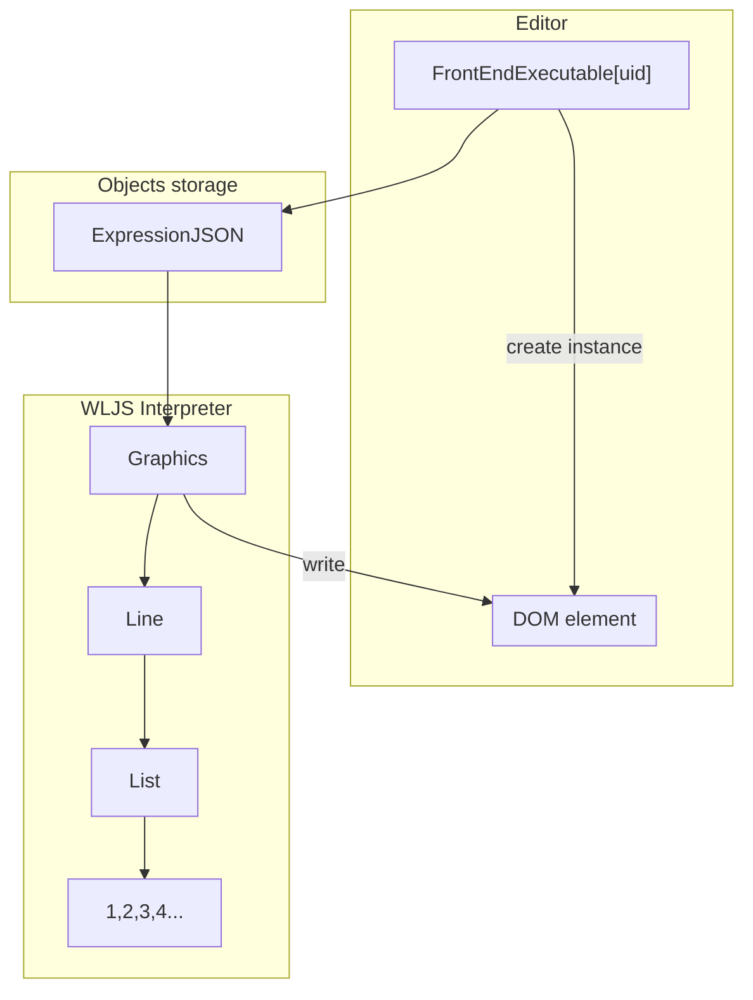
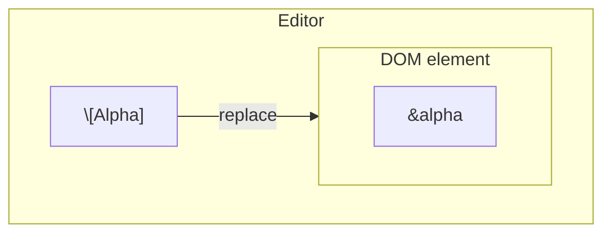
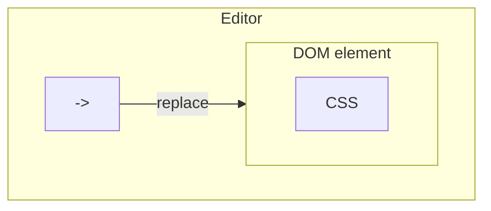
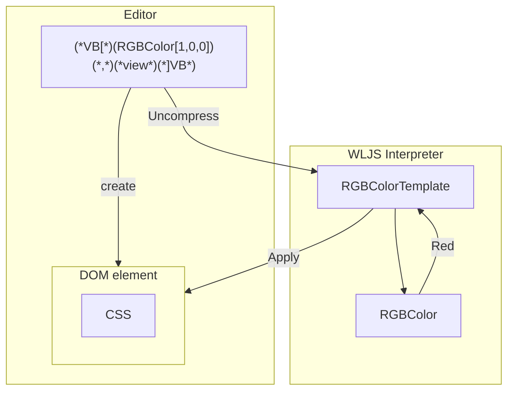
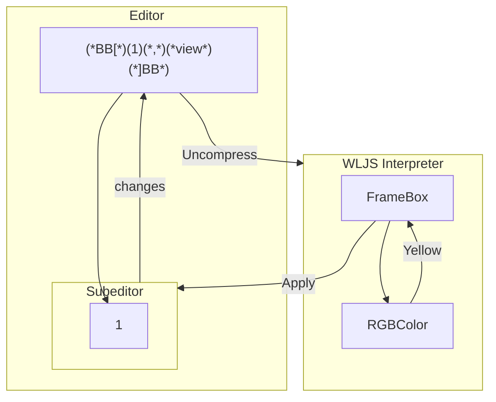

You can think about it as a visual syntax sugar, which is similar to what one can see in VSCode, when one edits a CSS colors, the corresponding color picker popups allowing user to deal with color wheel instead of HEX color code.

Frontend editor uses CodeMirror 6 and extensively utilizes the power of [Decorations](https://codemirror.net/examples/decoration/)

>The DOM structure inside a CodeMirror editor is managed by the editor itself. Inside the `cm-content` element, any attempt to add attributes or change the structure of nodes will usually just lead to the editor immediately resetting the content back to what it used to be.

This is one of the key-features of CM6 editor, allowing us to make a hybrid of _WYSIWYG_ and a plain code editor. Here this feature is used to the limits.

## Uneditable | Replacing decorations
All interactive objects like `Graphics`, `Plotly` are exactly this line of code

```mathematica
FrontEndExecutable["uid"]
```

See in action


An editor looks for this particular combination of characters and replace it (only visually!) with a DOM element, where the content is put. `uid` is a reference to a [[Frontend objects]], that will be loaded to the browser from the frontend and be executed in-place



You __can copy and paste it__, and it will create a separate instance of it.

An editor threats it as if it was a single character

### Greek Symbols
То type it, using ESC button in CodeMirror

```mathematica
ESCa -> \[Alpha]
```

Try to copy it and paste to a regular editor


### Arrows
Is automatically replaced by a unicode arrow symbol inside `span` wrapper

```mathematica
->
```



### Custom replacement views (ViewBox)
:::danger
Early stage of development. `RGBColor`, `DateObject` are supported only!
:::

:::note
Also see [ViewBox](../Reference/Decorations/Low%20level/ViewBox.md)
:::

Such decorations as `TemplateBox` are translated into

```mathematica
(*VB[*)(expr)(*,*)(*Compress[view]*)(*]VB*)
```

where `expr` is an original expression in the [InputForm](../Reference/Decorations/InputForm.md), and the second argument contains compressed expression `view`, that tells __what to display instead__ of the `expr` just like [InterpretationBox](../Reference/Decorations/InterpretationBox.md) but acts on a lower level

for example

```mathematica
(*VB[*)(RGBColor[1, 0.5, 0.2])(*,*)(*"1:eJxTTMoPSmNkYGAoZgESHvk5KRCeGJAIcndyzs/JLwouTyxJzghJzS3ISSxJTWMGyXMgyRcxgMEHeyjjgX3RrJkgcNIeAC1MGRs="*)(*]VB*)
```

displays as


An editor just places a `<span></span>` DOM element and gives a reference to a function, which is written inside `view`. The. last one can draw whatever inside this DOM element



Since it is just comments, after the evaluation it turns into the original form of `expr`.

#### The base for [`InterpretationBox`](../Reference/Decorations/InterpretationBox.md)
View boxes construction is a base for interpretation boxes as well. The source code for boxes look like this

```mathematica
InterpretationBox[placeholder_, expr_, opts___] := With[{data = expr, v = EditorView[ToString[placeholder /. {RowBox->RowBoxFlatten}], ReadOnly->True]},
	RowBox[{"(*VB[*)(", ToString[expr, InputForm], ")(*,*)(*", ToString[Compress[Hold[v]], InputForm], "*)(*]VB*)"}]
]
```

The only difference compared to colors and dates syntax sugar is that it places [EditorView](../Reference/Input/EditorView.md) inside

#### Placing custom EditorView inside
:::warning
This is not recommended, since it will place 2 instances of CodeMirror 6 editors, which is a big overhead. 
:::
One can also place a whole editor by placing [EditorView](../Reference/Input/EditorView.md) wrapped into [CreateFrontEndObject](../Reference/Dynamics/CreateFrontEndObject.md) like this

```mathematica
specialSymbol /: MakeBoxes[specialSymbol, StandardForm] := With[{editor = EditorView["EditMe", "Event"->"editing"] // CreateFrontEndObject},
	InterpretationBox[MakeBoxes[editor, StandardForm], specialSymbol]
]
```

and

```mathematica
EventHandler["editing", Print];
specialSymbol
```

You can handle the data using dedicated event handler (see [EventHandler](../Reference/Events/EventHandler.md)), however __the expression inside the main editor will not be changed at all__.


## Editable | Two-ways bounded widgets

This is something much more advanced than [[#Uneditable Replacing decorations]], where you can interact with it and the inner content will immediately be updated.

The typical user-case for this is Mathematica's typesetting for matrixes, fractions, square roots and etc. For example to type fraction, you can select a piece of a code and press `Ctrl+/`

```mathematica
(*FB[*)((1)(*,*)/(*,*)(2))(*]FB*)
```

that looks like a fraction


It works similar to [Custom replacement view (ViewBox)](#Custom%20replacement%20view%20(ViewBox)), but instead of simple DOM element it places a separate CodeMirror editor inside. It means, each of two boxes inside the fraction __has all features of a normal WL editor__!

### Wrapper Box view... (BoxBox?)

:::note
Also see [BoxBox](../Reference/Decorations/Low%20level/BoxBox.md)
:::

If one needs something more flexible and complex, than just mathematical typesetting, an attempt to bring to live to `StyleBox`, `FrameBox` and etc was made. In principle it can all be just [[Frontend Object]] aka [[#Uneditable Replacing decorations]] with an editor inside (see [EditorView](../Reference/Input/EditorView.md)), however image the following case


that highlights numbers, which are prime. Each call would cause a frontend object (see [CreateFrontEndObject](../Reference/Dynamics/CreateFrontEndObject.md) and [Uneditable Replacing decorations](#Uneditable%20Replacing%20decorations)) to be created and each time is is going to be unique. To release this overhead from the frontend a new object `BoxBox` was introduced

```mathematica
(*BB[*)(expr)(*,*)(*Compress[view]*)(*]BB*)
```

which is successor of [Custom replacement view (ViewBox)](#Custom%20replacement%20view%20(ViewBox)), where `expr` is placed into a editor ([EditorView](../Reference/Input/EditorView.md)), which is decorated by `view` expression (frame, background and etc).

The good example of applications are [Style](../Reference/Decorations/Style.md), [Framed](../Reference/Decorations/Framed.md). `view` is directly interpreted (see how - [WLJS Interpreter](../../../interpreter/intro.md)) applied to a DOM element of an editor.



In principle that's how any styling can be done. __The inner Subeditor allows to update the content underneath as well__. 