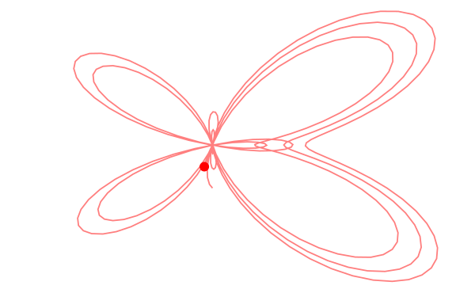

---
env:
  - Wolfram Kernel
source: https://github.com/JerryI/wl-misc/
update:
---
`Module` that always leaks memory on-purpose
```mathematica
LeakyModule[variables_List, expr_, opts__]
```

It might sound controversial, but it comes very useful to be used for dynamics with components approach.

## Example
If you need a module, that animates something

```mathematica
ParametricAnimator[equation_, variable_:t, range_:{0, Infinity, 0.1}] := LeakyModule[{time = range[[1]], task, scale = 1, array = {}, scaledArray={}},

    (* sample the equation each frame and rescale if needed *)
	animate := Block[{variable = time},
        With[{e = {Sin[t], Cos[t]} equation},
    		scale = If[Norm[e scale] > 1.4, scale 0.95, scale 1];
            array = Append[array, e];
    		scaledArray = scale array; 
            pointer = e scale;
        ];

		time += range[[3]];
		If[time >= range[[2]], TaskRemove[task]];
	];

    animate;

    (* async task to animate every 30 ms *)
	task = SetInterval[animate, 30];

    (* stop the task if cell was destroyed or reevaluated *)
	EventHandler[EvaluationCell[], {"destroy"->Function[Null, TaskRemove[task]; Print["removed"]]}];

	Graphics[{Red, PointSize[0.05], Point[pointer // Offload],
 Opacity[0.5], Line[scaledArray // Offload]
  }, TransitionDuration->10, TransitionType->"Linear", Controls->True]
]
```

Then, picking some fancy curve
```mathematica
ParametricAnimator[Exp[Sin[t]] - 2 Cos[4t] + Sin[(2t - Pi)/24], t, {0,16, 0.05}]
```

we will see this

### Why and how it works
`Module` provides lexical scoping, i.e. all temporal variables are visible from the global scope, but with modified names like `$332a` instead of `a`.

This is good change to send this variable to frontend wrapped with [`Offload`](../Dynamics/Offload.md), that holds its form. Then frontend seeks for it locally and ask backend to provide the information. Every-time this happens backend start to track the changes of this symbol and shares this information with frontend. This is a core of all dynamics.

Since each time those variables (symbols) are unique, then, they will not mess up with other instances being reevaluated by the user again.

Animation itself happens using asynchronous task spawned by [SetInterval](Timers/SetInterval.md). To prevent uncontrollable tasks running in the background [EventHandler](../Events/EventHandler.md) is used on [EvaluationCell](Notebook/EvaluationCell.md) to detect if this cell was removed or reevaluated, and for such case it will kill the task.

:::info
The major difference between `LeakyModule` and `Module` is that scoped symbols are stored in a dedicated garbage collection, controlled by the user. 
:::

## Options
You can take care about variables by yourself accessing `"Garbage"`  option

```mathematica
storage = {};
LeakyModule[{a,b,c}, a=3, "Garbage":>storage]
```