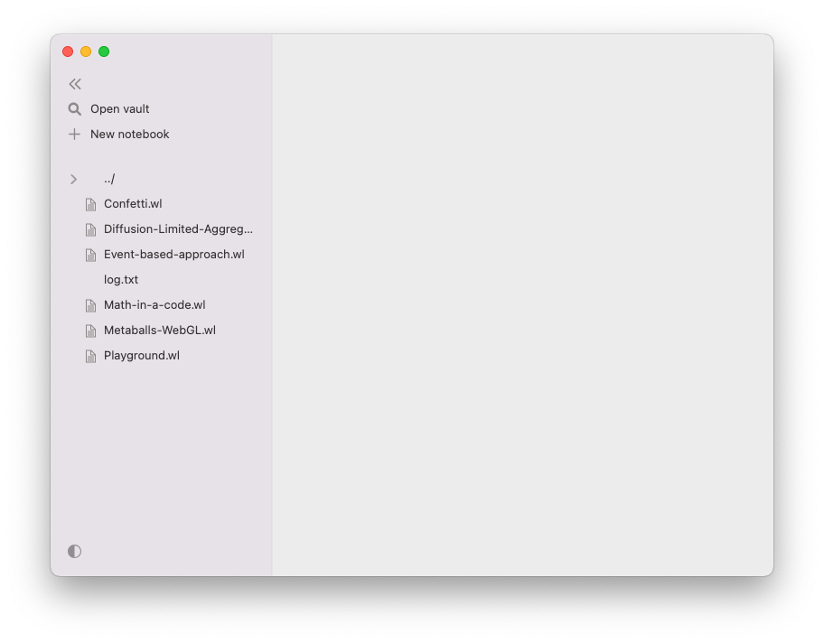
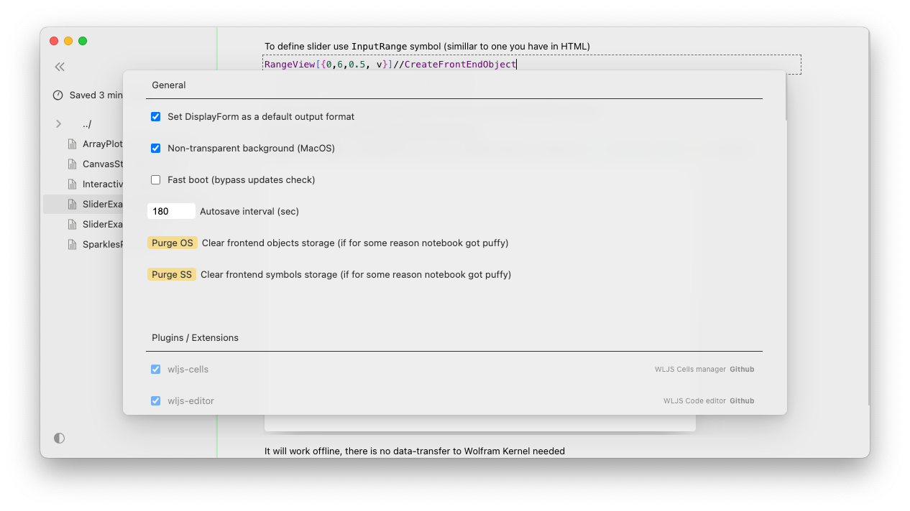

The whole notebook interface is made using plain Javascript, HTML powered by a [Wolfram WebServer](https://github.com/KirillBelovTest/HTTPHandler)  and [template engine](https://github.com/JerryI/wl-wsp) running locally on a Wolfram Kernel. It means you can work remotely by running a server anywhere you want. 

Some calculations are performed partially by your browser, you can have a control over it, [if you want](Dynamics.md) . All UI elements, cells operations are written in Javascript and Wolfram Language and performed by [WLJS Interpreter](../../../interpreter/intro.md). 

:::note
Frontend saves cell's data every-time you type something to RAM. Serializing to the disk is scheduled with a 3 minutes interval.
:::

Moving from the native desktop applications to a web stack has some drawbacks in terms of latency in communication between Wolfram Kernel and a browser, performance, however it shows many useful features, which are not possible in Mathematica. Sharing notebooks as `html` files, embedding them into your blog, customizing visualization of data using moderns and flexible tools like any Javascript framework, plain HTML and CSS together with Wolfram Language.

## File system
This is not cloud-based project, therefore all notebooks are actual files on you drive. 

:::info
Every notebook is stored as human-readable/editable `.wln` file imported by Wolfram Engine. 
:::

Once you open a file it is stored in RAM, even if you close a notebook. Save operations perform serialization and stores the data into a file.

The approach on how to organize your directories was inspired by Obsidian, where your notes are located in so-called *vaults*. Once you open a folder it becomes a vault and Wolfram Kernel __sets the directory to it__. So you can work with files using relative path.

:::note
You can open the same notebook in multiple tabs, but the Kernel's message transport is assigned to only one active tab, but it automatically switches between tabs.
:::

## UI
In general the whole UI is a rip-off from Notion-like web-based editors bringing clarity and minimalistic controls over your document. 

Let's have a look at the basic UI elements
### Working area
This is the first thing you will see

There is file browser tree on the right side, the left side is your working area, which is be populated by the notebook's content when the last one is open.

### Cell control buttons
All cells are grouped by parent input cell, apart from that the structure of the notebook is flat. The controls are applied to the whole group

- add a new cell after
- hide the input cell

- clear the output of the input cell
- mark a cell to be an initializing cell
- evaluate and project the output to a separate window (__experimental__) 
- evaluate the cell (or you can also use `Shift-Enter`)

### Settings
You can locate a cogwheel on the sidebar or (for desktop app) it is located in `Mics` section of your top-bar menu

Here you can manipulate the plugins you have or install a new one by the link to a Github repo - see [Plugins](Plugins.md)

There is a styles customization available as well, that overrides the default theme.
