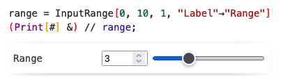
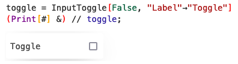
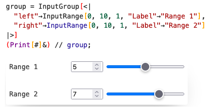

Usually, every UI element in a cell is [Event generator](../Advanced/Events%20system/event-generators.md), i.e. `EventObject[]` with a field `view`, which is shown on output. Unlike Mathematica, WLJS Frontend uses event-based approach, so you have to bind a handler function to each interactive element you used

```mathematica
element = EventObject[<|"id"->..., "view"->...|>];
```

there are a couple of ways

*direct*
```mathematica
EventHandler[element, Print]
```

*lazy shortcut*
```mathematica
Print // element
```

*even lazier (suitable only for assignments)*
```mathematica
element // Assign[x]
```
here is works as an automatic handler function like
```mathematica
EventHandler[element, Function[data, x = data]]
```

Each of those approaches return the original object, therefore you can apply them directly on any event-generator expression.

# WLJS Inputs
Elements are provided by the independent plugin/library [wljs-inputs](https://github.com/JerryI/wljs-inputs/tree/main).
## Features
Each type of an input is shipped with two components
- __event generator__ (like `InputButton`, `InputText`)
- __view__ component (like `ButtonView`, `TextView`), which are executed on the frontend

An __event generator__ is just a wrapper for __view component__, that automatically generates an event object and attaches it to the input view. The reason, why they are still separate thing is that __view component__ can act on both sides as an indicator or a display and as an input device.
## Basic usage | Event-generators
### Range input
A basic combo of a slider and numerical input field

```mathematica
range = InputRange[0, 10, 1, "Label"->"Range"]
(Print[#] &) // range;
```



It sends numerical values to the handler function.

### Text input
Text input, that sends as a string to the kernel

```mathematica
text = InputText["Hi"]
(Print[#] &) // text;
```


### Select
🚧 in dev 

### Wolfram Language Input
Please, use [EditorView](../Reference/Input/EditorView.md)

### Color picker
🚧 in dev
Please, use [Snippets](../Advanced/Snippets/Snippets.md) and type `color pick...`

### Input Matrix
Please, use [Snippets](../Advanced/Snippets/Snippets.md) and type `insert matrix...`

### Radio
🚧 in dev

### Toggle
Acts as a checkbox

```mathematica
toggle = InputToggle[False, "Label"->"Toggle"]
(Print[#] &) // toggle;
```



On switch it sends boolean values to the handler.

### Button

```mathematica
button = InputButton["Click me"]
(Print[#] &) // button;
```


On press it sends `True` to the handler

### File input
Sends any file as a `base64` encoded string via POST method

```mathematica
file = InputFile["Drag and Drop"]
(Print[BaseDecode[#["data"]]//ByteArrayToString] &) // file;
```


Try firstly with some small text files. The structure of the data for each file is following
```mathematica
<|"data"->"base64 encoded byte array", "name"->"filename"|>
```

## View components usage
This is a bit more advanced, since it requires the manual creation of frontend objects.

### TextView
The most practical thing to use it as text display
```mathematica
text = "dude"; 
TextView[text // Offload] // CreateFrontEndObject
```

Since `TextView` is not registered in the system, you need to force Wolfram Kernel execute it on the frontend's side - `CreateFrontEndObject` is used for that purpose.

:::info
`CreateFrontEndObject` forces Wolfram Kernel to pass an expression to be evaluated on the frontend side inside a container.
:::

The [dynamic binding](Dynamics.md) works as usual, if you change the variable `text`, the output will be updated

```mathematica
text = "mood;
```

## Grouping
One can group different inputs into a single event-object, that maintains the original structure

### Associations
```mathematica
group = InputGroup[<|
  "left"->InputRange[0, 10, 1, "Label"->"Range 1"],
  "right"->InputRange[0, 10, 1, "Label"->"Range 2"] 
|>]
(Print[#]&) // group;
```



On each update it generates the data for the handler function in a form

```mathematica
<|"left"->5, "right"->7|>
```

### Arrays
```mathematica
group = InputGroup[{
  InputRange[0, 10, 1, "Label"->"Range 1"],
  InputRange[0, 10, 1, "Label"->"Range 2"],
  InputText["Hi"]
}]
(Print[#]&) // group;
```


On each update it generates the data for the handler function in a form

```mathematica
{5, 7, "Hi"}
```

