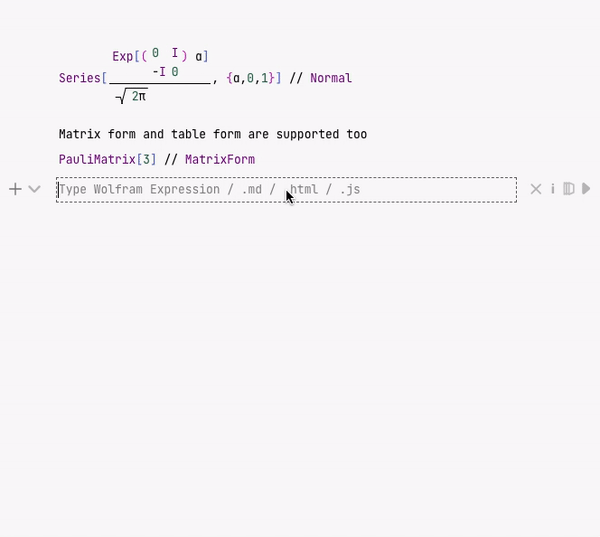

The whole notebook interface is made using plain Javascript, HTML powered by a [Wolfram WebServer](https://github.com/KirillBelovTest/HTTPHandler)  and [template engine](https://github.com/JerryI/wl-wsp) running locally on a Wolfram Kernel. It means you can work remotely by running a server anywhere you want. 

Some calculations are performed partially by your browser, you can have a control over it, [if you want](Dynamics.md) . All UI elements, cells operations are written in Javascript and Wolfram Language and performed by [WLJS Interpreter](../../../interpreter/intro.md). 

:::note
Frontend saves cell's data every-time you type something to RAM. Serializing to the disk is scheduled with a 3 minutes interval.
:::

Once you created a new notebook an empty cell will pop-up at the beginning of you notebook. A line on a side signals the status of a connected Kernel

Once connected you will see a __green light__.

:::info
Compared to Mathematica the cell design has mostly flat structure similar to Jupyter Notebook. Only `input` and `output` cells are joined into groups.
:::

:::info
Output cells are editable
:::

### Cell control buttons
All cells are grouped by parent input cell, apart from that the structure of the notebook is flat. The controls are applied to the whole group

- add a new cell after
- hide the input cell

- clear the output of the input cell
- mark a cell to be an initializing cell
- evaluate and project the output to a separate window (__experimental__) 
- evaluate the cell (or you can also use `Shift-Enter`)

## Wolfram Language
When you start typing the language you are using assumed to be WL. By pressing `Shift-Enter` you can start evaluation

Output cells are joined to the input and the last one can be hidden by clicking on the $\rightarrow$ sign on the left side from the cell.

:::note
Once you change something inside the output cell, it loses its parent and becomes new input cell, like in Mathematica.
:::

Syntax sugar, fractions and other 2D input are supported 

The most useful commands are listed below

- `Ctrl`+`/` fraction
- `Ctrl`+`^` power
- `Ctrl`+`-` subscript
- `Ctrl`+`2` square root

Colors, dates are also decorated

Now let us move to some other gems

## Snippets
To help in writing matrixes, colors, and some other useful stuff are accessible by the shortcut `Super+p`

All snippets are just notebooks in a bit different form including all UI elements.

## Graphics 2D & 3D
Most Mathematica's plotting functions produces lower-level primitives. The major part of them are supported

:::info
Try to drag and pan using your mouse!
:::

:::note
Graphics elements are not exported SVG. All primitives are recreated using d3.js and THREE.js from scratch
:::

## Other languages
Of course the notebook interface is impossible to use without text annotation, here you do not need to switch to a different cell type. To use you favorite (or not) Markdown type in the first line of a cell `.md` and magic happends

By clicking on an arrow on the right, you can hide the source cell and only the output will be displayed. An editor is very flexible you can quite easily add your custom output cell support. In Markdown mode embedded WL expressions are supported as well

For better output styling sometimes is easier to write in HTML language

Or combine WL together with Javascript to visualize your data in incredible way

Try it our by yourself!

__[Notebook](files/SparklesPlot.wln)__

