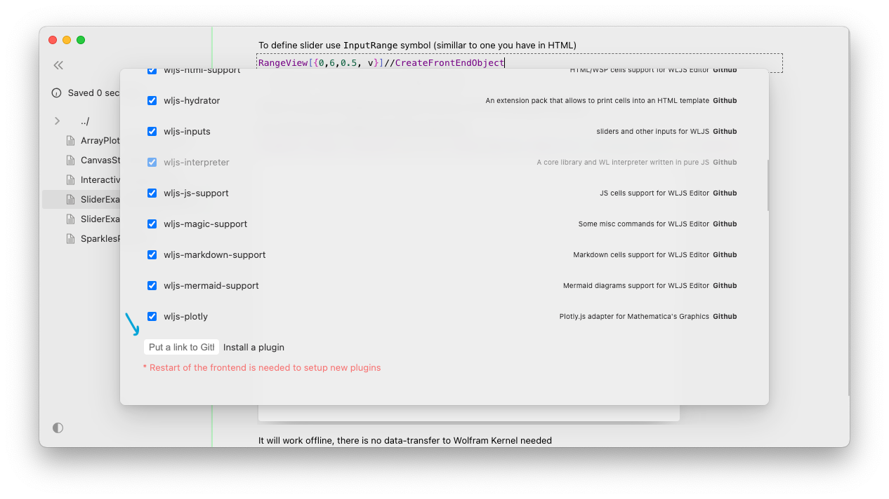

WLJS Frontend uses a custom package manager to download, update and store extensions from any suitable Github repo. At the first startup it extracts them to a local `Packages` folder, where one can freely edit and explore them.

:::tip
Please see [Known packages](../Development/Plugins/Known%20packages.md) page for community plugins
:::

In principle there is no defined limitations in what plugin can do and cannot, it can be
- editor extension (adds a new language support or autocomplete or a new cell type)
- kernel extension (adds new set of functions no matter which language JS or WL)
- frontend extensions (new modal windows, menu items and etc...)
- theme (change the UI look)

## How to install
You need a link to Github repo of the plugin. Then, open `Settings` of the notebook and paste a link into a window

## How to write
Please see a full guide on [Basics](../Development/Plugins/Basics.md)

