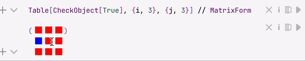

Used __to replace wrapped__ Wolfram Expression with custom HTML elements

```mathematica
(*VB[*)(expr)(*,*)(*view*)(*]VB*)
```

Most decorations generated by `TemplateBox` and etc...

- the expression is __not editable__ and is fully replaced in the editor by the provided view
- the inner `expr` __is revealed__ after first the evaluation 

`RGBColor`, `DateObject` and [InterpretationBox](../InterpretationBox.md) (together with [EditorView](../../Inputs/EditorView.md)) uses this structure to display a human-readable form of the content inside

:::tip
See the full guide on them [Decorations](../../../Development/Decorations.md)
:::

There is a helper function to prevent an editor from rendering, if you want to write using this low-level representation

```mathematica
ViewBox[expr_, displayView_]
```

it will keep `expr` in a code replacing visually by DOM element. The last one will be attached to the expression `displayView` executed after.

## Differed view
Allows to call WL Kernel while constructing the body of a widget
:::caution
This mode is still is development
:::


## Mutability
In general it is possible to update the expression underneath indirectly. For this reason, there are multiple way of accessing this feature

#### From Javascript function
An expression `displayView` is evaluated on [WLJS Interpreter](../../../../../interpreter/intro.md) in the browser with special property provided (see [core](../../Javascript%20API/core.md) and tutorial [Frontend functions](../../../Advanced/Frontend%20interpretation/Frontend%20functions.md))

```js
core.displayView = async (args, env) => {
	env.global.EditorWidget
}
```

this object contains property to update the content

```js
EditorWidget.applyChanges('"new content"')
```

##### Example
Let us create a special object, that will act like a checkbox

```mathematica
CheckObject /: MakeBoxes[CheckObject[state_:(True | False)], StandardForm] := With[{},
  ViewBox[CheckObject[state], CheckBoxDecorator[]]
]
```

now JS part

```js
.js

core.CheckBoxDecorator = async (args, env) => {
  let state = false;

  //check the raw data from the viewbox to determine the state
  if (env.global.EditorWidget.getDoc() == 'CheckObject[True]') state = true;

  //make a rectangle
  env.element.style.width = "1em";
  env.element.style.height = "1em";

  const update = (s) => env.element.style.background = s ? 'red' : 'blue';

  //color it depending on state
  update(state);

  //logic for updates when a user click on it
  env.element.addEventListener("click", () => {
    state = !state;
    update(state);
    
    const stringState = state ? 'True' : 'False';
    env.global.EditorWidget.applyChanges('CheckObject['+stringState+']');
  });
}
```

Let's test it!

```mathematica
CheckObject[True]
```
*then try to click on it, copy and paste it*


whatever you do, it will keep its state synced. No communication with WL Kernel happens, everything is running within the code-editor in the browser.

Or even cooler

```mathematica
Table[CheckObject[True], {i, 3}, {j, 3}] // MatrixForm 
```




#### From Wolfram Kernel #1
:::caution
This mode is still is development
:::

If you do not like to code in Javascript, there is a simpler solution using [Differed view](#Differed%20view) mode

```mathematica
...
```


## Examples

:::tip
This method __is much faster__ than [InterpretationBox](../InterpretationBox.md) or [Interpretation](../Interpretation.md), since it does not spawn [EditorView](../../Inputs/EditorView.md) inside for displaying regular boxes.
:::

### Replacing expression with custom JS
One can define its own style of cells boxes

```js
.js
core.Replacer = async (args, env) => {
  env.element.style.background = "red";
  env.element.style.width = "2em";
  env.element.style.height = "1em";
}
```

```mathematica
wrapper /: MakeBoxes[wrapper[expr_], StandardForm] := ViewBox[wrapper[expr], Replacer]
```

and then try

```mathematica
wrapper[1/2]
```

__Result__


:::note
This is basically how `RGBColor`, `DateObject` are implemented
:::

## Dev notes
Not all required features are implemented. TODO list:
- provide `Head` or `Template` options to specify the position of a head and etc
- [Differed view](#Differed%20view) 
- [From Wolfram Kernel 1](#From%20Wolfram%20Kernel%201) 

:::warning
This is just a concept, not a real code
:::

In principle [Differed view](#Differed%20view) can be implemented using 

```mathematica
CheckObject /: MakeBoxes[CheckObject[state_:(True | False)], StandardForm] := With[{},
  ViewBox[CheckObject[state], AskKernel[getWidgetData[This[]], CheckObject`Create] // Offload]
]

CheckObject`Create[widgetData_String] := Module[{state = If[ToExpression[widgetData], Red, Blue]},
	
	{Graphics[{state // Offload, EventHandler[Disk[], {"click"->Function[Null,
		state = If[state == Red, Blue, Red];
		FrontSubmit[ViewBoxUpdate[ToString[state == Red, InputForm], MetaMarker[uid]];
		
	]}]}], MetaMarker[uid]}
]
```