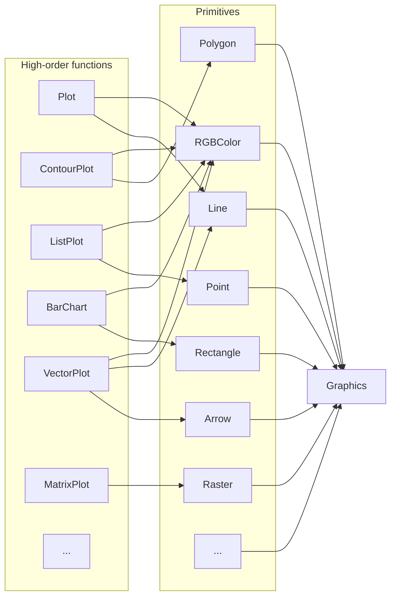

---
env:
  - WLJS
registered: true
needsContainer: true
update: false
draft: false
---
```mathematica
Graphics[objects_, opts___]
```
represents a two-dimensional graphical image. This is a fundamental expression, which is produced by all 2D plotting functions

```mathematica
Graphics[
 Table[{Hue[t/20.0,1., 0.5], Circle[{Cos[2 Pi t/20], Sin[2 Pi t/20]}]}, {t, 20}]]
```

<Wl data={`WyJHcmFwaGljcyIsWyJMaXN0IixbIkxpc3QiLFsiSHVlIiw1LjBlLTIsMS4wLDAuNV0sWyJDaXJj
bGUiLFsiTGlzdCIsWyJQb3dlciIsWyJQbHVzIixbIlJhdGlvbmFsIiw1LDhdLFsiVGltZXMiLFsi
UmF0aW9uYWwiLDEsOF0sWyJQb3dlciIsNSxbIlJhdGlvbmFsIiwxLDJdXV1dLFsiUmF0aW9uYWwi
LDEsMl1dLFsiVGltZXMiLFsiUmF0aW9uYWwiLDEsNF0sWyJQbHVzIiwtMSxbIlBvd2VyIiw1LFsi
UmF0aW9uYWwiLDEsMl1dXV1dXV0sWyJMaXN0IixbIkh1ZSIsMC4xLDEuMCwwLjVdLFsiQ2lyY2xl
IixbIkxpc3QiLFsiVGltZXMiLFsiUmF0aW9uYWwiLDEsNF0sWyJQbHVzIiwxLFsiUG93ZXIiLDUs
WyJSYXRpb25hbCIsMSwyXV1dXSxbIlBvd2VyIixbIlBsdXMiLFsiUmF0aW9uYWwiLDUsOF0sWyJU
aW1lcyIsWyJSYXRpb25hbCIsLTEsOF0sWyJQb3dlciIsNSxbIlJhdGlvbmFsIiwxLDJdXV1dLFsi
UmF0aW9uYWwiLDEsMl1dXV1dLFsiTGlzdCIsWyJIdWUiLDAuMTUwMDAwMDAwMDAwMDAwMDIsMS4w
LDAuNV0sWyJDaXJjbGUiLFsiTGlzdCIsWyJQb3dlciIsWyJQbHVzIixbIlJhdGlvbmFsIiw1LDhd
LFsiVGltZXMiLFsiUmF0aW9uYWwiLC0xLDhdLFsiUG93ZXIiLDUsWyJSYXRpb25hbCIsMSwyXV1d
XSxbIlJhdGlvbmFsIiwxLDJdXSxbIlRpbWVzIixbIlJhdGlvbmFsIiwxLDRdLFsiUGx1cyIsMSxb
IlBvd2VyIiw1LFsiUmF0aW9uYWwiLDEsMl1dXV1dXV0sWyJMaXN0IixbIkh1ZSIsMC4yLDEuMCww
LjVdLFsiQ2lyY2xlIixbIkxpc3QiLFsiVGltZXMiLFsiUmF0aW9uYWwiLDEsNF0sWyJQbHVzIiwt
MSxbIlBvd2VyIiw1LFsiUmF0aW9uYWwiLDEsMl1dXV0sWyJQb3dlciIsWyJQbHVzIixbIlJhdGlv
bmFsIiw1LDhdLFsiVGltZXMiLFsiUmF0aW9uYWwiLDEsOF0sWyJQb3dlciIsNSxbIlJhdGlvbmFs
IiwxLDJdXV1dLFsiUmF0aW9uYWwiLDEsMl1dXV1dLFsiTGlzdCIsWyJIdWUiLDAuMjUsMS4wLDAu
NV0sWyJDaXJjbGUiLFsiTGlzdCIsMCwxXV1dLFsiTGlzdCIsWyJIdWUiLDAuMzAwMDAwMDAwMDAw
MDAwMDQsMS4wLDAuNV0sWyJDaXJjbGUiLFsiTGlzdCIsWyJUaW1lcyIsWyJSYXRpb25hbCIsMSw0
XSxbIlBsdXMiLDEsWyJUaW1lcyIsLTEsWyJQb3dlciIsNSxbIlJhdGlvbmFsIiwxLDJdXV1dXSxb
IlBvd2VyIixbIlBsdXMiLFsiUmF0aW9uYWwiLDUsOF0sWyJUaW1lcyIsWyJSYXRpb25hbCIsMSw4
XSxbIlBvd2VyIiw1LFsiUmF0aW9uYWwiLDEsMl1dXV0sWyJSYXRpb25hbCIsMSwyXV1dXV0sWyJM
aXN0IixbIkh1ZSIsMC4zNTAwMDAwMDAwMDAwMDAwMywxLjAsMC41XSxbIkNpcmNsZSIsWyJMaXN0
IixbIlRpbWVzIiwtMSxbIlBvd2VyIixbIlBsdXMiLFsiUmF0aW9uYWwiLDUsOF0sWyJUaW1lcyIs
WyJSYXRpb25hbCIsLTEsOF0sWyJQb3dlciIsNSxbIlJhdGlvbmFsIiwxLDJdXV1dLFsiUmF0aW9u
YWwiLDEsMl1dXSxbIlRpbWVzIixbIlJhdGlvbmFsIiwxLDRdLFsiUGx1cyIsMSxbIlBvd2VyIiw1
LFsiUmF0aW9uYWwiLDEsMl1dXV1dXV0sWyJMaXN0IixbIkh1ZSIsMC40LDEuMCwwLjVdLFsiQ2ly
Y2xlIixbIkxpc3QiLFsiVGltZXMiLFsiUmF0aW9uYWwiLDEsNF0sWyJQbHVzIiwtMSxbIlRpbWVz
IiwtMSxbIlBvd2VyIiw1LFsiUmF0aW9uYWwiLDEsMl1dXV1dLFsiUG93ZXIiLFsiUGx1cyIsWyJS
YXRpb25hbCIsNSw4XSxbIlRpbWVzIixbIlJhdGlvbmFsIiwtMSw4XSxbIlBvd2VyIiw1LFsiUmF0
aW9uYWwiLDEsMl1dXV0sWyJSYXRpb25hbCIsMSwyXV1dXV0sWyJMaXN0IixbIkh1ZSIsMC40NSwx
LjAsMC41XSxbIkNpcmNsZSIsWyJMaXN0IixbIlRpbWVzIiwtMSxbIlBvd2VyIixbIlBsdXMiLFsi
UmF0aW9uYWwiLDUsOF0sWyJUaW1lcyIsWyJSYXRpb25hbCIsMSw4XSxbIlBvd2VyIiw1LFsiUmF0
aW9uYWwiLDEsMl1dXV0sWyJSYXRpb25hbCIsMSwyXV1dLFsiVGltZXMiLFsiUmF0aW9uYWwiLDEs
NF0sWyJQbHVzIiwtMSxbIlBvd2VyIiw1LFsiUmF0aW9uYWwiLDEsMl1dXV1dXV0sWyJMaXN0Iixb
Ikh1ZSIsMC41LDEuMCwwLjVdLFsiQ2lyY2xlIixbIkxpc3QiLC0xLDBdXV0sWyJMaXN0IixbIkh1
ZSIsMC41NSwxLjAsMC41XSxbIkNpcmNsZSIsWyJMaXN0IixbIlRpbWVzIiwtMSxbIlBvd2VyIixb
IlBsdXMiLFsiUmF0aW9uYWwiLDUsOF0sWyJUaW1lcyIsWyJSYXRpb25hbCIsMSw4XSxbIlBvd2Vy
Iiw1LFsiUmF0aW9uYWwiLDEsMl1dXV0sWyJSYXRpb25hbCIsMSwyXV1dLFsiVGltZXMiLFsiUmF0
aW9uYWwiLDEsNF0sWyJQbHVzIiwxLFsiVGltZXMiLC0xLFsiUG93ZXIiLDUsWyJSYXRpb25hbCIs
MSwyXV1dXV1dXV0sWyJMaXN0IixbIkh1ZSIsMC42MDAwMDAwMDAwMDAwMDAxLDEuMCwwLjVdLFsi
Q2lyY2xlIixbIkxpc3QiLFsiVGltZXMiLFsiUmF0aW9uYWwiLDEsNF0sWyJQbHVzIiwtMSxbIlRp
bWVzIiwtMSxbIlBvd2VyIiw1LFsiUmF0aW9uYWwiLDEsMl1dXV1dLFsiVGltZXMiLC0xLFsiUG93
ZXIiLFsiUGx1cyIsWyJSYXRpb25hbCIsNSw4XSxbIlRpbWVzIixbIlJhdGlvbmFsIiwtMSw4XSxb
IlBvd2VyIiw1LFsiUmF0aW9uYWwiLDEsMl1dXV0sWyJSYXRpb25hbCIsMSwyXV1dXV1dLFsiTGlz
dCIsWyJIdWUiLDAuNjUsMS4wLDAuNV0sWyJDaXJjbGUiLFsiTGlzdCIsWyJUaW1lcyIsLTEsWyJQ
b3dlciIsWyJQbHVzIixbIlJhdGlvbmFsIiw1LDhdLFsiVGltZXMiLFsiUmF0aW9uYWwiLC0xLDhd
LFsiUG93ZXIiLDUsWyJSYXRpb25hbCIsMSwyXV1dXSxbIlJhdGlvbmFsIiwxLDJdXV0sWyJUaW1l
cyIsWyJSYXRpb25hbCIsMSw0XSxbIlBsdXMiLC0xLFsiVGltZXMiLC0xLFsiUG93ZXIiLDUsWyJS
YXRpb25hbCIsMSwyXV1dXV1dXV0sWyJMaXN0IixbIkh1ZSIsMC43MDAwMDAwMDAwMDAwMDAxLDEu
MCwwLjVdLFsiQ2lyY2xlIixbIkxpc3QiLFsiVGltZXMiLFsiUmF0aW9uYWwiLDEsNF0sWyJQbHVz
IiwxLFsiVGltZXMiLC0xLFsiUG93ZXIiLDUsWyJSYXRpb25hbCIsMSwyXV1dXV0sWyJUaW1lcyIs
LTEsWyJQb3dlciIsWyJQbHVzIixbIlJhdGlvbmFsIiw1LDhdLFsiVGltZXMiLFsiUmF0aW9uYWwi
LDEsOF0sWyJQb3dlciIsNSxbIlJhdGlvbmFsIiwxLDJdXV1dLFsiUmF0aW9uYWwiLDEsMl1dXV1d
XSxbIkxpc3QiLFsiSHVlIiwwLjc1LDEuMCwwLjVdLFsiQ2lyY2xlIixbIkxpc3QiLDAsLTFdXV0s
WyJMaXN0IixbIkh1ZSIsMC44LDEuMCwwLjVdLFsiQ2lyY2xlIixbIkxpc3QiLFsiVGltZXMiLFsi
UmF0aW9uYWwiLDEsNF0sWyJQbHVzIiwtMSxbIlBvd2VyIiw1LFsiUmF0aW9uYWwiLDEsMl1dXV0s
WyJUaW1lcyIsLTEsWyJQb3dlciIsWyJQbHVzIixbIlJhdGlvbmFsIiw1LDhdLFsiVGltZXMiLFsi
UmF0aW9uYWwiLDEsOF0sWyJQb3dlciIsNSxbIlJhdGlvbmFsIiwxLDJdXV1dLFsiUmF0aW9uYWwi
LDEsMl1dXV1dXSxbIkxpc3QiLFsiSHVlIiwwLjg1MDAwMDAwMDAwMDAwMDEsMS4wLDAuNV0sWyJD
aXJjbGUiLFsiTGlzdCIsWyJQb3dlciIsWyJQbHVzIixbIlJhdGlvbmFsIiw1LDhdLFsiVGltZXMi
LFsiUmF0aW9uYWwiLC0xLDhdLFsiUG93ZXIiLDUsWyJSYXRpb25hbCIsMSwyXV1dXSxbIlJhdGlv
bmFsIiwxLDJdXSxbIlRpbWVzIixbIlJhdGlvbmFsIiwxLDRdLFsiUGx1cyIsLTEsWyJUaW1lcyIs
LTEsWyJQb3dlciIsNSxbIlJhdGlvbmFsIiwxLDJdXV1dXV1dXSxbIkxpc3QiLFsiSHVlIiwwLjks
MS4wLDAuNV0sWyJDaXJjbGUiLFsiTGlzdCIsWyJUaW1lcyIsWyJSYXRpb25hbCIsMSw0XSxbIlBs
dXMiLDEsWyJQb3dlciIsNSxbIlJhdGlvbmFsIiwxLDJdXV1dLFsiVGltZXMiLC0xLFsiUG93ZXIi
LFsiUGx1cyIsWyJSYXRpb25hbCIsNSw4XSxbIlRpbWVzIixbIlJhdGlvbmFsIiwtMSw4XSxbIlBv
d2VyIiw1LFsiUmF0aW9uYWwiLDEsMl1dXV0sWyJSYXRpb25hbCIsMSwyXV1dXV1dLFsiTGlzdCIs
WyJIdWUiLDAuOTUwMDAwMDAwMDAwMDAwMSwxLjAsMC41XSxbIkNpcmNsZSIsWyJMaXN0IixbIlBv
d2VyIixbIlBsdXMiLFsiUmF0aW9uYWwiLDUsOF0sWyJUaW1lcyIsWyJSYXRpb25hbCIsMSw4XSxb
IlBvd2VyIiw1LFsiUmF0aW9uYWwiLDEsMl1dXV0sWyJSYXRpb25hbCIsMSwyXV0sWyJUaW1lcyIs
WyJSYXRpb25hbCIsMSw0XSxbIlBsdXMiLDEsWyJUaW1lcyIsLTEsWyJQb3dlciIsNSxbIlJhdGlv
bmFsIiwxLDJdXV1dXV1dXSxbIkxpc3QiLFsiSHVlIiwxLjAsMS4wLDAuNV0sWyJDaXJjbGUiLFsi
TGlzdCIsMSwwXV1dXSxbIlJ1bGUiLCJJbWFnZVNpemUiLDM1MF0sWyJSdWxlIiwiSW1hZ2VQYWRk
aW5nIiwiTm9uZSJdXQ==
`}>{`Graphics[
 Table[{Hue[t/20.0,1., 0.5], Circle[{Cos[2 Pi t/20], Sin[2 Pi t/20]}]}, {t, 20}], ImageSize->350, ImagePadding->None]`}</Wl>

```mathematica
Graphics[{EdgeForm[Black], Green, Rectangle[{0, -1}, {2, 1}], Red, Disk[], Blue,
   Circle[{2, 0}], Yellow, Polygon[{{2, 0}, {4, 1}, {4, -1}}], Purple, Arrow[{{4, 3/2}, {0, 3/2}, {0, 0}}], Black, 
  SVGAttribute[Line[{{-1, 0}, {4, 0}}], "stroke-dasharray"->"3"]}]
```

<Wl data={`WyJHcmFwaGljcyIsWyJMaXN0IixbIkVkZ2VGb3JtIixbIkdyYXlMZXZlbCIsMF1dLFsiUkdCQ29s
b3IiLDAsMSwwXSxbIlJlY3RhbmdsZSIsWyJMaXN0IiwwLC0xXSxbIkxpc3QiLDIsMV1dLFsiUkdC
Q29sb3IiLDEsMCwwXSxbIkRpc2siLFsiTGlzdCIsMCwwXV0sWyJSR0JDb2xvciIsMCwwLDFdLFsi
Q2lyY2xlIixbIkxpc3QiLDIsMF1dLFsiUkdCQ29sb3IiLDEsMSwwXSxbIlBvbHlnb24iLFsiTGlz
dCIsWyJMaXN0IiwyLDBdLFsiTGlzdCIsNCwxXSxbIkxpc3QiLDQsLTFdXV0sWyJSR0JDb2xvciIs
MC41LDAsMC41XSxbIkFycm93IixbIkxpc3QiLFsiTGlzdCIsNCxbIlJhdGlvbmFsIiwzLDJdXSxb
Ikxpc3QiLDAsWyJSYXRpb25hbCIsMywyXV0sWyJMaXN0IiwwLDBdXV0sWyJHcmF5TGV2ZWwiLDBd
LFsiU1ZHQXR0cmlidXRlIixbIkxpbmUiLFsiTGlzdCIsWyJMaXN0IiwtMSwwXSxbIkxpc3QiLDQs
MF1dXSxbIlJ1bGUiLCInc3Ryb2tlLWRhc2hhcnJheSciLCInMyciXV1dLFsiUnVsZSIsIkltYWdl
U2l6ZSIsMzUwXSxbIlJ1bGUiLCJJbWFnZVBhZGRpbmciLCJOb25lIl1d
`}>{`Graphics[{EdgeForm[Black], Green, Rectangle[{0, -1}, {2, 1}], Red, Disk[], Blue,
   Circle[{2, 0}], Yellow, Polygon[{{2, 0}, {4, 1}, {4, -1}}], Purple, Arrow[{{4, 3/2}, {0, 3/2}, {0, 0}}], Black, 
  SVGAttribute[Line[{{-1, 0}, {4, 0}}], "stroke-dasharray"->"3"]}, ImageSize->350, ImagePadding->None]`}</Wl>

The engine that interprets graphical data is a [separate Javascript library](https://github.com/JerryI/wljs-graphics-d3).

## Graphics objects
Please see the corresponding section in __Reference__ section for expression to be used with `Graphics`.

Mostly all primitives are generated by a high-order functions like [Plot](../Plotting/Plot.md), [ListLinePlot](../Plotting/ListLinePlot.md), [ListVectorPlot](../Plotting/ListVectorPlot.md), [BubbleChart](../Plotting/BubbleChart.md) and etc




## Options
### `PlotRange`
manually specifies, where the borders of the visible area (viewport) are

```mathematica
PlotRange->{{-1,1}, {-1,1}}
```

:::note
If `PlotRange` is missing, WLJS Graphics will try to guess the dimensions in order to fit all objects to the screen
:::

### `ImageSize`
specifies the actual size in pixels of a canvas

```mathematica
ImageSize->300 or ImageSize->{300,200}
```

### `ImagePadding`
removes or adds the spacing between the plotted range and the canvas border

```mathematica title="remove any padding"
ImagePadding->None
```

<Wl data={`WyJHcmFwaGljcyIsWyJDaXJjbGUiLFsiTGlzdCIsMCwwXV0sWyJSdWxlIiwiSW1hZ2VQYWRkaW5n
IiwiTm9uZSJdLFsiUnVsZSIsIkltYWdlU2l6ZSIsMzUwXV0=
`}>{`Graphics[Circle[], ImagePadding->None, ImageSize->350]`}</Wl>

```mathematica title="add to all sides"
ImagePadding->10
```

<Wl data={`WyJHcmFwaGljcyIsWyJDaXJjbGUiLFsiTGlzdCIsMCwwXV0sWyJSdWxlIiwiSW1hZ2VQYWRkaW5n
IiwxMF0sWyJSdWxlIiwiSW1hZ2VTaXplIiwzNTBdXQ==
`}>{`Graphics[Circle[], ImagePadding->10, ImageSize->350]`}</Wl>

### `Axes`
Show or hide axes 

```mathematica
Axes->True
```

#### Example
```mathematica
Graphics[{EdgeForm[Black], Green, Rectangle[{0, -1}, {2, 1}], Red, Disk[], Blue,
   Circle[{2, 0}], Yellow, Polygon[{{2, 0}, {4, 1}, {4, -1}}], Purple, Arrow[{{4, 3/2}, {0, 3/2}, {0, 0}}], Black, 
  SVGAttribute[Line[{{-1, 0}, {4, 0}}], "stroke-dasharray"->"3"]}, Axes->True ]
```

<Wl data={`WyJHcmFwaGljcyIsWyJMaXN0IixbIkVkZ2VGb3JtIixbIkdyYXlMZXZlbCIsMF1dLFsiUkdCQ29s
b3IiLDAsMSwwXSxbIlJlY3RhbmdsZSIsWyJMaXN0IiwwLC0xXSxbIkxpc3QiLDIsMV1dLFsiUkdC
Q29sb3IiLDEsMCwwXSxbIkRpc2siLFsiTGlzdCIsMCwwXV0sWyJSR0JDb2xvciIsMCwwLDFdLFsi
Q2lyY2xlIixbIkxpc3QiLDIsMF1dLFsiUkdCQ29sb3IiLDEsMSwwXSxbIlBvbHlnb24iLFsiTGlz
dCIsWyJMaXN0IiwyLDBdLFsiTGlzdCIsNCwxXSxbIkxpc3QiLDQsLTFdXV0sWyJSR0JDb2xvciIs
MC41LDAsMC41XSxbIkFycm93IixbIkxpc3QiLFsiTGlzdCIsNCxbIlJhdGlvbmFsIiwzLDJdXSxb
Ikxpc3QiLDAsWyJSYXRpb25hbCIsMywyXV0sWyJMaXN0IiwwLDBdXV0sWyJHcmF5TGV2ZWwiLDBd
LFsiU1ZHQXR0cmlidXRlIixbIkxpbmUiLFsiTGlzdCIsWyJMaXN0IiwtMSwwXSxbIkxpc3QiLDQs
MF1dXSxbIlJ1bGUiLCInc3Ryb2tlLWRhc2hhcnJheSciLCInMyciXV1dLFsiUnVsZSIsIkltYWdl
U2l6ZSIsMzUwXSxbIlJ1bGUiLCJBeGVzIix0cnVlXV0=
`}>{`Graphics[{EdgeForm[Black], Green, Rectangle[{0, -1}, {2, 1}], Red, Disk[], Blue,
   Circle[{2, 0}], Yellow, Polygon[{{2, 0}, {4, 1}, {4, -1}}], Purple, Arrow[{{4, 3/2}, {0, 3/2}, {0, 0}}], Black, 
  SVGAttribute[Line[{{-1, 0}, {4, 0}}], "stroke-dasharray"->"3"]}, ImageSize->350, Axes->True ]`}</Wl>

### `AxesLabel`
Place labels on your axes
```mathematica
AxesLabel -> {"xxx", "yyy"}
```

:::note
Activate `Axes` option first
:::

for example

<Wl data={`WyJHcmFwaGljcyIsWyJDaXJjbGUiLFsiTGlzdCIsMCwwXV0sWyJSdWxlIiwiSW1hZ2VTaXplIiwz
NTBdLFsiUnVsZSIsIkF4ZXMiLHRydWVdLFsiUnVsZSIsIkF4ZXNMYWJlbCIsWyJMaXN0IiwiJ3h4
eCciLCIneXknIl1dXQ==
`}>{`Graphics[Circle[], ImageSize->350, Axes->True, AxesLabel->{"xxx","yy"}]`}</Wl>

Labels __accepts only strings__ or numbers unlike Mathematica, where you can put everything. 

Since it is translated into [`Text`](Text.md), one can use sort of TeX math input

```mathematica
Graphics[Circle[], Axes->True, AxesLabel -> {"x-axis (cm^{-1})", "y-axis \\alpha"}]
```

<Wl data={`WyJHcmFwaGljcyIsWyJDaXJjbGUiLFsiTGlzdCIsMCwwXV0sWyJSdWxlIiwiSW1hZ2VTaXplIiwz
NTBdLFsiUnVsZSIsIkF4ZXMiLHRydWVdLFsiUnVsZSIsIkF4ZXNMYWJlbCIsWyJMaXN0IiwiJ3gt
YXhpcyAoY21eey0xfSknIiwiJ3ktYXhpcyBcXGFscGhhJyJdXV0=
`}>{`Graphics[Circle[], ImageSize->350, Axes->True, AxesLabel -> {"x-axis (cm^{-1})", "y-axis \\alpha"}]`}</Wl>


It also supports [Offset](Offset.md) attribute

```mathematica
Graphics[Circle[], Axes->True, AxesLabel -> {Offset["x-axis (cm^{-1})", {0,0.5}], "y-axis \\alpha"}]
```

<Wl data={`WyJHcmFwaGljcyIsWyJDaXJjbGUiLFsiTGlzdCIsMCwwXV0sWyJSdWxlIiwiSW1hZ2VTaXplIiwz
NTBdLFsiUnVsZSIsIkF4ZXMiLHRydWVdLFsiUnVsZSIsIkF4ZXNMYWJlbCIsWyJMaXN0IixbIk9m
ZnNldCIsIid4LWF4aXMgKGNtXnstMX0pJyIsWyJMaXN0IiwwLDAuNV1dLCIneS1heGlzIFxcYWxw
aGEnIl1dXQ==
`}>{`Graphics[Circle[], ImageSize->350, Axes->True, AxesLabel -> {Offset["x-axis (cm^{-1})", {0,0.5}], "y-axis \\alpha"}]`}</Wl>


### `Ticks`
Customize ticks by providing an array of numbers for both axes
```mathematica
Graphics[Circle[], Axes->True, Ticks->{{0, 0.5, 1}, {}}]
```

<Wl data={`WyJHcmFwaGljcyIsWyJDaXJjbGUiLFsiTGlzdCIsMCwwXV0sWyJSdWxlIiwiSW1hZ2VTaXplIiwz
NTBdLFsiUnVsZSIsIkF4ZXMiLHRydWVdLFsiUnVsZSIsIlRpY2tzIixbIkxpc3QiLFsiTGlzdCIs
MCwwLjUsMV0sWyJMaXN0Il1dXV0=
`}>{`Graphics[Circle[], ImageSize->350, Axes->True, Ticks->{{0, 0.5, 1}, {}}]`}</Wl>

Or by providing as pairs `{Number, String}` one can specify the displayed text
```mathematica
Graphics[Circle[], Axes->True, Ticks->{{{0, "Zero"}, {0.5, "Half"}, {1,"One"}}, {}}]
```

<Wl data={`WyJHcmFwaGljcyIsWyJDaXJjbGUiLFsiTGlzdCIsMCwwXV0sWyJSdWxlIiwiSW1hZ2VTaXplIiwz
NTBdLFsiUnVsZSIsIkF4ZXMiLHRydWVdLFsiUnVsZSIsIlRpY2tzIixbIkxpc3QiLFsiTGlzdCIs
WyJMaXN0IiwwLCInWmVybyciXSxbIkxpc3QiLDAuNSwiJ0hhbGYnIl0sWyJMaXN0IiwxLCInT25l
JyJdXSxbIkxpc3QiXV1dXQ==
`}>{`Graphics[Circle[], ImageSize->350, Axes->True, Ticks->{{{0, "Zero"}, {0.5, "Half"}, {1,"One"}}, {}}]`}</Wl>


### `Controls`
The features __allows to pan and zoom your plots__, that was never possible in Mathematica

```mathematica
Controls->True
```

<Wl data={`WyJHcmFwaGljcyIsWyJMaXN0IixbIkxpc3QiLFsiTGlzdCIsWyJMaXN0Il0sWyJMaXN0Il0sWyJB
bm5vdGF0aW9uIixbIkxpc3QiLFsiRGlyZWN0aXZlIixbIk9wYWNpdHkiLDEuMF0sWyJSR0JDb2xv
ciIsMC4zNjg0MTcsMC41MDY3NzksMC43MDk3OThdLFsiQWJzb2x1dGVUaGlja25lc3MiLDEuNl1d
LFsiTGluZSIsWyJMaXN0IixbIkxpc3QiLDEuMDAwMDAyMDIwNDA4MTYzM2UtMywwLjgyNTc0MTYy
MDY1MDAxODhdLFsiTGlzdCIsMS45NzE2MTk3Mzk2Nzk4MzY1ZS0zLC0wLjk4NTU4MTQ5MjY3NjIx
NTNdLFsiTGlzdCIsMi45NDMyMzc0NTg5NTE1MDk2ZS0zLDAuNDUyODA2MDM0NTAxNTEwMV0sWyJM
aXN0IiwzLjk5NjU4MjQwNTIwNTk1OGUtMywtMC44OTczMDY4ODMyOTQyMTQyXSxbIkxpc3QiLDUu
MDQ5OTI3MzUxNDYwNDA2ZS0zLC0wLjEwMjEzNTExNzQ5MTQ3NzUyXSxbIkxpc3QiLDYuMDMzNDY4
OTEyNDUyNzMyZS0zLDAuNjkwNTcxNDA0MjUxNDM4OV0sWyJMaXN0Iiw3LjAxNzAxMDQ3MzQ0NTA1
N2UtMywtMC45MDgyODM0MzU5NzkxNjExXSxbIkxpc3QiLDcuOTgxMjU4ODUzMjU2ODk0ZS0zLC0w
LjM2MTc5MDgxMjgyMzg5NzhdLFsiTGlzdCIsOC45NDU1MDcyMzMwNjg3M2UtMywtMC45NjYwMjM4
ODA2NjM2MjA3XSxbIkxpc3QiLDkuOTkxNDgyODM5ODYzMzRlLTMsLTAuNDMxMTA4Mjg4NjY4NTI3
MTNdLFsiTGlzdCIsMS4xMDM3NDU4NDQ2NjU3OTVlLTIsMC40ODQzNDk0MDA1OTI5MzY4XSxbIkxp
c3QiLDEuMjAxMzYzMDY2ODE5MDQzOGUtMiwwLjk5OTkwOTkyNjIyMzU4NjhdLFsiTGlzdCIsMS4y
OTg5ODAyODg5NzIyOTI1ZS0yLDAuOTk5ODk1NzEzMTQ3MzY1XSxbIkxpc3QiLDEuNDA0NzcwMjMz
ODIzODE5ZS0yLDAuODc3NDk0MzgxMzE0Mjk2N10sWyJMaXN0IiwxLjUxMDU2MDE3ODY3NTM0NTJl
LTIsLTAuMjI1MjEyMTYwOTQ2NTEzNjddLFsiTGlzdCIsMS42MTQ0MjA4MDU0MDg4MjI3ZS0yLC0w
Ljc3NzE1NjA3ODc1ODQxODFdLFsiTGlzdCIsMS43MTgyODE0MzIxNDIzZS0yLDAuOTk2OTQyMzcz
NzkyNjU1N10sWyJMaXN0IiwxLjgxNTE2MTcyMDM0OTU2NTNlLTIsLTAuOTkzNTUwMDg4Mzc2NDU1
Nl0sWyJMaXN0IiwxLjkxMjA0MjAwODU1NjgzZS0yLDAuODk0MzQ2Nzg5NDAyMDE0Nl0sWyJMaXN0
IiwyLjAxNzA5NTAxOTQ2MjM3MjdlLTIsLTAuNjM1OTQ3NjkyOTgxMzE2Nl0sWyJMaXN0IiwyLjEy
MjE0ODAzMDM2NzkxNTJlLTIsMS44MjM1OTAyMDU4MTk4OTk3ZS0zXSxbIkxpc3QiLDIuMjIwMjIw
NzAyNzQ3MjQ1NmUtMiwwLjg3MTUwODUwNTgyODEwMzRdLFsiTGlzdCIsMi4zMTgyOTMzNzUxMjY1
NzU3ZS0yLC0wLjc0OTM3NTIzMzE0NDE0ODFdLFsiTGlzdCIsMi40MTQ0MzY3MjkzODc4NTdlLTIs
LTAuNTQ1MzYzODYyNzQzMjY5NF0sWyJMaXN0IiwyLjUxMDU4MDA4MzY0OTEzODRlLTIsMC44NDY0
NDQ2NjUxNzA0MDE3XSxbIkxpc3QiLDIuNjE0ODk2MTYwNjA4Njk3ZS0yLDAuNTE2OTg0NjA4OTA1
NDYzNV0sWyJMaXN0IiwyLjcxOTIxMjIzNzU2ODI1NmUtMiwtMC43OTc4NzA5NDIxMDc2MDI4XSxb
Ikxpc3QiLDIuODE2NTQ3OTc2MDAxNjAyNmUtMiwtMC44MTE2MjkxMjEzOTI3NjU5XSxbIkxpc3Qi
LDIuOTEzODgzNzE0NDM0OTQ5ZS0yLDAuMjM2Nzg5MjQyNzAzODEyNDZdLFsiTGlzdCIsMy4wMTkz
OTIxNzU1NjY1NzMzZS0yLDAuOTkxMjMxMzEzMTY4MTY2Ml0sWyJMaXN0IiwzLjEyNDkwMDYzNjY5
ODE5NzVlLTIsMC41NTIyNzUyMjgzOTA1NzI5XSxbIkxpc3QiLDMuMjI4NDc5Nzc5NzExNzcyZS0y
LC0wLjQyNzM4Mjg1NjY5Mzk2ODJdLFsiTGlzdCIsMy4zMzIwNTg5MjI3MjUzNDhlLTIsLTAuOTg2
MTk2NzMwMzc3NzYzN10sWyJMaXN0IiwzLjQyODY1NzcyNzIxMjcxMWUtMiwtMC43NzgwNzY5NzMx
Mzk0Nzk0XSxbIkxpc3QiLDMuNTI1MjU2NTMxNzAwMDc0ZS0yLC05LjIyNjQ2NDgwMDMxODU0NGUt
Ml0sWyJMaXN0IiwzLjYzMDAyODA1ODg4NTcxNGUtMiwwLjY2NDEzNTkzMjk4MTUyOTJdLFsiTGlz
dCIsMy43MzQ3OTk1ODYwNzEzNTQ0ZS0yLDAuOTk3NDMzNDU4Mzk3ODcyNl0sWyJMaXN0IiwzLjgz
MjU5MDc3NDczMDc4MjZlLTIsMC44MTg3NzI0NTEzNzg1ODE1XSxbIkxpc3QiLDMuOTMwMzgxOTYz
MzkwMjExZS0yLDAuMzA1MTMzNDUxOTUwMDE4NF0sWyJMaXN0Iiw0LjAzNjM0NTg3NDc0NzkxN2Ut
MiwtMC4zNTAyNjgyMDYwMjYxOTc4XSxbIkxpc3QiLDQuMTQyMzA5Nzg2MTA1NjIyZS0yLC0wLjgz
NjkxNDExNzI2NjA3MThdLFsiTGlzdCIsNC4yNDYzNDQzNzkzNDUyNzg2ZS0yLC0wLjk5OTkyNDYz
ODc4MjE5NzhdLFsiTGlzdCIsNC4zNTAzNzg5NzI1ODQ5MzU0ZS0yLC0wLjgzODk1MTk4NTg1ODUx
MzldLFsiTGlzdCIsNC40NDc0MzMyMjcyOTgzNzk0ZS0yLC0wLjQ3MzkxNDQ4MzAxNjgwMjMzXSxb
Ikxpc3QiLDQuNTQ0NDg3NDgyMDExODI0ZS0yLC0xLjM1MzI1OTQ4ODU2MTk0OTNlLTJdLFsiTGlz
dCIsNC42NDk3MTQ0NTk0MjM1NDZlLTIsMC40NjU3MjMxMTQ1MzY3Mzk4N10sWyJMaXN0Iiw0Ljc1
NDk0MTQzNjgzNTI2OGUtMiwwLjgxOTQxODI0MDM0MDYwMzhdLFsiTGlzdCIsNC44NTMxODgwNzU3
MjA3Nzc1ZS0yLDAuOTgyOTk4NzI1OTM5Nzc3MV0sWyJMaXN0Iiw0Ljk1MTQzNDcxNDYwNjI4N2Ut
MiwwLjk3NDk3NTQ1MjY2Njc2MDNdLFsiTGlzdCIsNS4wNDc3NTIwMzUzNzM3NDhlLTIsMC44MTk5
MDM3NTQ5OTQwODE3XSxbIkxpc3QiLDUuMTQ0MDY5MzU2MTQxMjA4NmUtMiwwLjU1NjYxNTU4ODAw
MDE4MzFdLFsiTGlzdCIsNS4yNDg1NTkzOTk2MDY5NDdlLTIsMC4yMDE4OTM4NzIyNzMzMzk1NV0s
WyJMaXN0Iiw1LjM1MzA0OTQ0MzA3MjY4NWUtMiwtMC4xNjc4MTcyMjUyODUyNjIzM10sWyJMaXN0
Iiw1LjQ1MDU1OTE0ODAxMjIxMWUtMiwtMC40ODE4OTM0Nzg2ODQ3MzUzN10sWyJMaXN0Iiw1LjU0
ODA2ODg1Mjk1MTczN2UtMiwtMC43MzQ3Mjg0MzcwNjk4NDczXSxbIkxpc3QiLDUuNjUzNzUxMjgw
NTg5NTQwNGUtMiwtMC45MTc2NzMxOTUxNzgyMzAyXSxbIkxpc3QiLDUuNzU5NDMzNzA4MjI3MzQz
NGUtMiwtMC45OTY0NjkxNjEyMDA2Njc4XSxbIkxpc3QiLDUuODYzMTg2ODE3NzQ3MDk4ZS0yLC0w
Ljk3NTE5NjY3OTI2NzE0NzFdLFsiTGlzdCIsNS45NjY5Mzk5MjcyNjY4NTI1ZS0yLC0wLjg2Nzk0
MzA4MTkwNDczMTFdLFsiTGlzdCIsNi4wNjM3MTI2OTgyNjAzOTRlLTIsLTAuNzA1ODIyMjc1Njc3
NDY0OF0sWyJMaXN0Iiw2LjE2MDQ4NTQ2OTI1MzkzN2UtMiwtMC41MDA4MDA3ODA1NjgzMDcyXSxb
Ikxpc3QiLDYuMjY1NDMwOTYyOTQ1NzU2ZS0yLC0wLjI0OTk1MjA3NDcyNjY0NTgyXSxbIkxpc3Qi
LDYuMzcwMzc2NDU2NjM3NTc2ZS0yLDEuMDMwMzY2NDYwMTYyNjI2OGUtMl0sWyJMaXN0Iiw2LjQ2
ODM0MTYxMTgwMzE4M2UtMiwwLjI0NTUxNDE1NjcwMzcyMzM3XSxbIkxpc3QiLDYuNTY2MzA2NzY2
OTY4NzkxZS0yLDAuNDYwNjI3NjQ1ODM2MjExMV0sWyJMaXN0Iiw2LjY2MjM0MjYwNDAxNjM1ZS0y
LDAuNjQyODYxMjMyNTM2MDM0Nl0sWyJMaXN0Iiw2Ljc1ODM3ODQ0MTA2MzkwN2UtMiwwLjc5MDQz
MjM4NDIzODQxNDhdLFsiTGlzdCIsNi44NjI1ODcwMDA4MDk3NDNlLTIsMC45MDcwMzk2NjIxNTQz
MDU0XSxbIkxpc3QiLDYuOTY2Nzk1NTYwNTU1NTc5ZS0yLDAuOTc2NjI2Mzc3ODA0NTU4OV0sWyJM
aXN0Iiw3LjA2NDAyMzc4MTc3NTIwM2UtMiwwLjk5OTgxODE1Nzk3Nzc1MDZdLFsiTGlzdCIsNy4x
NjEyNTIwMDI5OTQ4MjdlLTIsMC45ODUwNTA2OTk1MjM3Nzc3XSxbIkxpc3QiLDcuMjY2NjUyOTQ2
OTEyNzI3ZS0yLDAuOTMwMjYwODg0NDc1NDA1N10sWyJMaXN0Iiw3LjM3MjA1Mzg5MDgzMDYzZS0y
LDAuODQwNTg5MjYwOTgxNTQ4N10sWyJMaXN0Iiw3LjQ3MDQ3NDQ5NjIyMjMxOGUtMiwwLjczMDkx
MzgwMzkyMDE5NTZdLFsiTGlzdCIsNy41Njg4OTUxMDE2MTQwMDhlLTIsMC42MDE2NzU3MTQ4MjQ0
MjJdLFsiTGlzdCIsNy42NjUzODYzODg4ODc2NDllLTIsMC40NjExNDU5MDAyNzExMDQxXSxbIkxp
c3QiLDcuNzYxODc3Njc2MTYxMjg4ZS0yLDAuMzExODIxODkwNDMwODE2OF0sWyJMaXN0Iiw3Ljk3
MTIwNTY5NjEwNTEyM2UtMiwtMi4xMjE1NDAxODMxNDI3NjMzZS0yXSxbIkxpc3QiLDguMTY2NTcz
MDM4OTk2NTMzZS0yLC0wLjMxNTgzMDkxOTQ2OTAwNTNdLFsiTGlzdCIsOC4yNzI0Mjk0MzMxNDA1
MTZlLTIsLTAuNDYwMDI0OTY0Njc3NjU4ODVdLFsiTGlzdCIsOC4zNzgyODU4MjcyODQ0OThlLTIs
LTAuNTg5NzU0NTY4MDA4MDgzXSxbIkxpc3QiLDguNDgyMjEyOTAzMzEwNDMyZS0yLC0wLjcwMTEz
OTQ0NDAzMTQ1MTFdLFsiTGlzdCIsOC41ODYxMzk5NzkzMzYzNjZlLTIsLTAuNzk1NDE1ODk4NjUx
MjgyOF0sWyJMaXN0Iiw4LjY4MzA4NjcxNjgzNjA4N2UtMiwtMC44NjcyODgyMjcyNDk4NjU3XSxb
Ikxpc3QiLDguNzgwMDMzNDU0MzM1ODA5ZS0yLC0wLjkyMzQxNzc3Njg0MDU0OTldLFsiTGlzdCIs
OC44ODUxNTI5MTQ1MzM4MDllLTIsLTAuOTY2NjA2NTk4ODQ2NDIxNV0sWyJMaXN0Iiw4Ljk5MDI3
MjM3NDczMTgwN2UtMiwtMC45OTE4NzUzNDY3NDg5NjM0XSxbIkxpc3QiLDkuMDg4NDExNDk2NDAz
NTk1ZS0yLC0wLjk5OTk3MjI1OTA2Njc2MTddLFsiTGlzdCIsOS4xODY1NTA2MTgwNzUzODFlLTIs
LTAuOTkzOTQ1NTg3MDYzOTg4OF0sWyJMaXN0Iiw5LjI4Mjc2MDQyMTYyOTExOWUtMiwtMC45NzUy
NTY4MDEwMDIyMjddLFsiTGlzdCIsOS4zNzg5NzAyMjUxODI4NTdlLTIsLTAuOTQ0OTI3NjIyODE1
NjQyMl0sWyJMaXN0Iiw5LjQ4MzM1Mjc1MTQzNDg3M2UtMiwtMC45MDAxMDczNzUyNTUzNTMzXSxb
Ikxpc3QiLDkuNTg3NzM1Mjc3Njg2ODg3ZS0yLC0wLjg0NDI3NjU2NTgzNjQzMTFdLFsiTGlzdCIs
OS42ODUxMzc0NjU0MTI2OTFlLTIsLTAuNzgzNTI2MjI3Nzc0NjIyOF0sWyJMaXN0Iiw5Ljc4MjUz
OTY1MzEzODQ5M2UtMiwtMC43MTU2MjM1NDQ0NTE2MDQ3XSxbIkxpc3QiLDkuODkxMjY5NzI1NTQ4
ODM5ZS0yLC0wLjYzMjc4NzI1OTgwODE3ODRdLFsiTGlzdCIsOS45OTk5OTk3OTc5NTkxODVlLTIs
LTAuNTQ0MDIxMjgwNDE2MDU4MV1dXV0sIidDaGFydGluZ2BQcml2YXRlYFRhZyQ2Nzg2IzEnIl1d
XSxbIkxpc3QiXV0sWyJMaXN0IixbIlJ1bGUiLCJEaXNwbGF5RnVuY3Rpb24iLCJJZGVudGl0eSJd
LFsiUnVsZSIsIlRpY2tzIixbIkxpc3QiLCJBdXRvbWF0aWMiLCJBdXRvbWF0aWMiXV0sWyJSdWxl
IiwiQXhlc09yaWdpbiIsWyJMaXN0IiwwLDBdXSxbIlJ1bGUiLCJGcmFtZVRpY2tzIixbIkxpc3Qi
LFsiTGlzdCIsIkF1dG9tYXRpYyIsIkF1dG9tYXRpYyJdLFsiTGlzdCIsIkF1dG9tYXRpYyIsIkF1
dG9tYXRpYyJdXV0sWyJSdWxlIiwiR3JpZExpbmVzIixbIkxpc3QiLCJOb25lIiwiTm9uZSJdXSxb
IlJ1bGUiLCJEaXNwbGF5RnVuY3Rpb24iLCJJZGVudGl0eSJdLFsiUnVsZSIsIlBsb3RSYW5nZVBh
ZGRpbmciLFsiTGlzdCIsWyJMaXN0IixbIlNjYWxlZCIsMi4wZS0yXSxbIlNjYWxlZCIsMi4wZS0y
XV0sWyJMaXN0IixbIlNjYWxlZCIsNS4wZS0yXSxbIlNjYWxlZCIsNS4wZS0yXV1dXSxbIlJ1bGUi
LCJQbG90UmFuZ2VDbGlwcGluZyIsdHJ1ZV0sWyJSdWxlIiwiSW1hZ2VQYWRkaW5nIiwiQWxsIl0s
WyJSdWxlIiwiRGlzcGxheUZ1bmN0aW9uIiwiSWRlbnRpdHkiXSxbIlJ1bGUiLCJBc3BlY3RSYXRp
byIsWyJQb3dlciIsIkdvbGRlblJhdGlvIiwtMV1dLFsiUnVsZSIsIkF4ZXMiLFsiTGlzdCIsdHJ1
ZSx0cnVlXV0sWyJSdWxlIiwiQXhlc0xhYmVsIixbIkxpc3QiLCJOb25lIiwiTm9uZSJdXSxbIlJ1
bGUiLCJBeGVzT3JpZ2luIixbIkxpc3QiLDAsMF1dLFsiUnVsZURlbGF5ZWQiLCJEaXNwbGF5RnVu
Y3Rpb24iLCJJZGVudGl0eSJdLFsiUnVsZSIsIkZyYW1lIixbIkxpc3QiLFsiTGlzdCIsZmFsc2Us
ZmFsc2VdLFsiTGlzdCIsZmFsc2UsZmFsc2VdXV0sWyJSdWxlIiwiRnJhbWVMYWJlbCIsWyJMaXN0
IixbIkxpc3QiLCJOb25lIiwiTm9uZSJdLFsiTGlzdCIsIk5vbmUiLCJOb25lIl1dXSxbIlJ1bGUi
LCJGcmFtZVRpY2tzIixbIkxpc3QiLFsiTGlzdCIsIkF1dG9tYXRpYyIsIkF1dG9tYXRpYyJdLFsi
TGlzdCIsIkF1dG9tYXRpYyIsIkF1dG9tYXRpYyJdXV0sWyJSdWxlIiwiR3JpZExpbmVzIixbIkxp
c3QiLCJOb25lIiwiTm9uZSJdXSxbIlJ1bGUiLCJHcmlkTGluZXNTdHlsZSIsWyJEaXJlY3RpdmUi
LFsiR3JheUxldmVsIiwwLjUsMC40XV1dLFsiUnVsZSIsIkltYWdlU2l6ZSIsMzUwXSxbIlJ1bGUi
LCJNZXRob2QiLFsiTGlzdCIsWyJSdWxlIiwiJ0RlZmF1bHRCb3VuZGFyeVN0eWxlJyIsIkF1dG9t
YXRpYyJdLFsiUnVsZSIsIidEZWZhdWx0R3JhcGhpY3NJbnRlcmFjdGlvbiciLFsiTGlzdCIsWyJS
dWxlIiwiJ1ZlcnNpb24nIiwxLjJdLFsiUnVsZSIsIidUcmFja01vdXNlUG9zaXRpb24nIixbIkxp
c3QiLHRydWUsZmFsc2VdXSxbIlJ1bGUiLCInRWZmZWN0cyciLFsiTGlzdCIsWyJSdWxlIiwiJ0hp
Z2hsaWdodCciLFsiTGlzdCIsWyJSdWxlIiwiJ3JhdGlvJyIsMl1dXSxbIlJ1bGUiLCInSGlnaGxp
Z2h0UG9pbnQnIixbIkxpc3QiLFsiUnVsZSIsIidyYXRpbyciLDJdXV0sWyJSdWxlIiwiJ0Ryb3Bs
aW5lcyciLFsiTGlzdCIsWyJSdWxlIiwiJ2ZyZWVmb3JtQ3Vyc29yTW9kZSciLHRydWVdLFsiUnVs
ZSIsIidwbGFjZW1lbnQnIixbIkxpc3QiLFsiUnVsZSIsIid4JyIsIidBbGwnIl0sWyJSdWxlIiwi
J3knIiwiJ05vbmUnIl1dXV1dXV1dXSxbIlJ1bGUiLCInRGVmYXVsdE1lc2hTdHlsZSciLFsiQWJz
b2x1dGVQb2ludFNpemUiLDZdXSxbIlJ1bGUiLCInU2NhbGluZ0Z1bmN0aW9ucyciLCJOb25lIl0s
WyJSdWxlIiwiJ0Nvb3JkaW5hdGVzVG9vbE9wdGlvbnMnIixbIkxpc3QiLFsiUnVsZSIsIidEaXNw
bGF5RnVuY3Rpb24nIixbIkZ1bmN0aW9uIixbIkxpc3QiLFtbIkZ1bmN0aW9uIixbIklkZW50aXR5
IixbIlNsb3QiLDFdXV0sWyJQYXJ0IixbIlNsb3QiLDFdLDFdXSxbWyJGdW5jdGlvbiIsWyJJZGVu
dGl0eSIsWyJTbG90IiwxXV1dLFsiUGFydCIsWyJTbG90IiwxXSwyXV1dXV0sWyJSdWxlIiwiJ0Nv
cGllZFZhbHVlRnVuY3Rpb24nIixbIkZ1bmN0aW9uIixbIkxpc3QiLFtbIkZ1bmN0aW9uIixbIklk
ZW50aXR5IixbIlNsb3QiLDFdXV0sWyJQYXJ0IixbIlNsb3QiLDFdLDFdXSxbWyJGdW5jdGlvbiIs
WyJJZGVudGl0eSIsWyJTbG90IiwxXV1dLFsiUGFydCIsWyJTbG90IiwxXSwyXV1dXV1dXV1dLFsi
UnVsZSIsIlBsb3RSYW5nZSIsWyJMaXN0IixbIkxpc3QiLDEuMGUtMywwLjFdLFsiTGlzdCIsLTAu
OTk5OTcyMjU5MDY2NzYxNywwLjk5OTkwOTkyNjIyMzU4NjhdXV0sWyJSdWxlIiwiUGxvdFJhbmdl
Q2xpcHBpbmciLHRydWVdLFsiUnVsZSIsIlBsb3RSYW5nZVBhZGRpbmciLFsiTGlzdCIsWyJMaXN0
IixbIlNjYWxlZCIsMi4wZS0yXSxbIlNjYWxlZCIsMi4wZS0yXV0sWyJMaXN0IixbIlNjYWxlZCIs
Mi4wZS0yXSxbIlNjYWxlZCIsMi4wZS0yXV1dXSxbIlJ1bGUiLCJUaWNrcyIsWyJMaXN0IiwiQXV0
b21hdGljIiwiQXV0b21hdGljIl1dLFsiUnVsZSIsIkNvbnRyb2xzIix0cnVlXV1d
`}>{`Insert[Plot[Sin[1/x], {x, 0.001, 0.1}, MaxRecursion->1, ImageSize->350], Controls->True, {2,-1}]`}</Wl>

*Try to use your mouse here*

:::note
from the latest update, this is `True` by the default
:::

### `Frame`
Turns plot into the journals-like styled graph. In general it has much more options to customize the look

```mathematica
Graphics[Circle[], Axes->True, Frame->True]
```

<Wl data={`WyJHcmFwaGljcyIsWyJDaXJjbGUiLFsiTGlzdCIsMCwwXV0sWyJSdWxlIiwiSW1hZ2VTaXplIiwz
NTBdLFsiUnVsZSIsIkF4ZXMiLHRydWVdLFsiUnVsZSIsIkZyYW1lIix0cnVlXV0=
`}>{`Graphics[Circle[], ImageSize->350, Axes->True, Frame->True]`}</Wl>

#### `FrameTicks`
The same as [`Ticks`](#`Ticks`), but for this regime.

#### `FrameLabels` 
The same as [`AxesLabel`](#`AxesLabel`)

```mathematica
FrameLabel->{{"yy", None}, {"xx", None}}
```

<Wl data={`WyJHcmFwaGljcyIsWyJDaXJjbGUiLFsiTGlzdCIsMCwwXV0sWyJSdWxlIiwiSW1hZ2VTaXplIiwz
NTBdLFsiUnVsZSIsIkF4ZXMiLHRydWVdLFsiUnVsZSIsIkZyYW1lIix0cnVlXSxbIlJ1bGUiLCJG
cmFtZUxhYmVsIixbIkxpc3QiLFsiTGlzdCIsIid5eSciLCJOb25lIl0sWyJMaXN0IiwiJ3h4JyIs
Ik5vbmUiXV1dXQ==
`}>{`Graphics[Circle[], ImageSize->350, Axes->True, Frame->True, FrameLabel->{{"yy", None}, {"xx", None}}]`}</Wl>


#### `FrameStyle`
Affects the style of [`FrameLabels`](#`FrameLabels`). Use `Directive` for changing the style

```mathematica
FrameStyle->Directive[FontSize->16]
```

<Wl data={`WyJHcmFwaGljcyIsWyJDaXJjbGUiLFsiTGlzdCIsMCwwXV0sWyJSdWxlIiwiSW1hZ2VTaXplIiwz
NTBdLFsiUnVsZSIsIkF4ZXMiLHRydWVdLFsiUnVsZSIsIkZyYW1lIix0cnVlXSxbIlJ1bGUiLCJG
cmFtZUxhYmVsIixbIkxpc3QiLFsiTGlzdCIsIid5eSciLCJOb25lIl0sWyJMaXN0IiwiJ3h4JyIs
Ik5vbmUiXV1dLFsiUnVsZSIsIkZyYW1lU3R5bGUiLFsiRGlyZWN0aXZlIixbIlJ1bGUiLCJGb250
U2l6ZSIsMTZdXV1d
`}>{`Graphics[Circle[], ImageSize->350, Axes->True, Frame->True, FrameLabel->{{"yy", None}, {"xx", None}}, FrameStyle->Directive[FontSize->16]]`}</Wl>

#### `FrameTicksStyle`
Affects the style of [`FrameTicks`](#`FrameTicks`)

```mathematica
FrameTicksStyle->Directive[FontSize->16]
```

<Wl data={`WyJHcmFwaGljcyIsWyJDaXJjbGUiLFsiTGlzdCIsMCwwXV0sWyJSdWxlIiwiSW1hZ2VTaXplIiwz
NTBdLFsiUnVsZSIsIkF4ZXMiLHRydWVdLFsiUnVsZSIsIkZyYW1lIix0cnVlXSxbIlJ1bGUiLCJG
cmFtZUxhYmVsIixbIkxpc3QiLFsiTGlzdCIsIid5eSciLCJOb25lIl0sWyJMaXN0IiwiJ3h4JyIs
Ik5vbmUiXV1dLFsiUnVsZSIsIkZyYW1lVGlja3NTdHlsZSIsWyJEaXJlY3RpdmUiLFsiUnVsZSIs
IkZvbnRTaXplIiwxNl1dXV0=
`}>{`Graphics[Circle[], ImageSize->350, Axes->True, Frame->True, FrameLabel->{{"yy", None}, {"xx", None}}, FrameTicksStyle->Directive[FontSize->16]]`}</Wl>


#### `TickLabels`
To remove unnecessary ticks, use

```mathematica
TickLabels->{{True, False}, {True, False}}
```

<Wl data={`WyJHcmFwaGljcyIsWyJDaXJjbGUiLFsiTGlzdCIsMCwwXV0sWyJSdWxlIiwiSW1hZ2VTaXplIiwz
NTBdLFsiUnVsZSIsIkF4ZXMiLHRydWVdLFsiUnVsZSIsIkZyYW1lIix0cnVlXSxbIlJ1bGUiLCJU
aWNrTGFiZWxzIixbIkxpc3QiLFsiTGlzdCIsdHJ1ZSxmYWxzZV0sWyJMaXN0Iix0cnVlLGZhbHNl
XV1dXQ==
`}>{`Graphics[Circle[], ImageSize->350, Axes->True, Frame->True, TickLabels->{{True, False}, {True, False}}]`}</Wl>

### `Epilog`
Puts any graphics object on top 

```mathematica
Epilog->{Red, Line[{{-1,-1}, {1,1}}]}
```

<Wl data={`WyJHcmFwaGljcyIsWyJDaXJjbGUiLFsiTGlzdCIsMCwwXV0sWyJSdWxlIiwiSW1hZ2VTaXplIiwz
NTBdLFsiUnVsZSIsIkVwaWxvZyIsWyJMaXN0IixbIlJHQkNvbG9yIiwxLDAsMF0sWyJMaW5lIixb
Ikxpc3QiLFsiTGlzdCIsLTEsLTFdLFsiTGlzdCIsMSwxXV1dXV1d
`}>{`Graphics[Circle[], ImageSize->350, Epilog->{Red, Line[{{-1,-1}, {1,1}}]}]`}</Wl>

It opens up many possibilities, since it provides low-level access to the `Graphics` canvas.

#### Example
One can use it on a high-level function like `Plot` to add low-level primitives

```mathematica
Plot[Sin[x], {x,0,Pi}, Epilog->{Red, Line[{{-1,-1}, {1,1}}]}]
```

<Wl data={`WyJHcmFwaGljcyIsWyJMaXN0IixbIkxpc3QiLFsiTGlzdCIsWyJMaXN0Il0sWyJMaXN0Il0sWyJB
bm5vdGF0aW9uIixbIkxpc3QiLFsiRGlyZWN0aXZlIixbIk9wYWNpdHkiLDEuMF0sWyJSR0JDb2xv
ciIsMC4zNjg0MTcsMC41MDY3NzksMC43MDk3OThdLFsiQWJzb2x1dGVUaGlja25lc3MiLDEuNl1d
LFsiTGluZSIsWyJMaXN0IixbIkxpc3QiLDYuNDExNDEzNTc4NzU0Njc5ZS04LDYuNDExNDEzNTc4
NzU0Njc1ZS04XSxbIkxpc3QiLDkuNjM1ODI3NjU5NTQ0NjExZS00LDkuNjM1ODI2MTY4NDEzNjA1
ZS00XSxbIkxpc3QiLDEuOTI3MTAxNDE3NzczMTM0N2UtMywxLjkyNzEwMDIyNDk4NzU1MDVlLTNd
LFsiTGlzdCIsMy44NTQxMzg3MjE0MTA0ODJlLTMsMy44NTQxMjkxNzk2MDczMThlLTNdLFsiTGlz
dCIsNy43MDgyMTMzMjg2ODUxNzY1ZS0zLDcuNzA4MTM2OTk2MzM0Njc2ZS0zXSxbIkxpc3QiLDEu
NTQxNjM2MjU0MzIzNDU2NmUtMiwxLjU0MTU3NTE4OTc0OTE3MjdlLTJdLFsiTGlzdCIsMy4wODMy
NjYwOTcyMzMzMzQ0ZS0yLDMuMDgyNzc3NjAxMTAxNDk1N2UtMl0sWyJMaXN0Iiw2LjE2NjUyNTc4
MzA1MzA5ZS0yLDYuMTYyNjE4MzgzNDE2MzUzZS0yXSxbIkxpc3QiLDAuMTI4NTE3Mzk0MDkwMTA0
ODUsMC4xMjgxNjM5MDUxNTg5Mjc3OF0sWyJMaXN0IiwwLjE5MDkzOTM1MjUyNDcyNTYsMC4xODk3
ODEyNTk2NzU0NDE3N10sWyJMaXN0IiwwLjI1MjEzNjgzOTkyMzc3MDUsMC4yNDk0NzM4MDM1OTA3
Mzg1XSxbIkxpc3QiLDAuMzE4NTIxMjY5ODY1OTk0MjcsMC4zMTMxNjI1NTQxODgzOTQwNl0sWyJM
aXN0IiwwLjM4MDQ3NTUyMTk4MzI2NDg0LDAuMzcxMzYyMDI3OTA5MTU1NF0sWyJMaXN0IiwwLjQ0
NzYxNjcxNjY0MzcxNDIsMC40MzI4MTgyODAyNDA0MjIwN10sWyJMaXN0IiwwLjUxMzUzMzQ0MDI2
ODU4NzgsMC40OTEyNTc5ODM1NjEzMTU5NV0sWyJMaXN0IiwwLjU3NTAxOTk4NjA2ODUwODEsMC41
NDM4NTE1NjI3Mjk4NzM3XSxbIkxpc3QiLDAuNjQxNjkzNDc0NDExNjA3MywwLjU5ODU1MjkxMzAx
OTg0MzldLFsiTGlzdCIsMC43MDM5MzY3ODQ5Mjk3NTMzLDAuNjQ3MjIzNzA2NTMxNDU4N10sWyJM
aXN0IiwwLjc2NDk1NTYyNDQxMjMyMzUsMC42OTI1MDQ5ODYxMTU0OTE2XSxbIkxpc3QiLDAuODMx
MTYxNDA2NDM4MDcyNSwwLjczODcxNDY3ODMwMTU4ODhdLFsiTGlzdCIsMC44OTI5MzcwMTA2Mzg4
NjgzLDAuNzc4OTE2OTgzMTY3MTY0XSxbIkxpc3QiLDAuOTU5ODk5NTU3MzgyODQyOSwwLjgxOTEz
Mzk1ODMyMDQwNTNdLFsiTGlzdCIsMS4wMjU2Mzc2MzMwOTEyNDE4LDAuODU1MDQ1MDEwMzI2NDIx
M10sWyJMaXN0IiwxLjA4Njk0NTUzMDk3NDY4NzQsMC44ODUyMTAxMzM0MDQwNTM3XSxbIkxpc3Qi
LDEuMTUzNDQwMzcxNDAxMzEyLDAuOTE0MTYzODg0MTk1MDMyNl0sWyJMaXN0IiwxLjE1NDQxMDEz
MTc1NDQ2MzMsMC45MTQ1NTY1NDE1NzcxMTc2XSxbIkxpc3QiLDEuMTU1Mzc5ODkyMTA3NjE0NCww
LjkxNDk0ODMzODg3ODE1ODRdLFsiTGlzdCIsMS4xNTczMTk0MTI4MTM5MTY2LDAuOTE1NzI5MzUx
NzY0MDc3Ml0sWyJMaXN0IiwxLjE2MTE5ODQ1NDIyNjUyMSwwLjkxNzI4MTA0MDQwNTM4MzldLFsi
TGlzdCIsMS4xNjg5NTY1MzcwNTE3Mjk5LDAuOTIwMzQyOTg3NzE5NzgxN10sWyJMaXN0IiwxLjE4
NDQ3MjcwMjcwMjE0NzYsMC45MjYzMDA1MjE4MzAzMDIxXSxbIkxpc3QiLDEuMjE1NTA1MDM0MDAy
OTgzMiwwLjkzNzU0NTE5ODQ3MjQ5ODVdLFsiTGlzdCIsMS4yMTY1NTU4NDAzMzMzNzE0LDAuOTM3
OTEwMjE3OTM2NDYxNV0sWyJMaXN0IiwxLjIxNzYwNjY0NjY2Mzc1OTgsMC45MzgyNzQyMDE3NjU3
MzcyXSxbIkxpc3QiLDEuMjE5NzA4MjU5MzI0NTM2MywwLjkzODk5OTA2MDkxMzczNTRdLFsiTGlz
dCIsMS4yMjM5MTE0ODQ2NDYwODkyLDAuOTQwNDM2MzMzOTg2MTcyN10sWyJMaXN0IiwxLjIzMjMx
NzkzNTI4OTE5NTUsMC45NDMyNjEwMTA3NDg1MjU5XSxbIkxpc3QiLDEuMjQ5MTMwODM2NTc1NDA4
MSwwLjk0ODcxMDE5NDI3Mjg5NTNdLFsiTGlzdCIsMS4yODI3NTY2MzkxNDc4MzMzLDAuOTU4ODAy
NTg5NjUxOTU5MV0sWyJMaXN0IiwxLjI4Mzc4ODMxMzExODI5MDgsMC45NTkwOTUxNTAyOTUwMTU2
XSxbIkxpc3QiLDEuMjg0ODE5OTg3MDg4NzQ4MiwwLjk1OTM4NjY5MDEyNDEwNjRdLFsiTGlzdCIs
MS4yODY4ODMzMzUwMjk2NjMsMC45NTk5NjY3MDYxMDAyNzQ5XSxbIkxpc3QiLDEuMjkxMDEwMDMw
OTExNDkyNSwwLjk2MTExNDQ3NDcwNDYyNzddLFsiTGlzdCIsMS4yOTkyNjM0MjI2NzUxNTE4LDAu
OTYzMzYwODkwNDc2MDM4Nl0sWyJMaXN0IiwxLjMxNTc3MDIwNjIwMjQ3MDMsMC45Njc2NTY3MDY1
NTg5NTQ3XSxbIkxpc3QiLDEuMzE2ODAxODgwMTcyOTI3OCwwLjk2NzkxNjQ1MjY0ODI0NzRdLFsi
TGlzdCIsMS4zMTc4MzM1NTQxNDMzODUyLDAuOTY4MTc1MTY4NTM0NjExN10sWyJMaXN0IiwxLjMx
OTg5NjkwMjA4NDMsMC45Njg2ODk1MDg1OTgxOTM3XSxbIkxpc3QiLDEuMzI0MDIzNTk3OTY2MTI5
NywwLjk2OTcwNTgxNDI0NzY3ODJdLFsiTGlzdCIsMS4zMzIyNzY5ODk3Mjk3ODksMC45NzE2ODg4
Njc0Mjk1MTI4XSxbIkxpc3QiLDEuMzQ4NzgzNzczMjU3MTA3NSwwLjk3NTQ1NjI3NDQ1NDA1MDld
LFsiTGlzdCIsMS4zNDk3NDYyMjU2OTkwNTAyLDAuOTc1NjY3NzQ4MTM5MzYyM10sWyJMaXN0Iiwx
LjM1MDcwODY3ODE0MDk5MjcsMC45NzU4NzgzMTgwNDkzNjMxXSxbIkxpc3QiLDEuMzUyNjMzNTgz
MDI0ODc3NywwLjk3NjI5Njc0NTc2NDA1NDJdLFsiTGlzdCIsMS4zNTY0ODMzOTI3OTI2NDc2LDAu
OTc3MTIyNzQ3MzYzNDQ3M10sWyJMaXN0IiwxLjM2NDE4MzAxMjMyODE4OCwwLjk3ODczMTI5MjY3
NjMwNTRdLFsiTGlzdCIsMS4zNzk1ODIyNTEzOTkyNjgyLDAuOTgxNzc0MjIyNTA5MjA3OF0sWyJM
aXN0IiwxLjM4MDU0NDcwMzg0MTIxMDYsMC45ODE5NTY2ODI3OTc0MjU3XSxbIkxpc3QiLDEuMzgx
NTA3MTU2MjgzMTUzMSwwLjk4MjEzODIzMzQ4NDgwMDddLFsiTGlzdCIsMS4zODM0MzIwNjExNjcw
MzgsMC45ODI0OTg2MDUzODUxNzMxXSxbIkxpc3QiLDEuMzg3MjgxODcwOTM0ODA4MywwLjk4MzIw
ODQyNjYzMjY2MThdLFsiTGlzdCIsMS4zOTQ5ODE0OTA0NzAzNDg0LDAuOTg0NTg0MzQyMzc3MDky
NF0sWyJMaXN0IiwxLjQxMDM4MDcyOTU0MTQyODYsMC45ODcxNjA5ODU5MTA5NThdLFsiTGlzdCIs
MS40MTE0MjQyMjc5NjA2MDg0LDAuOTg3MzI3MTI0ODQ0NjZdLFsiTGlzdCIsMS40MTI0Njc3MjYz
Nzk3ODgsMC45ODc0OTIxODg2ODg4NjI1XSxbIkxpc3QiLDEuNDE0NTU0NzIzMjE4MTQ3NSwwLjk4
NzgxOTA5MDM5MDk5NDldLFsiTGlzdCIsMS40MTg3Mjg3MTY4OTQ4NjYxLDAuOTg4NDU5OTg0ODkx
MzMwOV0sWyJMaXN0IiwxLjQyNzA3NjcwNDI0ODMwMzcsMC45ODk2OTAwOTk1ODk3Njc2XSxbIkxp
c3QiLDEuNDI4MTIwMjAyNjY3NDgzMywwLjk4OTgzOTAxNjE3OTE1ODldLFsiTGlzdCIsMS40Mjkx
NjM3MDEwODY2NjMsMC45ODk5ODY4NTQ5NDM4ODAyXSxbIkxpc3QiLDEuNDMxMjUwNjk3OTI1MDIy
NCwwLjk5MDI3OTI5ODM1NjU2NjZdLFsiTGlzdCIsMS40MzU0MjQ2OTE2MDE3NDEsMC45OTA4NTEy
NDQyODE0MzQ2XSxbIkxpc3QiLDEuNDQzNzcyNjc4OTU1MTc4NiwwLjk5MTk0MzMzODA0NzkxMzZd
LFsiTGlzdCIsMS40NDQ4MTYxNzczNzQzNTgyLDAuOTkyMDc0OTkwNzgyNjI5NV0sWyJMaXN0Iiwx
LjQ0NTg1OTY3NTc5MzUzOCwwLjk5MjIwNTU2MzI1Nzk0NzVdLFsiTGlzdCIsMS40NDc5NDY2NzI2
MzE4OTcyLDAuOTkyNDYzNDY2ODYyODUwOV0sWyJMaXN0IiwxLjQ1MjEyMDY2NjMwODYxNjEsMC45
OTI5NjYzMDQ3ODI4NDEzXSxbIkxpc3QiLDEuNDYwNDY4NjUzNjYyMDUzNSwwLjk5MzkyMDA3MzE5
NzIxMjRdLFsiTGlzdCIsMS40NzcxNjQ2MjgzNjg5Mjg2LDAuOTk1NjE5NzU0MDI0NTI4MV0sWyJM
aXN0IiwxLjQ3ODEzODkwNTI1OTU5MzUsMC45OTU3MTAzNzE0NDkwNDY4XSxbIkxpc3QiLDEuNDc5
MTEzMTgyMTUwMjU4LDAuOTk1ODAwMDQzNzI5OTYyNF0sWyJMaXN0IiwxLjQ4MTA2MTczNTkzMTU4
NzYsMC45OTU5NzY1NTI1MjE0MDc5XSxbIkxpc3QiLDEuNDg0OTU4ODQzNDk0MjQ3LDAuOTk2MzE4
MjI0Njk1OTczOV0sWyJMaXN0IiwxLjQ5Mjc1MzA1ODYxOTU2NTIsMC45OTY5NTYxNjk1NTE0ODYx
XSxbIkxpc3QiLDEuNDkzNzI3MzM1NTEwMjMsMC45OTcwMzE2NTQ5NjY3NDUxXSxbIkxpc3QiLDEu
NDk0NzAxNjEyNDAwODk0NywwLjk5NzEwNjE5Mzk4NDIxODJdLFsiTGlzdCIsMS40OTY2NTAxNjYx
ODIyMjQyLDAuOTk3MjUyNDMyNTQzNjkwOV0sWyJMaXN0IiwxLjUwMDU0NzI3Mzc0NDg4MzUsMC45
OTc1MzM1NDk4MzYyNDU1XSxbIkxpc3QiLDEuNTA4MzQxNDg4ODcwMjAxOCwwLjk5ODA1MDMzMDQ3
NDY5ODddLFsiTGlzdCIsMS41MDkzMTU3NjU3NjA4NjY3LDAuOTk4MTEwNjY1NTM4MTc3XSxbIkxp
c3QiLDEuNTEwMjkwMDQyNjUxNTMxMywwLjk5ODE3MDA1MzE3OTY1NThdLFsiTGlzdCIsMS41MTIy
Mzg1OTY0MzI4NjA4LDAuOTk4Mjg1OTg1OTcyMDI4Nl0sWyJMaXN0IiwxLjUxNjEzNTcwMzk5NTUy
MDEsMC45OTg1MDY0ODAwNzI2ODk4XSxbIkxpc3QiLDEuNTE3MTA5OTgwODg2MTg0OCwwLjk5ODU1
OTIzNDIzMjEzNTJdLFsiTGlzdCIsMS41MTgwODQyNTc3NzY4NDk2LDAuOTk4NjExMDQwNTQzNzkz
XSxbIkxpc3QiLDEuNTIwMDMyODExNTU4MTc5NCwwLjk5ODcxMTgwOTQyNzk0NDJdLFsiTGlzdCIs
MS41MjM5Mjk5MTkxMjA4Mzg0LDAuOTk4OTAxOTcwOTE5MzY3XSxbIkxpc3QiLDEuNTI0OTA0MTk2
MDExNTAzMywwLjk5ODk0NzE0MDk2OTk5MThdLFsiTGlzdCIsMS41MjU4Nzg0NzI5MDIxNjgyLDAu
OTk4OTkxMzYyODA0NjIxOV0sWyJMaXN0IiwxLjUyNzgyNzAyNjY4MzQ5NzcsMC45OTkwNzY5NjE2
NTg4OTQzXSxbIkxpc3QiLDEuNTMxNzI0MTM0MjQ2MTU3LDAuOTk5MjM2Nzc4OTg4ODY2NF0sWyJM
aXN0IiwxLjUzMjY5ODQxMTEzNjgyMTgsMC45OTkyNzQzNjIxODY2MTM0XSxbIkxpc3QiLDEuNTMz
NjcyNjg4MDI3NDg2NSwwLjk5OTMxMDk5Njg1Nzc2MjFdLFsiTGlzdCIsMS41MzU2MjEyNDE4MDg4
MTYsMC45OTkzODE0MjA0ODIwNjk1XSxbIkxpc3QiLDEuNTM5NTE4MzQ5MzcxNDc1MiwwLjk5OTUx
MDg4Mzk0MTc3MTFdLFsiTGlzdCIsMS41NDA0NzM0OTM5MDIyMDkzLDAuOTk5NTQwMjk4MTI3OTY3
OV0sWyJMaXN0IiwxLjU0MTQyODYzODQzMjk0MzIsMC45OTk1Njg4MDA0MzI1NDU5XSxbIkxpc3Qi
LDEuNTQzMzM4OTI3NDk0NDExLDAuOTk5NjIzMDY5MjkzNjY2OF0sWyJMaXN0IiwxLjU0NDI5NDA3
MjAyNTE0NDgsMC45OTk2NDg4MzU4MDA3MDAzXSxbIkxpc3QiLDEuNTQ1MjQ5MjE2NTU1ODc4Nyww
Ljk5OTY3MzY5MDMyNzA5NTldLFsiTGlzdCIsMS41NDcxNTk1MDU2MTczNDY2LDAuOTk5NzIwNjYz
MzQ4MTA2Nl0sWyJMaXN0IiwxLjU0ODExNDY1MDE0ODA4MDcsMC45OTk3NDI3ODE3OTk4NjgxXSxb
Ikxpc3QiLDEuNTQ5MDY5Nzk0Njc4ODE0NiwwLjk5OTc2Mzk4ODE4NTI4NDldLFsiTGlzdCIsMS41
NTA5ODAwODM3NDAyODIzLDAuOTk5ODAzNjY0NjgwNTI5NV0sWyJMaXN0IiwxLjU1MTkzNTIyODI3
MTAxNjIsMC45OTk4MjIxMzQ3NTQxNjA2XSxbIkxpc3QiLDEuNTUyODkwMzcyODAxNzUsMC45OTk4
Mzk2OTI2ODkwNTNdLFsiTGlzdCIsMS41NTQ4MDA2NjE4NjMyMTgsMC45OTk4NzIwNzIwNzkzODE5
XSxbIkxpc3QiLDEuNTU1NzU1ODA2MzkzOTUyLDAuOTk5ODg2ODkzNTA1Mjc4Nl0sWyJMaXN0Iiwx
LjU1NjcxMDk1MDkyNDY4NiwwLjk5OTkwMDgwMjczMzM1NzFdLFsiTGlzdCIsMS41NTc2NjYwOTU0
NTU0MTk4LDAuOTk5OTEzNzk5NzUwOTI4Ml0sWyJMaXN0IiwxLjU1ODYyMTIzOTk4NjE1MzcsMC45
OTk5MjU4ODQ1NDYxMzQ2XSxbIkxpc3QiLDEuNTU5NTc2Mzg0NTE2ODg3NSwwLjk5OTkzNzA1NzEw
Nzk1MTRdLFsiTGlzdCIsMS41NjA1MzE1MjkwNDc2MjE0LDAuOTk5OTQ3MzE3NDI2MTg1OF0sWyJM
aXN0IiwxLjU2MTQ4NjY3MzU3ODM1NTIsMC45OTk5NTY2NjU0OTE0Nzc0XSxbIkxpc3QiLDEuNTYy
NDQxODE4MTA5MDg5MywwLjk5OTk2NTEwMTI5NTI5NzldLFsiTGlzdCIsMS41NjMzOTY5NjI2Mzk4
MjM0LDAuOTk5OTcyNjI0ODI5OTUxMl0sWyJMaXN0IiwxLjU2NDM1MjEwNzE3MDU1NzMsMC45OTk5
NzkyMzYwODg1NzM4XSxbIkxpc3QiLDEuNTY1MzA3MjUxNzAxMjkxMSwwLjk5OTk4NDkzNTA2NTEz
MzldLFsiTGlzdCIsMS41NjYyNjIzOTYyMzIwMjUsMC45OTk5ODk3MjE3NTQ0MzI3XSxbIkxpc3Qi
LDEuNTY3MjE3NTQwNzYyNzU4OSwwLjk5OTk5MzU5NjE1MjEwMjldLFsiTGlzdCIsMS41NjgxNzI2
ODUyOTM0OTI3LDAuOTk5OTk2NTU4MjU0NjEwM10sWyJMaXN0IiwxLjU2OTEyNzgyOTgyNDIyNjYs
MC45OTk5OTg2MDgwNTkyNTIzXSxbIkxpc3QiLDEuNTcwMDgyOTc0MzU0OTYwNywwLjk5OTk5OTc0
NTU2NDE1OV0sWyJMaXN0IiwxLjU3MTAzODExODg4NTY5NDgsMC45OTk5OTk5NzA3NjgyOTI1XSxb
Ikxpc3QiLDEuNTcxOTkzMjYzNDE2NDI4NiwwLjk5OTk5OTI4MzY3MTQ0NzVdLFsiTGlzdCIsMS41
NzI5NDg0MDc5NDcxNjI1LDAuOTk5OTk3Njg0Mjc0MjUwOF0sWyJMaXN0IiwxLjU3MzkwMzU1MjQ3
Nzg5NjQsMC45OTk5OTUxNzI1NzgxNjE1XSxbIkxpc3QiLDEuNTc0ODU4Njk3MDA4NjMwMiwwLjk5
OTk5MTc0ODU4NTQ3MDldLFsiTGlzdCIsMS41NzU4MTM4NDE1MzkzNjQsMC45OTk5ODc0MTIyOTkz
MDNdLFsiTGlzdCIsMS41NzY3Njg5ODYwNzAwOTgsMC45OTk5ODIxNjM3MjM2MTM2XSxbIkxpc3Qi
LDEuNTc3NzI0MTMwNjAwODMyLDAuOTk5OTc2MDAyODYzMTkxXSxbIkxpc3QiLDEuNTc4Njc5Mjc1
MTMxNTY2MSwwLjk5OTk2ODkyOTcyMzY1NTddLFsiTGlzdCIsMS41Nzk2MzQ0MTk2NjIzLDAuOTk5
OTYwOTQ0MzExNDYwN10sWyJMaXN0IiwxLjU4MDU4OTU2NDE5MzAzMzksMC45OTk5NTIwNDY2MzM4
OTFdLFsiTGlzdCIsMS41ODE1NDQ3MDg3MjM3Njc3LDAuOTk5OTQyMjM2Njk5MDYzOV0sWyJMaXN0
IiwxLjU4MjQ5OTg1MzI1NDUwMTYsMC45OTk5MzE1MTQ1MTU5MjkyXSxbIkxpc3QiLDEuNTgzNDU0
OTk3Nzg1MjM1NSwwLjk5OTkxOTg4MDA5NDI2ODZdLFsiTGlzdCIsMS41ODUzNjUyODY4NDY3MDM0
LDAuOTk5ODkzODc0NTc4NjU4NF0sWyJMaXN0IiwxLjU4NjMyMDQzMTM3NzQzNzUsMC45OTk4Nzk1
MDM1MDg0MzM3XSxbIkxpc3QiLDEuNTg3Mjc1NTc1OTA4MTcxNCwwLjk5OTg2NDIyMDI0NzEzMjhd
LFsiTGlzdCIsMS41ODkxODU4NjQ5Njk2MzksMC45OTk4MzA5MTcyMDc5MDY1XSxbIkxpc3QiLDEu
NTkwMTQxMDA5NTAwMzczLDAuOTk5ODEyODk3NDYwMzYzNF0sWyJMaXN0IiwxLjU5MTA5NjE1NDAz
MTEwNjgsMC45OTk3OTM5NjU1ODI1MDldLFsiTGlzdCIsMS41OTMwMDY0NDMwOTI1NzQ4LDAuOTk5
NzUzMzY1NTA1Nzg0M10sWyJMaXN0IiwxLjU5Mzk2MTU4NzYyMzMwODksMC45OTk3MzE2OTczNDM5
NTM1XSxbIkxpc3QiLDEuNTk0OTE2NzMyMTU0MDQyNywwLjk5OTcwOTExNzEyNTg5MDNdLFsiTGlz
dCIsMS41OTY4MjcwMjEyMTU1MTA1LDAuOTk5NjYxMjIwNjA0Mjk4NF0sWyJMaXN0IiwxLjYwMDY0
NzU5OTMzODQ0NjEsMC45OTk1NTQ0ODM4NDg0Njk2XSxbIkxpc3QiLDEuNjAxNjgzNzg5ODQ2NDE3
MSwwLjk5OTUyMzAyMDIzNjIyNjddLFsiTGlzdCIsMS42MDI3MTk5ODAzNTQzODgzLDAuOTk5NDkw
NDgzNDQ1NDM5OF0sWyJMaXN0IiwxLjYwNDc5MjM2MTM3MDMzMDMsMC45OTk0MjIxOTA0NjkxMjRd
LFsiTGlzdCIsMS42MDg5MzcxMjM0MDIyMTQ3LDAuOTk5MjcyNzI3OTg4Mjc2Nl0sWyJMaXN0Iiwx
LjYwOTk3MzMxMzkxMDE4NiwwLjk5OTIzMjY3OTk5MDM2NzldLFsiTGlzdCIsMS42MTEwMDk1MDQ0
MTgxNTcsMC45OTkxOTE1NTkxMjU2NTA4XSxbIkxpc3QiLDEuNjEzMDgxODg1NDM0MDk5MSwwLjk5
OTEwNjA5ODk3MzU0NzddLFsiTGlzdCIsMS42MTcyMjY2NDc0NjU5ODM1LDAuOTk4OTIyMzA2Mjg3
NDYxNl0sWyJMaXN0IiwxLjYxODI2MjgzNzk3Mzk1NDgsMC45OTg4NzM2NzY2NTU4MTc5XSxbIkxp
c3QiLDEuNjE5Mjk5MDI4NDgxOTI1OCwwLjk5ODgyMzk3NDU0MjgyNDVdLFsiTGlzdCIsMS42MjEz
NzE0MDk0OTc4NjgsMC45OTg3MjEzNTMwODczOThdLFsiTGlzdCIsMS42MjU1MTYxNzE1Mjk3NTI0
LDAuOTk4NTAzMjQyODI1NTM3NV0sWyJMaXN0IiwxLjYzMzgwNTY5NTU5MzUyMSwwLjk5ODAxNTU2
NjM5ODc5MjFdLFsiTGlzdCIsMS42MzQ4NDE4ODYxMDE0OTIsMC45OTc5NDk3ODQxMTQwMTcyXSxb
Ikxpc3QiLDEuNjM1ODc4MDc2NjA5NDYzMiwwLjk5Nzg4MjkzMDMzOTg2NzNdLFsiTGlzdCIsMS42
Mzc5NTA0NTc2MjU0MDUxLDAuOTk3NzQ2MDA4NjExNzEzOV0sWyJMaXN0IiwxLjY0MjA5NTIxOTY1
NzI4OTYsMC45OTc0NTkzMTA1MTgzMDg2XSxbIkxpc3QiLDEuNjUwMzg0NzQzNzIxMDU4NCwwLjk5
NjgzNDUxMzQwNzY2MzddLFsiTGlzdCIsMS42NTE0MjA5MzQyMjkwMjk2LDAuOTk2NzUxNTk2NTUw
NTgwNV0sWyJMaXN0IiwxLjY1MjQ1NzEyNDczNzAwMDYsMC45OTY2Njc2MDk0OTA2MDUyXSxbIkxp
c3QiLDEuNjU0NTI5NTA1NzUyOTQyOCwwLjk5NjQ5NjQyNTEyMzgzMTFdLFsiTGlzdCIsMS42NTg2
NzQyNjc3ODQ4MjcyLDAuOTk2MTQxMjE4MDAwMzAwNl0sWyJMaXN0IiwxLjY2Njk2Mzc5MTg0ODU5
NTgsMC45OTUzNzk0NzE5MzY1Nzg3XSxbIkxpc3QiLDEuNjY3OTMwNzYwODI4MDUxOCwwLjk5NTI4
NjE1ODkwNzgxMDddLFsiTGlzdCIsMS42Njg4OTc3Mjk4MDc1MDgsMC45OTUxOTE5MTUyNTc2ODZd
LFsiTGlzdCIsMS42NzA4MzE2Njc3NjY0MjA2LDAuOTk1MDAwNjM2NDQ2NzE5M10sWyJMaXN0Iiwx
LjY3NDY5OTU0MzY4NDI0NTMsMC45OTQ2MDY5MTUzMDQxMDE0XSxbIkxpc3QiLDEuNjgyNDM1Mjk1
NTE5ODk1LDAuOTkzNzc0ODM5ODQ0MTcyMV0sWyJMaXN0IiwxLjY5NzkwNjc5OTE5MTE5NCwwLjk5
MTkzMjMzNTE3MTQ0NTZdLFsiTGlzdCIsMS42OTg4NzM3NjgxNzA2NSwwLjk5MTgwOTI5MDI3OTQ3
NF0sWyJMaXN0IiwxLjY5OTg0MDczNzE1MDEwNjMsMC45OTE2ODUzMTgwMTcxMTg1XSxbIkxpc3Qi
LDEuNzAxNzc0Njc1MTA5MDE4OCwwLjk5MTQzNDU5MTg0NTc5MzZdLFsiTGlzdCIsMS43MDU2NDI1
NTEwMjY4NDM2LDAuOTkwOTIyMDE2MjE2OTk4N10sWyJMaXN0IiwxLjcxMzM3ODMwMjg2MjQ5MzIs
MC45ODk4NTIzOTg5NDUyMDI1XSxbIkxpc3QiLDEuNzI4ODQ5ODA2NTMzNzkyMywwLjk4NzUzNTUy
OTAyNDQ5MTldLFsiTGlzdCIsMS43Mjk4OTc4MjE0OTA0ODU3LDAuOTg3MzcwMDMzMTEwMDE2M10s
WyJMaXN0IiwxLjczMDk0NTgzNjQ0NzE3ODgsMC45ODcyMDM0NTI3MzIyMjk2XSxbIkxpc3QiLDEu
NzMzMDQxODY2MzYwNTY1NiwwLjk4Njg2NzAzOTMxOTc1ODRdLFsiTGlzdCIsMS43MzcyMzM5MjYx
ODczMzksMC45ODYxODEyMDcwNjUxNTAxXSxbIkxpc3QiLDEuNzQ1NjE4MDQ1ODQwODg2LDAuOTg0
NzU3NTYzNDIwMzE3Nl0sWyJMaXN0IiwxLjc2MjM4NjI4NTE0Nzk4MDEsMC45ODE3MDI3MTYyMjg5
OTc5XSxbIkxpc3QiLDEuNzYzNDM0MzAwMTA0NjczNSwwLjk4MTUwMjYxNDEzNjYxNzJdLFsiTGlz
dCIsMS43NjQ0ODIzMTUwNjEzNjY5LDAuOTgxMzAxNDM0MDI1MzE4Nl0sWyJMaXN0IiwxLjc2NjU3
ODM0NDk3NDc1MzYsMC45ODA4OTU4NDA2MzEwMDM4XSxbIkxpc3QiLDEuNzcwNzcwNDA0ODAxNTI3
MSwwLjk4MDA3MTcyNzQxNzAzODldLFsiTGlzdCIsMS43NzkxNTQ1MjQ0NTUwNzQsMC45NzgzNzE4
NDYzNzM1NTEzXSxbIkxpc3QiLDEuNzk1OTIyNzYzNzYyMTY3OCwwLjk3NDc2NTg5MDM4NTUzMjld
LFsiTGlzdCIsMS43OTY5NTE2NDYzNTg5MzAzLDAuOTc0NTM1Njk3NDIxNjI4NV0sWyJMaXN0Iiwx
Ljc5Nzk4MDUyODk1NTY5MjcsMC45NzQzMDQ0NzI4MTQ5MTI3XSxbIkxpc3QiLDEuODAwMDM4Mjk0
MTQ5MjE3NywwLjk3MzgzODkyOTY1MzIzNTJdLFsiTGlzdCIsMS44MDQxNTM4MjQ1MzYyNjc2LDAu
OTcyODk1NDc0NDU5MzQ1MV0sWyJMaXN0IiwxLjgxMjM4NDg4NTMxMDM2NzcsMC45NzA5NTkxNDQ4
ODUyMzM4XSxbIkxpc3QiLDEuODI4ODQ3MDA2ODU4NTY3NiwwLjk2Njg4OTI3Mzk5NTE1MzFdLFsi
TGlzdCIsMS44NjE3NzEyNDk5NTQ5NjcyLDAuOTU3OTY0NjM4NzE2NDYzXSxbIkxpc3QiLDEuODYy
NzMwOTExMDIzMjE0NiwwLjk1NzY4ODg4NDAyNDA4ODldLFsiTGlzdCIsMS44NjM2OTA1NzIwOTE0
NjIzLDAuOTU3NDEyMjQ3MzQ4ODEyXSxbIkxpc3QiLDEuODY1NjA5ODk0MjI3OTU3NSwwLjk1Njg1
NjMyOTA2OTQzNTJdLFsiTGlzdCIsMS44Njk0NDg1Mzg1MDA5NDgsMC45NTU3MzM5MTk5ODAwNDgx
XSxbIkxpc3QiLDEuODc3MTI1ODI3MDQ2OTI4NywwLjk1MzQ0Njg2OTgzNzI3MzNdLFsiTGlzdCIs
MS44OTI0ODA0MDQxMzg4OTAzLDAuOTQ4NzA0MzE3ODQ0MTM4OF0sWyJMaXN0IiwxLjkyMzE4OTU1
ODMyMjgxMzYsMC45Mzg1NDkzODk2MzI5MzA3XSxbIkxpc3QiLDEuOTg5Nzk0ODA5MjMzODM4Nyww
LjkxMzQ5Njg2MTU2NzMzMDldLFsiTGlzdCIsMi4wNTE5Njk4ODIzMTk5MTA2LDAuODg2NDUyMzg4
NjAxODA1XSxbIkxpc3QiLDIuMTEyOTIwNDg0MzcwNDA3LDAuODU2NjE0NjQxMzE0MDUzNV0sWyJM
aXN0IiwyLjE3OTA1ODAyODk2NDA4MiwwLjgyMDY0MjU5MzI1MDc3ODddLFsiTGlzdCIsMi4yNDA3
NjUzOTU3MzI4MDQ0LDAuNzgzODQwODczMjYyMDE2Nl0sWyJMaXN0IiwyLjMwNzY1OTcwNTA0NDcw
NTQsMC43NDA1Nzk5MDg3MjEwMDEzXSxbIkxpc3QiLDIuMzcwMTIzODM2NTMxNjUzMywwLjY5NzE4
ODk2Njc1Njc5ODNdLFsiTGlzdCIsMi40MzEzNjM0OTY5ODMwMjUsMC42NTIwMDc1Mzc1Mzk0Mjhd
LFsiTGlzdCIsMi40OTc3OTAwOTk5Nzc1NzU3LDAuNjAwMjQxMTI4NTkwODAwOF0sWyJMaXN0Iiwy
LjU1OTc4NjUyNTE0NzE3MywwLjU0OTUzMzgwMTA5OTUxNDddLFsiTGlzdCIsMi42MjY5Njk4OTI4
NTk5NDk0LDAuNDkyMjA2NTA1NDA2MzI4MV0sWyJMaXN0IiwyLjY5MjkyODc4OTUzNzE1LDAuNDMz
NzYyMDI2NDYzOTk1NF0sWyJMaXN0IiwyLjc1NDQ1NzUwODM4OTM5NzYsMC4zNzc1MzcxMjg0MTE1
ODcyXSxbIkxpc3QiLDIuODIxMTczMTY5Nzg0ODI0LDAuMzE0OTY0NzIxODEyODE1MTVdLFsiTGlz
dCIsMi44ODM0NTg2NTMzNTUyOTcsMC4yNTUyNzY4MjE4OTQ3Ml0sWyJMaXN0IiwyLjk0NDUxOTY2
NTg5MDE5NCwwLjE5NTc5OTgxNjkyMzM3MTUzXSxbIkxpc3QiLDMuMDEwNzY3NjIwOTY4MjcsMC4x
MzA0NTIxNjkzMTU4NTYwMV0sWyJMaXN0IiwzLjA3MjU4NTM5ODIyMTM5Myw2Ljg5NTI0OTk2MzQx
NDk3M2UtMl0sWyJMaXN0IiwzLjA3MzY2MzYzNTU4NDc0MDYsNi43ODc2Nzg4NjYyNTI3NzJlLTJd
LFsiTGlzdCIsMy4wNzQ3NDE4NzI5NDgwODg0LDYuNjgwMDk5ODc3NzY0MzE0ZS0yXSxbIkxpc3Qi
LDMuMDc2ODk4MzQ3Njc0Nzg0NCw2LjQ2NDkxODcyNzEwMTA5ZS0yXSxbIkxpc3QiLDMuMDgxMjEx
Mjk3MTI4MTc2LDYuMDM0NDY3MjMzNTc0NjU4ZS0yXSxbIkxpc3QiLDMuMDg5ODM3MTk2MDM0OTU5
LDUuMTczMjM1NTA1MTUzMTQ0ZS0yXSxbIkxpc3QiLDMuMTA3MDg4OTkzODQ4NTI1MywzLjQ0OTY4
MTQwMzMwMzc3ZS0yXSxbIkxpc3QiLDMuMTA4MTY3MjMxMjExODczLDMuMzQxOTE5ODU4NDA1MzIz
ZS0yXSxbIkxpc3QiLDMuMTA5MjQ1NDY4NTc1MjIxLDMuMjM0MTU0NDI4MjA1MjIxZS0yXSxbIkxp
c3QiLDMuMTExNDAxOTQzMzAxOTE3LDMuMDE4NjEyNDEzMDU0ODg1OGUtMl0sWyJMaXN0IiwzLjEx
NTcxNDg5Mjc1NTMwODQsMi41ODc0ODcyNzIwNzQ2NjVlLTJdLFsiTGlzdCIsMy4xMjQzNDA3OTE2
NjIwOTE2LDEuNzI1MTAwNjE3MTE5OTI1MmUtMl0sWyJMaXN0IiwzLjEyNTQxOTAyOTAyNTQzOTMs
MS42MTcyOTE5NDQwOTI5MzQzZS0yXSxbIkxpc3QiLDMuMTI2NDk3MjY2Mzg4Nzg3LDEuNTA5NDgx
MzkwODA5Mjg1MWUtMl0sWyJMaXN0IiwzLjEyODY1Mzc0MTExNTQ4MywxLjI5Mzg1NTE0NDgzNDM0
OTdlLTJdLFsiTGlzdCIsMy4xMzI5NjY2OTA1Njg4NzQ3LDguNjI1ODU2MDQ4OTY5MjQ1ZS0zXSxb
Ikxpc3QiLDMuMTM0MDQ0OTI3OTMyMjIyNCw3LjU0NzY1Mzk5NDQzMTE2MmUtM10sWyJMaXN0Iiwz
LjEzNTEyMzE2NTI5NTU3MDIsNi40Njk0NDMxNjUwMjMwMDhlLTNdLFsiTGlzdCIsMy4xMzcyNzk2
NDAwMjIyNjYsNC4zMTMwMDAxOTU2OTgzMmUtM10sWyJMaXN0IiwzLjEzODM1Nzg3NzM4NTYxMzYs
My4yMzQ3NzA1NjI4NTMxMDc1ZS0zXSxbIkxpc3QiLDMuMTM5NDM2MTE0NzQ4OTYxMywyLjE1NjUz
NzE2OTI3NzU1MDhlLTNdLFsiTGlzdCIsMy4xNDA1MTQzNTIxMTIzMDk2LDEuMDc4MzAxMjY4NTIw
NzEyMmUtM10sWyJMaXN0IiwzLjE0MTU5MjU4OTQ3NTY1NzMsNi40MTE0MTM1OTAwNjkwNjNlLThd
XV1dLCInQ2hhcnRpbmdgUHJpdmF0ZWBUYWckNzIyOCMxJyJdXV0sWyJMaXN0Il1dLFsiTGlzdCIs
WyJSdWxlIiwiRGlzcGxheUZ1bmN0aW9uIiwiSWRlbnRpdHkiXSxbIlJ1bGUiLCJUaWNrcyIsWyJM
aXN0IiwiQXV0b21hdGljIiwiQXV0b21hdGljIl1dLFsiUnVsZSIsIkF4ZXNPcmlnaW4iLFsiTGlz
dCIsMCwwXV0sWyJSdWxlIiwiRnJhbWVUaWNrcyIsWyJMaXN0IixbIkxpc3QiLCJBdXRvbWF0aWMi
LCJBdXRvbWF0aWMiXSxbIkxpc3QiLCJBdXRvbWF0aWMiLCJBdXRvbWF0aWMiXV1dLFsiUnVsZSIs
IkdyaWRMaW5lcyIsWyJMaXN0IiwiTm9uZSIsIk5vbmUiXV0sWyJSdWxlIiwiRGlzcGxheUZ1bmN0
aW9uIiwiSWRlbnRpdHkiXSxbIlJ1bGUiLCJQbG90UmFuZ2VQYWRkaW5nIixbIkxpc3QiLFsiTGlz
dCIsWyJTY2FsZWQiLDIuMGUtMl0sWyJTY2FsZWQiLDIuMGUtMl1dLFsiTGlzdCIsWyJTY2FsZWQi
LDUuMGUtMl0sWyJTY2FsZWQiLDUuMGUtMl1dXV0sWyJSdWxlIiwiUGxvdFJhbmdlQ2xpcHBpbmci
LHRydWVdLFsiUnVsZSIsIkltYWdlUGFkZGluZyIsIkFsbCJdLFsiUnVsZSIsIkRpc3BsYXlGdW5j
dGlvbiIsIklkZW50aXR5Il0sWyJSdWxlIiwiQXNwZWN0UmF0aW8iLFsiUG93ZXIiLCJHb2xkZW5S
YXRpbyIsLTFdXSxbIlJ1bGUiLCJBeGVzIixbIkxpc3QiLHRydWUsdHJ1ZV1dLFsiUnVsZSIsIkF4
ZXNMYWJlbCIsWyJMaXN0IiwiTm9uZSIsIk5vbmUiXV0sWyJSdWxlIiwiQXhlc09yaWdpbiIsWyJM
aXN0IiwwLDBdXSxbIlJ1bGVEZWxheWVkIiwiRGlzcGxheUZ1bmN0aW9uIiwiSWRlbnRpdHkiXSxb
IlJ1bGUiLCJFcGlsb2ciLFsiTGlzdCIsWyJSR0JDb2xvciIsMSwwLDBdLFsiTGluZSIsWyJMaXN0
IixbIkxpc3QiLC0xLC0xXSxbIkxpc3QiLDEsMV1dXV1dLFsiUnVsZSIsIkZyYW1lIixbIkxpc3Qi
LFsiTGlzdCIsZmFsc2UsZmFsc2VdLFsiTGlzdCIsZmFsc2UsZmFsc2VdXV0sWyJSdWxlIiwiRnJh
bWVMYWJlbCIsWyJMaXN0IixbIkxpc3QiLCJOb25lIiwiTm9uZSJdLFsiTGlzdCIsIk5vbmUiLCJO
b25lIl1dXSxbIlJ1bGUiLCJGcmFtZVRpY2tzIixbIkxpc3QiLFsiTGlzdCIsIkF1dG9tYXRpYyIs
IkF1dG9tYXRpYyJdLFsiTGlzdCIsIkF1dG9tYXRpYyIsIkF1dG9tYXRpYyJdXV0sWyJSdWxlIiwi
R3JpZExpbmVzIixbIkxpc3QiLCJOb25lIiwiTm9uZSJdXSxbIlJ1bGUiLCJHcmlkTGluZXNTdHls
ZSIsWyJEaXJlY3RpdmUiLFsiR3JheUxldmVsIiwwLjUsMC40XV1dLFsiUnVsZSIsIkltYWdlU2l6
ZSIsMzUwXSxbIlJ1bGUiLCJNZXRob2QiLFsiTGlzdCIsWyJSdWxlIiwiJ0RlZmF1bHRCb3VuZGFy
eVN0eWxlJyIsIkF1dG9tYXRpYyJdLFsiUnVsZSIsIidEZWZhdWx0R3JhcGhpY3NJbnRlcmFjdGlv
biciLFsiTGlzdCIsWyJSdWxlIiwiJ1ZlcnNpb24nIiwxLjJdLFsiUnVsZSIsIidUcmFja01vdXNl
UG9zaXRpb24nIixbIkxpc3QiLHRydWUsZmFsc2VdXSxbIlJ1bGUiLCInRWZmZWN0cyciLFsiTGlz
dCIsWyJSdWxlIiwiJ0hpZ2hsaWdodCciLFsiTGlzdCIsWyJSdWxlIiwiJ3JhdGlvJyIsMl1dXSxb
IlJ1bGUiLCInSGlnaGxpZ2h0UG9pbnQnIixbIkxpc3QiLFsiUnVsZSIsIidyYXRpbyciLDJdXV0s
WyJSdWxlIiwiJ0Ryb3BsaW5lcyciLFsiTGlzdCIsWyJSdWxlIiwiJ2ZyZWVmb3JtQ3Vyc29yTW9k
ZSciLHRydWVdLFsiUnVsZSIsIidwbGFjZW1lbnQnIixbIkxpc3QiLFsiUnVsZSIsIid4JyIsIidB
bGwnIl0sWyJSdWxlIiwiJ3knIiwiJ05vbmUnIl1dXV1dXV1dXSxbIlJ1bGUiLCInRGVmYXVsdE1l
c2hTdHlsZSciLFsiQWJzb2x1dGVQb2ludFNpemUiLDZdXSxbIlJ1bGUiLCInU2NhbGluZ0Z1bmN0
aW9ucyciLCJOb25lIl0sWyJSdWxlIiwiJ0Nvb3JkaW5hdGVzVG9vbE9wdGlvbnMnIixbIkxpc3Qi
LFsiUnVsZSIsIidEaXNwbGF5RnVuY3Rpb24nIixbIkZ1bmN0aW9uIixbIkxpc3QiLFtbIkZ1bmN0
aW9uIixbIklkZW50aXR5IixbIlNsb3QiLDFdXV0sWyJQYXJ0IixbIlNsb3QiLDFdLDFdXSxbWyJG
dW5jdGlvbiIsWyJJZGVudGl0eSIsWyJTbG90IiwxXV1dLFsiUGFydCIsWyJTbG90IiwxXSwyXV1d
XV0sWyJSdWxlIiwiJ0NvcGllZFZhbHVlRnVuY3Rpb24nIixbIkZ1bmN0aW9uIixbIkxpc3QiLFtb
IkZ1bmN0aW9uIixbIklkZW50aXR5IixbIlNsb3QiLDFdXV0sWyJQYXJ0IixbIlNsb3QiLDFdLDFd
XSxbWyJGdW5jdGlvbiIsWyJJZGVudGl0eSIsWyJTbG90IiwxXV1dLFsiUGFydCIsWyJTbG90Iiwx
XSwyXV1dXV1dXV1dLFsiUnVsZSIsIlBsb3RSYW5nZSIsWyJMaXN0IixbIkxpc3QiLDAsIlBpIl0s
WyJMaXN0IiwwLjAsMC45OTk5OTk5NzA3NjgyOTI1XV1dLFsiUnVsZSIsIlBsb3RSYW5nZUNsaXBw
aW5nIix0cnVlXSxbIlJ1bGUiLCJQbG90UmFuZ2VQYWRkaW5nIixbIkxpc3QiLFsiTGlzdCIsWyJT
Y2FsZWQiLDIuMGUtMl0sWyJTY2FsZWQiLDIuMGUtMl1dLFsiTGlzdCIsWyJTY2FsZWQiLDIuMGUt
Ml0sWyJTY2FsZWQiLDIuMGUtMl1dXV0sWyJSdWxlIiwiVGlja3MiLFsiTGlzdCIsIkF1dG9tYXRp
YyIsIkF1dG9tYXRpYyJdXV1d
`}>{`Plot[Sin[x], {x,0,Pi}, Epilog->{Red, Line[{{-1,-1}, {1,1}}]}, ImageSize->350]`}</Wl>

or together with [MetaMarker](../Dynamics/MetaMarker.md).

### `Prolog`
The same as [`Epilog`](#`Epilog`), but acts before plotting the data.

### `TransitionType`
See [Dynamics](#Dynamics). The possible values

#### `"Linear"`
For example
```mathematica title="cell 1"
pt = {-1,0};
Graphics[{PointSize[0.3], Point[pt // Offload]}, ImageSize->350, PlotRange->{{-1,1}, {-1,1}}, TransitionType->"Linear"]
```

```mathematica title="cell 2"
pt = RandomReal[{-1,1}, 2];
```


#### `"CubicInOut"`
This one is used by the default

```mathematica title="cell 1"
pt = {-1,0};
Graphics[{PointSize[0.3], Point[pt // Offload]}, ImageSize->350, PlotRange->{{-1,1}, {-1,1}}, TransitionType->"CubicInOut"]
```


### `TransitionDuration`
Sets the duration of any transitions of graphics objects on canvas __in milliseconds__. The default value is `300`. 

## Combining two graphics plots
One can put `Graphics` into another `Graphics` canvas using [[Inset]]

## Dynamics
The time-dependent symbols ([Dynamics](../../Tutorial/Dynamics.md)) are supported on the level of graphics primitives such as [Line](Line.md), [Point](Point.md), [Rectangle](Rectangle.md), [Text](Text.md) and etc... Not all primitives do support dynamic updates, please, check individually. 

The full reevaluation of `Graphics` does not happen, that allows to gain much more performance. However, since the dynamic binding is established between individual primitives and symbols, one can make nested constructions like this one

```mathematica
radius = 1.;
angle = 0.;
tpos = 0.

group = {
  LightBlue, Disk[{0,0}, radius // Offload],
  LightBlue, AbsoluteThickness[25], Line[{{-1,1}, {1,-1}}],
  Red, Directive[FontSize->24],
  Text["Hello World", {Offload[-0.23 + tpos],0}]
};

Graphics[Rotate[group, angle // Offload], TransitionType->"Linear", TransitionDuration->100]
```

Here
- an update of `angle` will not cause reevaluation of `group`
- and update of `radius` will only update the radius of `Disk`
- and update of `tpos` will reevaluate an expression `-0.23 + tpos` and change the text position

Let us animate this example

```mathematica title="evaluate in a separate cell"
Do[
  radius = 1+0.5 Sin[x];
  tpos = 0.5 Cos[4x];
  angle = x;
  Pause[0.1];
, {x, 0. , 2Pi, 0.1}];
```

The result will look like


