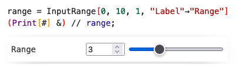
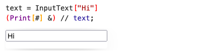
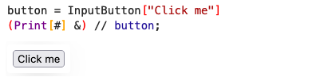
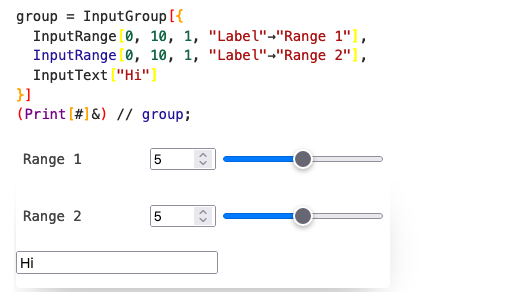

Elements are provided by the independent plugin/library [wljs-inputs](https://github.com/JerryI/wljs-inputs/tree/main).

## Basic usage
### Range input
A basic combo of a slider and numerical input field

```mathematica
range = InputRange[0, 10, 1, "Label"->"Range"]
(Print[#] &) // range;
```



It sends numerical values to the handler function.

### Text input
Text input, that sends as a string to the kernel

```mathematica
text = InputText["Hi"]
(Print[#] &) // text;
```


### Select
🚧 in dev 

### Wolfram Language Input
Please, use [EditorView](../Reference/Inputs/EditorView.md)

### Input Matrix
Please, use [Snippets](../Advanced/Snippets/Snippets.md) and type `insert matrix...`

### Button

```mathematica
button = InputButton["Click me"]
(Print[#] &) // button;
```



On press it sends `True` to the handler

## View components usage
This is a bit more advanced, since it requires the manual creation of frontend objects.

### TextView
The most practical thing to use it as text display
```mathematica
text = "dude"; 
TextView[text // Offload] 
```


The [dynamic binding](Dynamics.md) works as usual, if you change the variable `text`, the output will be updated.

Try to evaluate in the next cell

```mathematica
text = RandomWord[];
```

## Grouping
One can group different inputs into a single event-object, that maintains the original structure

### Associations
```mathematica
group = InputGroup[<|
  "left"->InputRange[0, 10, 1, "Label"->"Range 1"],
  "right"->InputRange[0, 10, 1, "Label"->"Range 2"] 
|>]
(Print[#]&) // group;
```


On each update it generates the data for the handler function in a form

```mathematica
<|"left"->5, "right"->7|>
```

### Arrays
```mathematica
group = InputGroup[{
  InputRange[0, 10, 1, "Label"->"Range 1"],
  InputRange[0, 10, 1, "Label"->"Range 2"],
  InputText["Hi"]
}]
(Print[#]&) // group;
```



On each update it generates the data for the handler function in a form

```mathematica
{5, 7, "Hi"}
```

