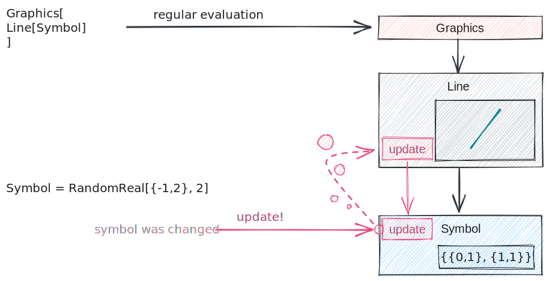

# Architecture of symbols

## Features
Let us show the most essential parts

### Symbol definition
In general the rule is

```js
context.Symbol = async (arguments, env) => {
	//evaluating arguments
	const a = await interpretate(arguments[0], env);
	//body
	some calculations
	//may return or not
	return result;
}
```

### Contexts
To prevent the mess of duplicated function names and etc, you can specify the context or let's say library of symbols using

```js
var library = {};
interpretate.extendContext(library);

library.Symbol = async (args, env) => {/*...*/}
```

The interpreter will check all available contexts and find the first match. However, you can prioritize the context providing the information in `env` object

```js
core.GrandSymbol = async (args, env) => {
	const data = await interpretate(args, {...env, context: library});
	//...
}
```

More about `env` object is here [Meta Data](#Meta%20Data).

In the same manner, the separation between `Line[]` used in `Graphics3D` and in `Graphics` functions was made.

### External  functions
:::caution
This feature is still in development
:::
If the called expression was not found in all available contexts, the interpreter will extend `core` with a server-call, i.e. __will ask kernel to evaluate the unknown symbol and return back the result__.

By the default, those special missing expressions becomes in the end virtual containers and can call `update` method on other containerized functions.

See [executables](../../frontend/Outdated/Advanced/Frontend%20interpretation/executables.md) and [Sub symbols](#Methods%20Sub%20symbols) for more information about methods and etc.

### Metadata
To share some data between functions, to use local and global memory of the executable objects, specifying methods of evaluation and DOM access the following object is provided

```js
env = {
	element: document.element, /* a Code Mirror widget */

	context: core, /* default context */

	/* subsymbol */
	method: undefined | 'update' | 'destory',

	/* global and local memory of front-end objects*/
	local: {},
	global: {call: uid},

	numerical: false, /* keep symbolic or not */
	hold: false /* keep exps in a List and JS Objects */
	unsafe: false /* allows to ask Wolfram Kernel for undefined symbols */

	novirtual: false /* prevents creatation of virtual containers (all functions inside are executed normally) */

	/* anything you want to share */
	root: ExecutableObject/* a reference to the FrontEndObject container */

	...
	//anything else you want
}
```

`local` and `global` cannot be deeply-copied, therefore they will be the same for all nested expressions if the expression is containerized (frontend object or virtual), then `local` will be overridden.

Ones, which ave the most influence to the process of interpreting, are

- `context` - prioritizes the context to fetch, the symbol to evaluate. See section [Contexts](#Contextes)
- `method` - it is meant to specify a sub-symbol for the whole three of WL expression (or in practice so-called method of interpreting)

#### Methods | Sub-symbols

- `undefined` (leave empty)
- `update` - usually called when the sub-expression was updated
- `destroy` - used only on the wolfram frontend, when the widget was removed

The following sub-symbols can be defined as
```js
core.MySymbol = (args, env) => {}
core.MySymbol.update = (args, env) => {}
core.MySymbol.destory = (args, env) => {}
```

You can think about it if it was a class definition with a constructor and several methods.

:::tip
It is good to declare `update` method for your function, even if you do not plan to use it explicitly, define `core.MySymbol.update = core.MySymbol` 
:::

For the sake of performance, when something changes with the data inside the plot, there is no need to reevaluate the whole tree of WL expressions. Therefore, we can specify the method of reevaluation

```js
//to create a plot
core.ListLinePlotly = (args, env) => {
	...
	Plotly.newPlot(env.element, data)
}

//to update only the data
core.ListLinePlotly.update = (args, env) => {
	...
	Plotly.restyle(env.element, newdata)
}
```

When a nested expression was changed, the nearest parent can be called using `update` method like on a picture



In principle, interpreter has no idea about what `update` and etc means, one can write any "method", which is basically just a sub-symbol.

For `Graphics3D` object is crucial to use `destroy` method, when object has removed from the editor, since it is necessary to remove the `animation` cycle

```js
core.Graphics3D.destroy = (args, env) => {
	cancelAnimationFrame(env.local.aid);
	//to cancel the animation
}
```

#### DOM
When the WL expressing is called via `FrontEndVirtual` on editor's side it creates `local` memory and unique identifier, where one can attach DOM element using

```mathematica
AttachDOM["dom-element-id"]
```

which is accessible by `env.element` field

```js
core.Canvas = (args, env) => {
	const canvas = document.createElement('canvas');
	env.element.append(canvas);
	//....
}
```

#### Global and local memory
- `env.global` is visible to all containers and its inner WL expressions, where `env.global.stack` contains the call-tree
- `env.local` is isolated memory related to individual `executable` functions, i.e. real or virtual containers.

```js
core.MyFunction = (args, env) => {
	env.local  = {} //pointer to the local memory of the instance
	env.global = {} //pointer to the global memory of the call tree
	env //sharable memory
}
```
