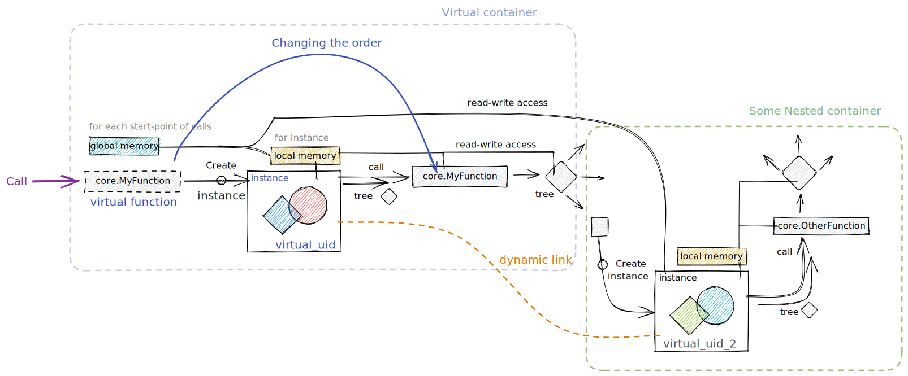

# Definitions

Let's make the things clear.

## Functions
Let's talk about how to define a function properly
:::note
In wolfram language terms, there is no difference between function and a symbol. These are all expressions. However, here WLJS only mimics WL language paradigm, therefore here we distinguish function and a variable.
:::

### Direct call
The simplest way of calling a defined function
```mathematica
MyFunction[data]
```

:::note
❗️ no local memory, no identity <br/>
❗️ not possible to dynamically update <br/>
✅  the fastest and memory friendly way
:::


A called function has no persistent memory except from the `env` variable, which can share the data with other functions from the sub-tree - see more in [architecture](architecture.md) (Meta Data). 

Somewhere in Javascript code there will be
```js
core.MyFunction = async (args, env) => {...}
```

An update method is good to define as well, therefore a function can be used together with updatable object called somewhere in the tree

```js
core.MyFunction.update = core.MyFunction
core.MyFunction.destroy = core.MyFunction
```

Since there is no identity of a function, there is no need to define a different function for `update` and `destroy`.

:::tip
Any defined functions must return javascript object or nothing
:::
While in the arguments `args` it is always Wolfram Expression, therefore `interpretate` is always called on them to convert anything into javascript data type.

#### 🎡 Example 1
Let us write some cellular automatic machine starting from Javascript code
<details>

```js
//create js canvas
const canvas = document.createElement("canvas");
canvas.width = 400;
canvas.height = 100;

let context = canvas.getContext("2d");

//a function to draw on it
core.MyFunction = async (args, env) => {
  const data = await interpretate(args[0], env);

  //draw our boxes
  for(let i=0; i<40; ++i) {
    for (let j=0; j<10; ++j) {
      //new pixels
      if (data[i][j] > 0) {
        context.fillStyle = "rgba(255,0,0,0.4)"; 
        context.fillRect(i*10 + 1, j*10 + 1, 8, 8);
      } else {
        context.fillStyle = "rgba(255,255,255,0.4)"; 
        context.fillRect(i*10 + 1, j*10 + 1, 8, 8);
      }
    }
  }
}

return canvas
```

Now we can animate it in a loop using the simplest rule

```mathematica
data = RandomReal[{-1,1}, {40,10}];

While[True, 
  data = Table[
    If[(data[[i]][[If[j+1>10,1,j+1]]]  
    + data[[If[i+1>40,1,i+1]]][[j]]  
    + data[[If[i-1<1,40,i-1 ]]][[j]] 
    + data[[i]][[If[j-1<1,10,j-1 ]]]) > 0.5, 1, RandomReal[{-1,0}]] 
  , {i,1, 40}, {j,1,10}];   

  Pause[0.05];

  MyFunction[data];  
];
```

</details>

The result will look like

import Sandbox from '@site/src/components/sandbox';

<Sandbox code="('wls!'VDq%5B(-1K)N(40K0)%3F99While%5BTrueN96VDTable%5B966If%5B%7BVXiAXIf%5Bj%2B1%3E10K%2Cj%2B1Y6%23If%5Bi%2B1%3E40K%2Ci%2B1YXjA6%23If%5Bi-1%3C1%2C40%2Ci-1%20YXjA%20%23iAXIf%5Bj-1%3C1K0%2Cj-1%20Y%7F%3E%200.5N1Nq%5B(-1%2C0)A%2096N(iKN40)N(jKK0)%3F6%20996Pause%5B0.05%3F996%25%5BV%3F69%3F'~js!'%5Ecreate%20js%20Z9const%20ZDdocument.createElement%7B%5C'Z%5C'%7D%3B9Z.widthD400%3B9Z.heightD100%3B99let%20contextDZ.getContext%7B%5C'2d%5C'%7D%3B99%5Ea%20function%20to%20draw%20on%20it9core.%25Dasync%20%7BargsNenv%7F%3D%3E%20(96const%20VDawait%20interpretate%7Bargs%5B0%5DNenv%7D%3B996%5Edraw%20our%20boxes96for%7Blet%20i%3D0zi%3C40z%2B%2Bi%7F(966for%20%7Blet%20j%3D0zj%3C10z%2B%2Bj%7F(9666%5Enew%20pixels9666if%20%7BV%5Bi%5D%5Bj%5D%20%3E%200%7DQ0%2C0%26B9666)%20elseQ255%2C255%26B9666)966)96)9)99return%20Z'~includes!%5B'https%3A%5Ecdn.jsdelivr.net%2Fgh%2FJerryI%2Fwljs-graphics-d3%40latest%2Fdist%2Fkernel.js'~.%2Fcurves.js'%5D~compiled!%5B'Hold'_q'7List%24K%5D7List'%2C40K0Y7While'%2Ctrue_Table'%227Plus'O~i'%5D%22Uj'K%5DK0%5DKUj'KYO%22Ui'K%5D%2C40%5DKUi'KY~j'%5DO7If'7Less'Ui%24%5DK%5D%2C40Ui%24Y~j'%5DO~i'%5D7If'7Less'Uj%24%5DK%5DK0Uj%24AA%2C0.5%5DK7q'7List%24%2C0Y7List'~i'K%2C40%5D7List'~j'KK0Y7Pause'%2C0.05%5D7%25'~V'%5D%2CnullA%2CnullA)6%20%207%2C%5B'9%5CnY%5DB%60Rect%7Bi%7Cj%7C8N8%7D%3BD%20%3D%20K%2C1N%2C%20O7Part'7Part'~V'Q%20(96%60StyleD%5C'rgba%7B255%2CU7Plus'~VdataX%5B%5BYA%5DZcanvas_7CompoundExpression'7Set'~V'7qRandomRealz%3B%20%227If'7Greater'%23966%2B%20VX%24'%2C-1%25MyFunction%26%2C0.4%7D%5C'z96%3F%5D%3B%5E%2F%2F%60666context.fill%7C*10%20%2B%201N%7F%7D%20%01%7F%7C%60%5E%3F%26%25%24%23%22zq_ZYXVUQONKDBA976_">Cellautomata</Sandbox>

### Virtual container
Things are getting interesting, if one need to store some additional information for the individual instance of the function and bind it to other objects for dynamics.

```mathematica
FrontEndVirtual[{
	MyFunction[data]
}]
```

:::note
✅  local memory and identity <br/>
✅  possible to dynamically update and bind <br/>
❗️ each time creates new instance
:::

See an example on a picture



:::danger
Do not put `FrontEndVirtual` into the loops like `While`, it will cause memory leakage!
:::

Now an interpreter can bind the inner objects or outer to our function, can forms a chain, that will be used for updates. For example

```mathematica
data = 1;

FrontEndVirtual[{
	MyFunction[data]
}];

Pause[1];
data = 10;
```

Here as one can see, we use defined symbol `data`, that by default has [Auto-virtual container](#Auto-virtual%20container) type, therefore on each call it also create an instance like `FrontEndVirtual` implicitly and binds to the parent container (no matter how far is it in the call tree).

Now let us write a simple function, that uses local memory and `update` method.

```js
core.MyFunction = async (args, env) => {
	const data = await interpretate(args[0], env);
	console.log('created!');
	console.log(data);
	//store the data into local storage
    env.local.data = data;
}
```

```js
core.MyFunction.update = async (args, env) => {
	const newdata = await interpretate(args[0], env);
	console.log('updated!');
	console.log(newdata);
	//apply some math for fun
    env.local.data += newdata;
    console.log('result: '+env.local.data);
}
```

On each update, this function will print the result of accumulated data.

### Auto-virtual container
This process can be simplified if we use automatic detection

```mathematica
MyFunction[data]
```

where somewhere in Javascript it is defined as

```js
core.MyFunction.virtual = true
```

:::note
✅  local memory and identity <br/>
✅  possible to dynamically update and bind <br/>
❗️ each time creates new instance 
:::

The result will be the same as in [Virtual container](#Virtual%20container), but it is implicitly done by the interpreter.

#### 🎡 Example 2
Let us simplify the code from the previous example. Firstly we need to define update method for the function we have
<details>

*add a few lines*
```js
core.MyFunction.update = core.MyFunction;
core.MyFunction.virtual = true
```

Now we can work with in a much prettier way

```mathematica
data = RandomReal[{-1,1}, {40,10}];

MyFunction[data];

While[True, 
  data = Table[
    If[(data[[i]][[If[j+1>10,1,j+1]]]  
    + data[[If[i+1>40,1,i+1]]][[j]]  
    + data[[If[i-1<1,40,i-1 ]]][[j]] 
    + data[[i]][[If[j-1<1,10,j-1 ]]]) > 0.5, 1, RandomReal[{-1,0}]] 
  , {i,1, 40}, {j,1,10}];   

  Pause[0.05];     
];
```

</details>

### Container with a storage
This way is usually used for all objects in cells of Wolfram Frontend and is not really useful, when you use WLJS as a standalone thing. Firstly you need to create a container or object, populate it with data and execute it

```mathematica
CreateFrontEndObject[MyFunction[data], "obj"];
FrontEndExecutable["obj"]
```

:::note
✅  local memory and identity <br/>
✅  possible to dynamically update and bind <br/>
✅  expression is stored inside the object's storage <br/>
❗️ each time creates new instance on `FrontEndExecutable` call, that has a reference to the same object
:::

:::info
All instances of `obj` refer to the same storage
:::

An update can be caused in two scenarios

#### Storage was changed
To mutate the container's storage, one can simple use

```mathematica
SetFrontEndObject["obj", MyFunction[data2]]
```

But this is not great implementation, since we basically send the same function, but with an arguments. However it will cause `MyFunction.update` method called on each instance, that we created using `FrontEndExecutable` expression.

#### Subexpressions was updated
Sub-expression has to be also a container, in order to be able to bind updates to that. Let us show you an example

```mathematica
CreateFrontEndObject[{1,2,3}, "var"];
CreateFrontEndObject[MyFunction[FrontEndExecutable["var"]], "obj"];

FrontEndExecutable["obj"];
```

The last line will create an instance of our `MyFunction` container. To trigger an update, one can update this expression via

```mathematica
SetFrontEndObject["var", {3,4,5}];
```

It can be illustrated as following


<details>
<summary>Details on garbage collector</summary>
Normal containers are the only species, that can be destroyed properly. Because they are explicitly bounded to the corresponding widget.

Since virtual functions and nested objects creates each time new identity, there is no way on how to clean them up using `destory` method on a tree.

However, they are still presented in a stack call, stored in `env.global.stack`. Therefore, one can remove them by going through the stack and calling `dispose` method.
</details>

## Variables
All variables or (expressions with only own-values) has virtual type by default, i.e.
__they are executed in a virtual containers__

```mathematica
a = 4;
```

It extends `core` context with a symbol `a`, that has property 
```js
core.a.virtual = true //what actually happends
```

Therefore, if it enters any container as a sub-expression, it will bind to the container. 
:::note
✅  local memory and identity <br/>
✅  possible to dynamically update and bind <br/>
❗️ each time creates new instance  <br/>
:::

`Set` operation scans this symbol in the `core` context, and if it exists, `update` method will be called with bubbling up to the nearest linked container

i.e,
```mathematica
a = 4;
FrontEndVirtual[{
	MyFunction[a] (* BINDED *)
}]     (*.       ^ *)    
	   (*        | *)
a = 5; (* UPDATE | *)
```

The last line will cause an update of `MyFunction`.

### Conditions, when an instance will be created or not

```mathematica
a = 4;
```

:::note
❗️ for the first time, there is no instance created, only `core.a`  
:::

```mathematica
a = a + 1;
```

:::note
❗️ set operation blocks instance creating for `a` symbol <br/>
✅ set operation causes `update` on the binded containers
:::

```mathematica
While[True,
	MyFunction[a] (* NO DYNAMIC LINK CREATED *)
]
```

:::note
❗️ while operation blocks instance creating to prevent memory leakage
:::

```mathematica
MyFunction[a] (* DYNAMIC LINK CREATED *)
```

:::note
✅ `a` now is possibly binded to `MyFunction`, if the last one is a virtual container
:::

```mathematica
data = Table[b[[i]] + b[[i+1]], {i,1,Length[b]-1}];  
```

:::note
❗️ `Set` blocks instance creating, no dynamic binding possible
:::

For example, when we plot graphics, by default `Line`, `Point` and etc has virtual type 
```mathematica
Graphics[
	Table[Line[b[[i]]], {i, Length[b]}]
] //FrontEndVirtual
```

:::note
✅  multiple instances of `b` were created and binded to `Line`
:::

So this binding happends only between `Line` and `b[[i]]`, no `Graphics` function is involved.

#### 🎡 Example 3
Lines

<details>

```mathematica
a = Table[{{0,0}, RandomReal[{-1,1}, 2]}, {i, 100}];

FrontEndVirtual[{
    AttachDOM["canvas"];
    Graphics[{RGBColor[0.0,1.0,1.0],  
    
    Table[Line[a[[i]]], {i, Length[a]}]}];
}];

(* mix them up *)
a = RandomSample[a];  
```

</details>

<Sandbox code="('wls!'%24TablX((U0)NZReal%5B(-1%2C1)N2%5D)N(iN100)Q99_%5B(7977AttachDOM%5B%5C'canvas%5C'Q977G%23%5B(RGBColor%5B0.U1.U1.0Y7%20977977TablXLinXa%5B%5Bi6%5DN(iNLength%5Ba%5D)%5D)NImageSize-%3E(40U400)Q9)Q%2099WhilXTrue%2C9%24ZSamplXaQ%209PausX0.15Q9Q9'~js!'console.log%7B%22Hi%22%7D%3B'~includes!%5B'https%3A%2F%2Fcdn.jsdelivr.net%2Fgh%2FJerryI%2Fwljs-g%23-d3%40latest%2Fdist%2Fkernel.js'~.%2Fcurves.js'%5D~compiled!%5B'Hold'8Setf*Table'KK%2CU0qZReal'K%2C-1%2C1Y26K~i'%2C1006q_'K8AttachDOM'~%22canvas%22'qG%23'K*RGBColor'%2CU1%2C1qTable'*Line'*Partf~i'6K~i'*Lengthf66*Rule'~ImageSize'K%2C40U4006Ynull6qWhile'%2Ctrue8Setf*ZSamplef6*Pause'%2C0.15Ynull6%2Cnull6)*%2C%5B'6%5D%5D7%20%208*CompoundExpression'*9%5CnK*List'N%2C%20Q%5D%3BU0%2CXe%5BY%5D%2CZRandom_FrontEndVirtualf'~a'q%5D*%23raphics%24a%20%3D%20%01%24%23qf_ZYXUQNK9876*_" height="500">Lines example</Sandbox>

