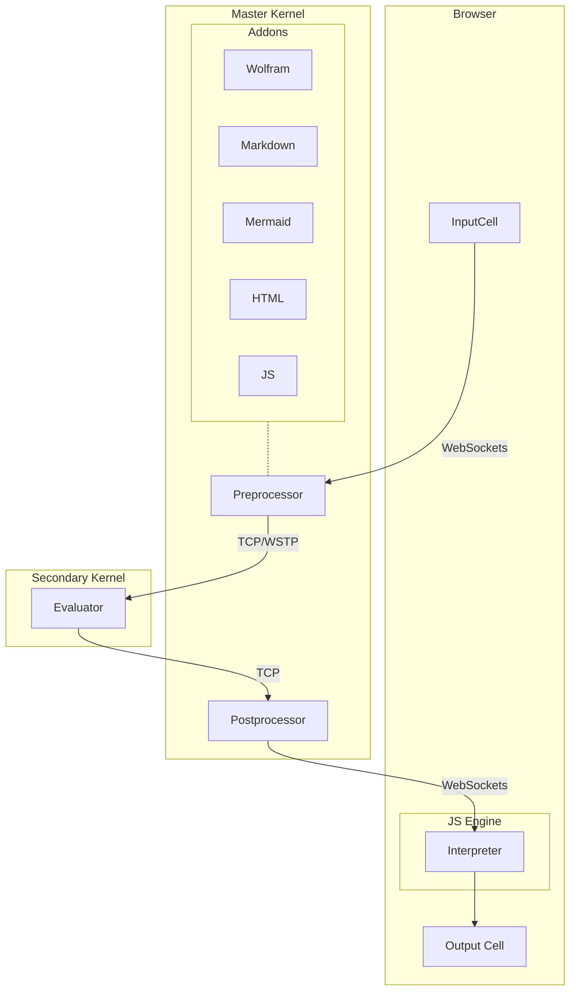

## Static evaluation

#### Editor in the browser
When you open an editor and __start typing__, the following happends
1. each character is send to a server and updates the cell (autosaving)
2. editor tries to figure out the language or a cell type 
3. considering (2) it changes the highlighting and autocomplete / other plugins

In this sence your input cell is an ultimate tool.

![[ezgif.com-video-to-gif-4.gif]]

To specify the type it uses a prefix in the first line of the cell

```markdown
.md
# Hello
```

it can be anything `**.**` the behavior is defined by so-called `Addons` to the frontend.

Then whatever you typed, you press `Shift-Enter`, the magic begins

### 1. WL Processing
JS sends the data via websockets to the server and sets the status of the cell to  `working`



#### Pre/Postprocessing on Master Kernel
Firstly the preprocessing happends on the first master-kernel. It applies all available processors to the input expression listed in `jsfn'Processors` . This is an example with Markdown

```mathematica
{
	MarkdownQ -> <|"SyntaxChecker"->(True&), "Epilog"->(#&), "Prolog"->(#&), "Evaluator"->MarkdownProcessor |>,
}
```

it includes

- the detector `MarkdownQ` applied to the input expressions as a string
- syntax checker (optional)
- epilog function (optional)
- evaluator function
- prolog function (optional) applied to the result

Here evaluator function (`MarkdownProcessor`) can decide if it returns the result immediately or send to the evaluation to the secondary kernel with a callback included.

```mathematica
MarkdownProcessor[expr_String, signature_String, callback_] := 
Module[{str = StringDrop[expr, StringLength[First[StringSplit[expr, "\n"]]] ]},

	JerryI`WolframJSFrontend`Notebook`Notebooks[signature]["kernel"][JerryI`WolframJSFrontend`Evaluator`TemplateEvaluator[str, signature, "markdown"], callback, "Link"->"WSTP"];
	
];
```

Here it takes the field of the notebook `kernel`, which provides the reference to the connected Kenrel (remote, local, etc), and calls `TemplateEvaluator` with a provided `callback` generated by the cells manager.

There are two evaluators defined on the secondary kernel

```mathematica
JerryI`WolframJSFrontend`Evaluator`WolframEvaluator[str_String, block_, signature_][callback_]
```

normal evaluation of expressions

```mathematica
JerryI`WolframJSFrontend`Evaluator`TemplateEvaluator[str_String, block_, signature_][callback_]
```

[WSP template engine](https://github.com/JerryI/tinyweb-mathematica) (suitable for Markdown or HTML with WSP injections) - see [[#Default cell types]]. 

#### Evaluation on the secondary kernel
The expression arrives in a form of string and then converts to the Wolfram Expression with a held head. 

To support fully [[Frontend Object]] it replace them with an actual wolfram expressions. If it is not available on the kernel it makes a query to the master kernel and download them.

All non-native boxes, decorations (see [[Decorations#Editable Two-ways binded widgets]]) are replaced with the corresponding Wolfram Expressions.

The result evaluates normally. However if it encounters the creation function for [[Frontend Object]] or registered Frontend Objects (see [[Writting WebObject]]) like `Graphics`, `Plotly` it replaces them with `FrontEndExecutable` and stores the compressed to JSON data for them into the local storage to be shared lately with the master kernel and a notebook.

On the very last stage it converts the result to sort of `Boxes` (see [[Decorations#Editable Two-ways binded widgets]]).

If the resulting string is too long, then instead of a string it returns a pointer to the corresponding data to prevent frontend overloading.

The result, created frontend objects, the cell type are shared via provided callback function with a master kernel.

#### Output processing
Secondary kernel executes the callback function called by the secondary kernel, creates a new cell and "publish" it to all users connected to the same notebook via websockets

### 2. JS Processing
Once the message is decoded by the frontend in your browser, it creates a cell and fetches the corresponding handler to display the result in a cell. 

For example, here the handler function for `markdown`

```js
class MarkdownCell {
	dispose() {}
	constructor(parent, data) {
		//parse markdown code and draw it to DOM element
		parent.element.innerHTML = marked.parse(data);
		return this;
	}
}
```

After that the user can see the content.

### Default cell types
There are a few built-in cell types available for the user

#### Wolfram Language
Works out of the box and has all features as an input cell
```mathematica
1+1
2
```

#### Markdown
Provides Markdown language with LaTeX support and WSP template engine
```markdown
.md
# Hello World!
- 1
- 2
```


WSP template engine allows to use Wolfram Language to process the text like PHP (see [more here](https://github.com/JerryI/tinyweb-mathematica)). For example, to create a list in Markdown one can do
```md
.md
# A list of items
<?wsp Table[ ?>
- <?wsp i ?>th element
<?wsp , {i,1,5}] ?>
```
it will produce
```md
# A list of items
- 1th element
- 2th element
- 3th element
- 4th element
- 5th element
```

#### HTML
You can also write plain HTML with WSP templates as well
```html
.html
<h1>Hello World</h1>
```


#### Mermaid
Draw beautiful diagrams by code (WSP is supported)
```bash
```shell
.mermaid
pie title NETFLIX
         "Time spent looking for movie" : 90
         "Time spent watching it" : 10
```


##### Image/File viewer/editor
It is questinable if it a good idea to implement it in the following syntax. The prefix itself defines the urls and the type of the processor. 

However, for now you can drop any image available in the folder of your notebook
```shell
randompic.png
```


to print the content of any file
```
filename.txt
```

to create or to write to a file
```
filename.txt
Hello World
```


##### SVG Art
This feature was added mostly for fun. If you like to draw using symbols, you should definitely try a new creating - [SVGBob](https://github.com/ivanceras/svgbob). Written in Rust and packed as a WASM module
```shell
.svgbob
--------->
```


### Definning your own cell-processor
🚧  To be written

## Dynamic evaluation
🚧  To be written