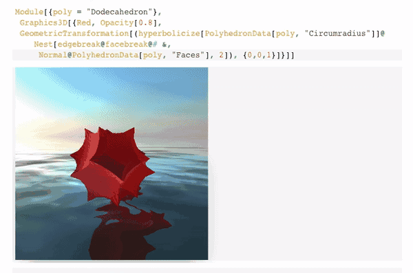
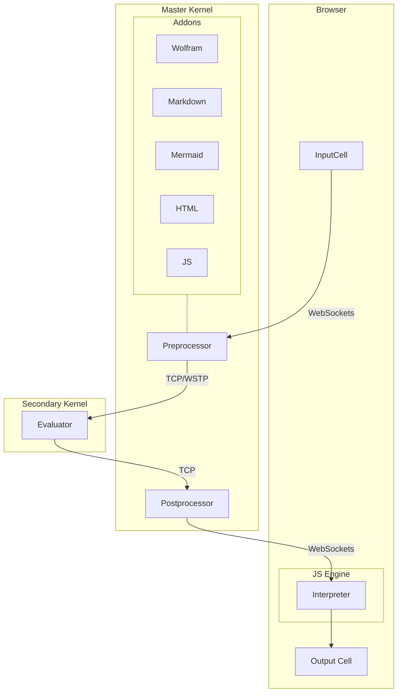

# Wolfram Engine JS Frontend
*the synergy of web technologies and symbolic computations*
This is a minimalistic, opensource, portable and lightweight notebook interface with syntax sugar, interactive objects built for freeware __Wolfram Engine__



**Warning! Early Stage of Development**

__The heart of the project is [WLJS](https://github.com/JerryI/wljs-interpreter) (Wolfram Language interpreter written in Javascript)__

To help maintain this project. 
kirill.vasin@uni-a.de
[__PayPal__](https://www.paypal.com/donate/?hosted_button_id=BN9LWUUUJGW54)
Thank you 🍺 

## Motivation
The idea is to implement a minimalistic, opensource, portable and lightweight notebook interface with syntax sugar, interactive objects for freeware Wolfram Engine.

__There is no aim to copy Mathematica__ (it will never be possible), but make the notebook interface in a different and unique taking advantage of the web-technology stack.

The target community can probably divided by two groups
- who like and can write in Javascript and Mathematica
- who uses Jypiter with free Wolfram Language Kernel and needs *much more* features
- who wants to share their research notebook to some collegues or people on the web with no access to Wolfram Mathematica/Player

Web technologies nowadays are aimed to be extremely efficient in order to compete with a native desktop applications. Therfore we are using classical HTML5 + JS stack to brind life to UI and all graphical objects by __recreating some of Mathematica's function__ using `plotly.js`, `d3.js` and `Three.js` (add your own one! this is easy) libraries. 

## How to run (testdrive)
This is quite simple. All that you need is

- Freeware WolframEngine

the rest will be downloaded via the internet. Then `cd` to the project folder and

```shell
git clone https://github.com/JerryI/wolfram-js-frontend
cd wolfram-js-frontend
wolframscript -f Scripts/run.wls
```
and open your browser with `http://127.0.0.1:8090`


## The general concept

> Everyhting is a symbol

For me @JerryI as a maintener, the most facinating feature from Mathematica was the symbolic concept, which was fully implemented on the frontened as well. Here it was a compromise between showing the actual code of the cell and interpreting the result of it in-place.

Here there is an example, where one can copy and paste 3D object into the cell if it was a single  symbol and apply different settings to it


 
 Behind it there is nothing else, than `FrontEndExectuable["ref"]` a reference. However, here the idea is to expand this concept and be able to store and execute any expressions on the frontened. Not it is very limited, by the idea is there


The goal here is to make it possible a manual or semi-automaic code splitting between frontened and the backend. Therefore for the sake of perfomance, one can rely on custom written JS functions (you can do it within the same notebook) and update the content dynamically, without the reevaluating the whole cell.


Dynamic binding between JS and Wolfram Kernel removes all borders, you can be really creative designing your own approach on visualising the data.

> One cell to rule them all

An input cell is a key. Nobody knows the type of it until it has submitted for the evaluation
The user can add its own extensions and type handlers. 

to write a JS code
```js
.js
const canvas = document.createElement("canvas");
let context = canvas.getContext("2d");
context.fillStyle = "red";
context.fillRect(10, 10, 100, 50);
return canvas
```


to write Markdown
```markdown
.md
# Hello World!
- 1
- 2
```


to make Mermaid diagram
```shell
.mermaid
pie title NETFLIX
         "Time spent looking for movie" : 90
         "Time spent watching it" : 10
```


to write HTML
```html
.html
<h1>Hello World</h1>
```


to display an image
```shell
exampleimage.png
```


to display a file
```
filename.txt
```

to create and write to a file
```
filename.txt
Hello World
```


to display an ASCII art
```shell
.svgbob
--------->
```


to evaluate a regular WL expression
```mathematica
1+1
```

> Output cells, graphs are editable/evaluatable

## How it works
A web server and the half of logic runs on freeware Wolfram Engine as a __backend__
- serves the static page via library [TinyWeb & WSP](https://github.com/JerryI/tinyweb-mathematica) (hypertext preprocessor)
- stores the whole structure of the notebook
- communicates with a JS __frontend__ via websockets

Here is the graph shows how the data flow



### Cell types
- Wolfram Language
- Markdown
- Javascript (with DOM)
- HTML
- *define your own type or language extension* (ask me how or wait for Docs be prepared)

### Supported features
#### Syntax sugar
- greek symbols
- autocomplete

#### Input
- editable output cells
- inline graphical objects (as a single symbol)
- truncated output for the large data (no actual data transfer happens)

CodeMirror 6 library was used to operate notebook cells inside the page, when you press `Shift-Enter` it sends the content and a command to Wolfram Engine via websockets. 

The key feature is `Decorations` which comes with Code Mirror 6, that allows to embed DOM elements into the text, keeping the content untouched

...to be concluded

# Technology stack
## Backend
- Wolfram Engine
*as HTTP Server, IO operator, DB manager and etc*
- NodeJS
*as JS bundler (using Rollup.js) for dev. purposes*
## Frontend
- WL JS interpreter *for graphics, internal commands, events handing, lightweight calculations*
- CodeMirror 6 *as a cell's editor*
- d3.js, plotly.js *for 2D Graphics*
- three.js *for 3D Graphics*
- mermaid.js, svgbob *for diagrams*
- svgbob.js *for svg drawings*
- marked.js *for markdown exprs. processing*
- katex.js *as $\LaTeX$ renderer*
- styles and layout from Notion


## Inspired by
- *Wolfram Mathematica*
- [Observable](http://observablehq.com/@jerryi)
- [Wolfram Language Notebook VSCode](https://github.com/njpipeorgan/wolfram-language-notebook)
- [Mathics](https://mathics.org)
- [Markdown Decoration extension](https://github.com/fuermosi777) 


