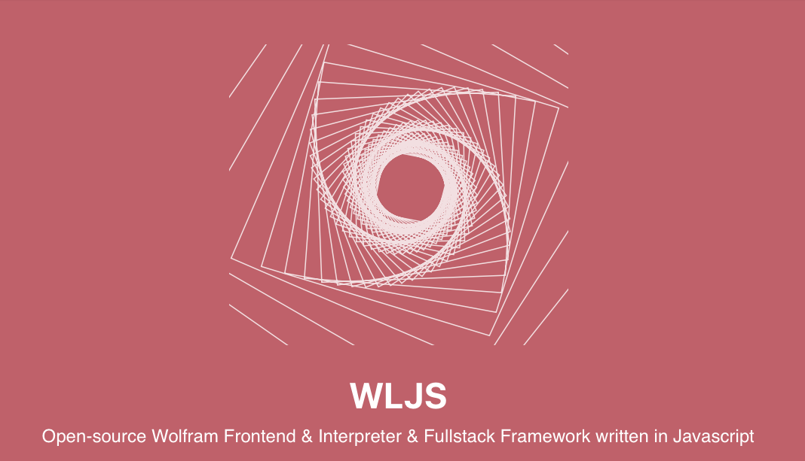

# WLJS Frontend (Wolfram Language Javascript Frontend)


*written for the freeware Wolfram Engine using Javascript*
*web-based, fully customizable and free*

__[See Docs](https://jerryi.github.io/wljs-docs/)__

__[See Docs](https://jerryi.github.io/wljs-docs/)__

__[See Docs](https://jerryi.github.io/wljs-docs/)__

**Warning! Early Stage of Development**

__The heart of the project is [WLJS](https://github.com/JerryI/wljs-interpreter) (Wolfram Language interpreter written in Javascript)__

__Special thanks to [@KirillBelovTest](https://github.com/KirillBelovTest) (Wolfram HTTP/WS Server developer & and a nice guy)__

To help maintain this project. 
- [GitHub Sponsors](https://github.com/sponsors/JerryI)
- [__PayPal__](https://www.paypal.com/donate/?hosted_button_id=BN9LWUUUJGW54)
Thank you 🍺 

__[Recorded webinar](https://www.youtube.com/watch?v=2QNu7FOdYus&t=537) from the Wolfram Conference in Saint-Petersburg 2023 (available only in Russian, please, use automatic subtitles; also it is quite outdated)__

## Motivation
The idea is to implement a minimalistic, opensource, portable and lightweight notebook interface with syntax sugar, interactive objects for freeware Wolfram Engine.

__There is no aim to copy Mathematica__ (it will never be possible), but make the notebook interface in a different and unique taking advantage of the web-technology stack.

The target community can probably divided by two groups
- who like and can write in Javascript and Mathematica
- who uses Jypiter with free Wolfram Language Kernel and needs *much more* features
- who wants to share their research notebook to some collegues or people on the web with no access to Wolfram Mathematica/Player

Web technologies nowadays are aimed to be extremely efficient in order to compete with a native desktop applications. Therfore we are using classical HTML5 + JS stack to brind life to UI and all graphical objects by __recreating some of Mathematica's function__ using `plotly.js`, `d3.js` and `Three.js` (add your own one! this is easy) libraries. 

## How to run (testdrive)
This is quite simple. All that you need is

- Freeware WolframEngine

the rest will be downloaded via the internet. Then `cd` to the project folder and

```shell
git clone https://github.com/JerryI/wolfram-js-frontend
cd wolfram-js-frontend
wolframscript -f Scripts/run.wls
```
and open your browser with `http://127.0.0.1:8090`

in a case of troubles with page loading use
```shell
wolframscript -f Scripts/run.wls legacySockets
```

## Package system
Frontend uses its own package/plugin system. It doent require any software installed except *wolframscript*. Precompiled plugins are downloaded via `URLFetch` from github repositories and imported to the system. They can extend core WL, autocomplete, JS and UI. The following packages are available (already included as a default plugins)

- [wljs-interpreter](https://github.com/JerryI/wljs-interpreter) - WL interpreter written in JS is a core component, that controls UI, draw graphics, manage states (bridges WL and WEB). Can be used as a standalone library for building web apps
- [wljs-editor](https://github.com/JerryI/wljs-editor) - cells editor based on CodeMirror 6
- [wljs-inputs](https://github.com/JerryI/wljs-inputs) - io library that provides sliders, textboxes for buuilding simple GUI in the notebook
- [wljs-graphics3d-threejs](https://github.com/JerryI/Mathematica-ThreeJS-graphics-engine) - library for `Graphics3D` based on Three.js. Can also be used as a standalone plugin together with `wljs-interpreter`
- [wljs-graphics-d3](https://github.com/JerryI/wljs-graphics-d3) implementation of `Graphics` function and primitives based on `d3.js` and `plotly.js`. Can be used separately
- [wljs-svgbob-support](https://github.com/JerryI/wljs-svgbob-support) adds support of SVGBob diagrams language to `wljs-editor`
- [wljs-mermaid-support](https://github.com/JerryI/wljs-mermaid-support) support for Mermaid.js diagrams language
- [wljs-markdown-support](https://github.com/JerryI/wljs-markdown-support) support for markdown language
- [wljs-magic-support](https://github.com/JerryI/wljs-magic-support) misc useful features for the editor
- [wljs-js-support](https://github.com/JerryI/wljs-js-support) support for JS cells in the editor with data-binding between WL and JS
- [wljs-html-support](https://github.com/JerryI/wljs-html-support) support for HTML language in the cells with a template engine [WSP](https://github.com/JerryI/tinyweb-mathematica/tree/master/Tinyweb)
- and some of yours plugins should be here!

# Technology stack
## Backend
- Wolfram Engine
*as HTTP Server, IO operator, DB manager and etc*
## Frontend
- WLJS interpreter *for graphics, internal commands, events handing, lightweight calculations*
- CodeMirror 6 *as a cell's editor*
- d3.js, plotly.js *for 2D Graphics*
- three.js *for 3D Graphics*
- mermaid.js, svgbob *for diagrams*
- svgbob.js *for svg drawings*
- marked.js *for markdown exprs. processing*
- katex.js *as $\LaTeX$ renderer*
- styles and layout from Notion


## Inspired by
- *Wolfram Mathematica*
- [Observable](http://observablehq.com/@jerryi)
- [Wolfram Language Notebook VSCode](https://github.com/njpipeorgan/wolfram-language-notebook)
- [Mathics](https://mathics.org)
- [Markdown Decoration extension](https://github.com/fuermosi777) 

## License
GNU GPLv3


