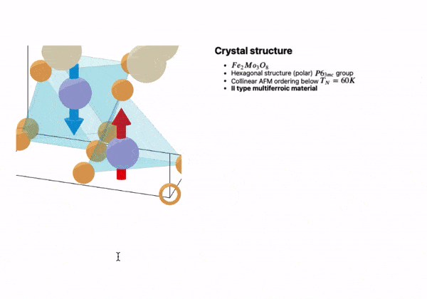

# Open-source Notebook Interface for Wolfram Language


__Made for scientists by scientists__

*Written for the freeware Wolfram Engine using JavaScript and [WLX](https://jerryi.github.io/wlx-docs/)*

__[Documentation & Tutorials](https://jerryi.github.io/wljs-docs/)__

__[Telegram support chat](https://t.me/+PBotB9UJw-hiZDEy)__

**Recommended Wolfram Engine: 13.3 or higher**

__Special thanks to [@KirillBelovTest](https://github.com/KirillBelovTest) (Wolfram Language HTTP Stack developer)__

To help maintain this project:
- [GitHub Sponsors](https://github.com/sponsors/JerryI)
- [__PayPal__](https://www.paypal.com/donate/?hosted_button_id=BN9LWUUUJGW54)
Thank you 🍺 

## Highlights


### Not a typical Jupyter-like notebook environment

It supports dynamics, GUI building blocks, and powerful Mathematica syntax out of the box.


No more static graphics! Each primitive of `Graphics`/`Graphics3D` was recreated from scratch using `d3.js` and `THREE.js` libraries. Most native plotting functions of Mathematica are supported.

#### AI Assistant
We deeply integrated ChatGPT, so that AI can have a read/write acccess to your notebook


### Command Palette and GUI-in-Code Emulation
#### Inline Dynamic Tool for Tuning 2D/3D Positions


### Native Math Input in the Code Editor
Write beautiful equations between lines of normal Wolfram Language expressions.


### Compress to HTML
An entire notebook can be exported to a standalone `.html` file keeping all data inside. __No internet dependency, no additional software__ is required for viewing a notebook


Later, once opened using WLJS Notebook application, it is unpacked back to a normal editable format.

### Data-Driven Slides
Make a presentation right from the notebook.



### Real-Time Interactivity
Follows the mouse pointer and performs complex calculations.


### Many More
#### Autocomplete
#### JavaScript Cells and Integration with WL
#### HTML Cells
#### Markdown Cells
#### Mermaid Diagrams

#### Offline documentation 🩺

WLJS Notebook __runs locally__ and belongs to you (no cloud-based stuff involved). __No internet connection is needed__.

## Motivation
The idea is to implement a minimalistic but easily extendable open-source notebook interface with syntax sugar, interactive objects for the freeware Wolfram Engine.

__There is no aim to fully copy Mathematica__ (it will never be possible), however, there are a few things that can be improved:

- __Stability__ and speed
- Independence from WRI
- Portability (not PDF) - easy to share your work with someone outside the ecosystem __keeping your graphics interactive__ or embedded on a website
- Event-based approach to dynamics - allow users to __build complex dynamic notebooks__ and to have clear control over all moving parts
- Natural bridge between other languages - HTML as markup, WL for computations, and JS for stunning visuals

# Installation
[The freeware Wolfram Engine](https://www.wolfram.com/engine/) is required (Version 13.3 is preferable).

## Desktop App
Download from the __[releases](https://github.com/JerryI/wolfram-js-frontend/releases)__ section.

## Standalone Server
Clone this repository and run:

```shell
wolframscript -f Scripts/start.wls
```

or on a specific hostname

```shell
wolframscript -f Scripts/start.wls host 0.0.0.0 http 8080 ws 8081 ws2 8082 docs 8085
```

that will open __an HTTP server__ on `8080` port with `8081`, `8082` __used for realtime communication__ and __docs pages__ at `8085`

## Package System

The frontend uses its own package/plugin system. It doesn't require any software installed except wolframscript. Precompiled plugins are downloaded using URLFetch from GitHub repositories and imported to the system.

## Sponsors
@MitsuhaMiyamizu 🤍

## Technology Stack
Wolfram Language, JavaScript

## Inspired By

- Wolfram Mathematica
- Jupyter Notebook
- Observable
- Wolfram Language Notebook VSCode
- Mathics

# License
GNU GPLv3


