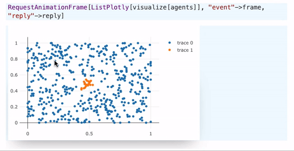
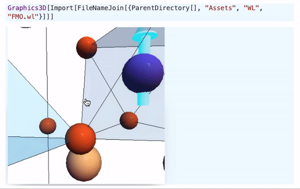
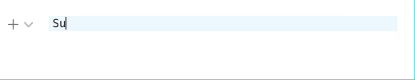
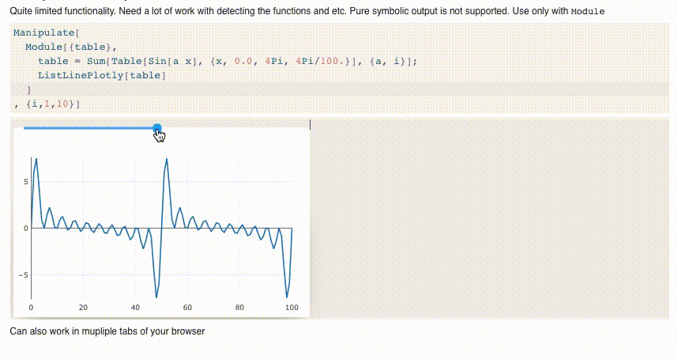
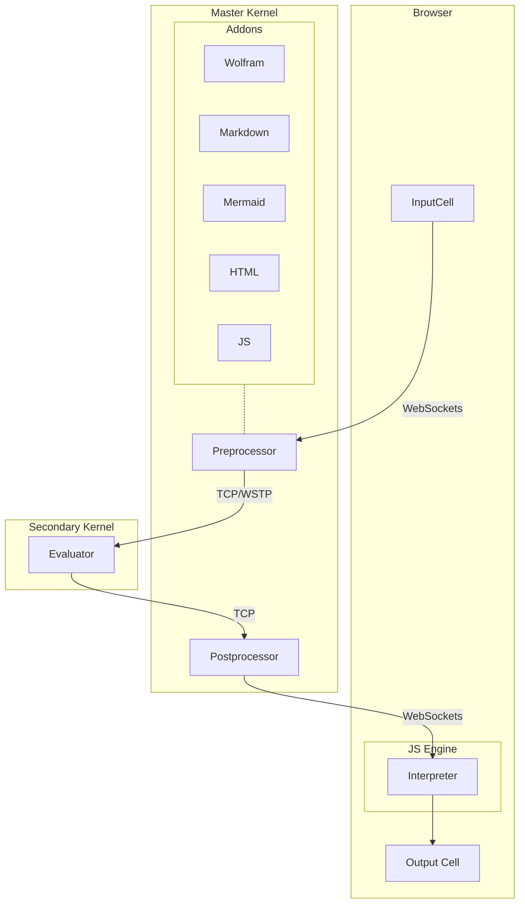
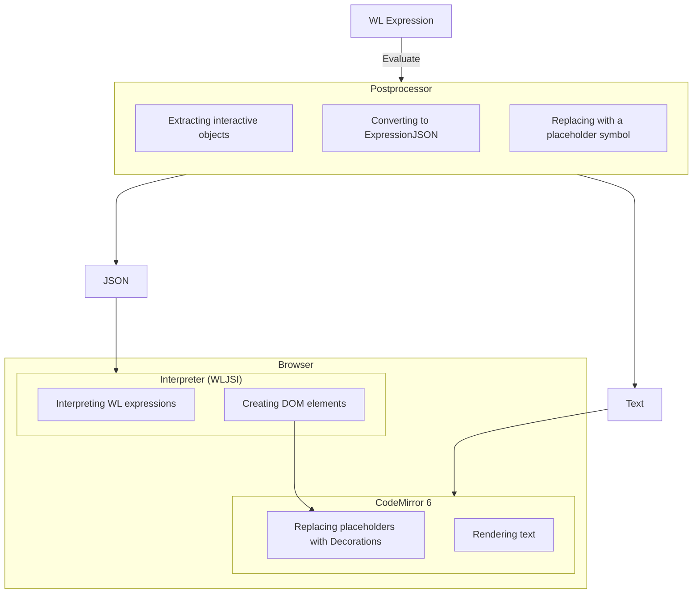

# Wolfram Engine JS Frontend
*the synergy of web technologies and symbolic computations*
This is a minimalistic, opensource, portable and lightweight notebook interface with syntax sugar, interactive objects built for freeware __Wolfram Engine__


**Warning! Early Stage of Development**

To help maintain this project. 
kirill.vasin@uni-a.de
[__PayPal__](https://www.paypal.com/donate/?hosted_button_id=BN9LWUUUJGW54)
Thank you 🍺 

## Motivation
The idea is to implement a minimalistic, opensource, portable and lightweight notebook interface with syntax sugar, interactive objects for freeware Wolfram Engine, which can be easily extended to any user's defined functions and exported as a standalone `.html` application. 

__There is no aim to copy Mathematica__ (it will never be possible), but make the notebook interface in a different and unique taking advantage of the web-technology stack.

The target community can probably divided by two groups
- who like and can write in Javascript and Mathematica
- who uses Jypiter with free Wolfram Language Kernel and needs *much more* features
- who wants to share their research notebook to some collegues or people on the web with no access to Wolfram Mathematica/Player

### Crossplatform
The frontened is an HTTP & Websockets server, which runs locally on your PC and the notebook interface built from opensource components is entirely in your browser. Which also makes possible to do all work remotely attaching different wolfram kernels to the notebook.

### Performance
Web technologies nowadays are aimed to be extremely efficient in order to compete with a native desktop applications. Therfore we are using classical HTML5 + JS stack to brind life to UI and all graphical objects by __recreating some of Mathematica's function__ using `plotly.js`, `d3.js` and `Three.js` (add your own one! this is easy) libraries. 

### Flexibillity
Want to make fancy WebGl animated figures of your brilliant calculaltions? Sure! - Use modern stack of __Javascript__ and `three.js` or any other framework you like, by typing `.js` in the beginning of a cell or write your own Wolfram Language function and attach it to the core library.


Several data transfer method between Wolfram Kernel and Javascript are already implemented. __HTML__, __Markdown__ cells are the part of frontened. You can define your own evaluators kernels (processors) and add new languages used in frontened.

Built-in Wolfram Language JS engine will serve the purpose by interpreting Wolfram expressions in the browser.

In principle, one can perform hetero-calculations, splittting your code between parts evaluated on the frontned and backend to optimize the perfomance.

> The project is in __alpha stage__, some features might be changed. Some experimental features can be buggy. Check your browser's console more often

## Highlights

### Minimalistic WEB-GUI
Now it is kinda buggy. It runs purely on Wolfram Script and plain JS with a partial server-side rendering


### 2D Plots and 3D
The following functions`Plotly`, `ListLinePlotly`, `Graphics3D`, `Plot3D`, `SphericalPlot3D` are implemented and are interactive (without styling and options)




## Syntax sugar
`Subscript`, `Superscript` are supported and works at syntax.



Fractions, square roots and etc will be implemented in future as well.


### Dynamics
It will be implemented later, but here is a proof of concept example example



### Export to standalone HTML notebook app
Click on `Share` button in the top-right corner, it will export the whole notebook into `.html` with no external dependecies. There is no need even to have an internet connection.


### Runs locally and stores the data to a file
no external dependencies 

## How to install (test)
This is quite simple. All that you need is

- Freeware WolframEngine
- NodeJS (only for building)

the rest will be downloaded via the internet. Then `cd` to the project folder and

```shell
git clone --branch indev https://github.com/JerryI/wolfram-js-frontend
cd wolfram-js-frontend
npm i
wolframscript -f Scripts/build.wls
wolframscript -f Scripts/run.wls
```

Wait until the bundle will be finished (takes some time ~80 seconds) and open your browser with `http://127.0.0.1:8090`

There is a `Introduction` notebook, which shows most gems...

## Development

```shell
wolframscript -f Scripts/run.wls dev
```

## The general concept

> Everyhting is a symbol

For me @JerryI as a maintener, the most facinating feature from Mathematica was the symbolic concept, which was fully implemented on the frontened as well. Here it was a compromise between showing the actual code of the cell and interpreting the result of it in-place.

Here there is an example, where one can copy and paste 3D object into the cell if it was a single  symbol and apply different settings to it


 
 Behind it there is nothing else, than `FrontEndExectuable["ref"]` a reference. However, here the idea is to expand this concept and be able to store and execute any expressions on the frontened. Not it is very limited, by the idea is there


The goal here is to make it possible a manual or semi-automaic code splitting between frontened and the backend. Therefore for the sake of perfomance, one can rely on custom written JS functions (you can do it within the same notebook) and update the content dynamically, without the reevaluating the whole cell.


Dynamic binding between JS and Wolfram Kernel removes all borders, you can be really creative designing your own approach on visualising the data.

> One cell to rule them all

An input cell is a key. Nobody knows the type of it until it has submitted for the evaluation
The user can add its own extensions and type handlers. 

to write a JS code
```js
.js
const canvas = document.createElement("canvas");
let context = canvas.getContext("2d");
context.fillStyle = "red";
context.fillRect(10, 10, 100, 50);
return canvas
```


to write Markdown
```markdown
.md
# Hello World!
- 1
- 2
```


to make Mermaid diagram
```shell
.mermaid
pie title NETFLIX
         "Time spent looking for movie" : 90
         "Time spent watching it" : 10
```


to write HTML
```html
.html
<h1>Hello World</h1>
```


to display an image
```shell
exampleimage.png
```


to display a file
```
filename.txt
```

to create and write to a file
```
filename.txt
Hello World
```


to display an ASCII art
```shell
.svgbob
--------->
```


to evaluate a regular WL expression
```mathematica
1+1
```

> Output cells, graphs are editable/evaluatable

## How it works
A web server and the half of logic runs on freeware Wolfram Engine as a __backend__
- serves the static page via library [TinyWeb & WSP](https://github.com/JerryI/tinyweb-mathematica) (hypertext preprocessor)
- stores the whole structure of the notebook
- communicates with a JS __frontend__ via websockets

Here is the graph shows how the data flow




### Cell types
- Wolfram Language
- Markdown
- Javascript (with DOM)
- HTML
- *define your own type or language extension*

### Supported features
#### Syntax sugar
- greek symbols
- autocomplete

#### Graphics
- `Graphics3D` without styling, axes and etc. see [repo](https://github.com/JerryI/Mathematica-ThreeJS-graphics-engine)
- `SVGForm`, `HTMLForm` to show any objects as the corresponding forms
- `Plotly` interactive replacement to `Plot`
- `ListLinePlotly` replacement for `ListLinePlot`
- `ListPlotly`
- `RequestAnimationFrame` method for real-time animated graphics

#### Input
- editable output cells
- inline graphical objects (as a single symbol)
- truncated output for the large data (no actual data transfer happens)

CodeMirror 6 library was used to operate notebook cells inside the page, when you press `Shift-Enter` it sends the content and a command to Wolfram Engine via websockets. 

The key feature is `Decorations` which comes with Code Mirror 6, that allows to embed DOM elements into the text, keeping the content untouched

The evaluation process is shown below


# Wolfram Expressions representation

The aim is to make a compomise between `DisplayForm` and `InputForm` representations of Wolfram Expressions on the frontend's side.

In Matheamtica notebook (`DisplayForm`) everything you type becomes a bunch of __wrapper functions  being executed on a small WL interpreter__, ==which runs on a java-frontend==

what user see
$$\frac{1}{2}$$
what it actually is
```mathematica
Cell[BoxData[FractionBox["1", "2"]], "Input"]
```

i.e. this is an executable object, written as a sort of computable WL functions.

The power of Mathematica's frontend, that it expands and follows the paradigm of WL, where 
> Everything is symbol

to all intergactive objects, including mostly graphics. It makes you feel like you are still operating a bunch of symbolic expressions underneath it
> Graphics is a syntax sugar

```mathematica
Cuboid[]//Graphics3D
% /. {Cuboid :> Sphere}
```

To recreate the functionality of Mathematica's frontend in this manner is doomed by a few reasons

- frontend functions are poorely documented
- WYSIWIG editor with mutable WL expressions inside is a mess
- even with a ~20 years of development, Mathematica frontend is quite slow and laggy

*We need something more flexible, lightweight and easily expandable.*
However, one can find a compromise

## Relaying on InputForm
In principle, we do not need to make the whole WL expression mutable and interactive. There are only a few cases, where we really need this

1. Graphics, sliders, buttons and etc - __separate objects__
2. Syntax sugar for fractions, square roots and etc. - __mixed__: code and objects

*The first one* can be even separated from the actual code-area, since it originally works as inline block (a symbol). 

In the simples case, where the Graphics and symbols are mixed in the code, one could just replace graphics objects with images and substitute it to some advanced HTML-like editor. For this see [[Frontend Object]].

Anyway, since `Plot` and `Plot3D` is a set of `Graphics` and `Graphics3D` symbols with a recipy of our graphs inside made from other symbols, afterwards one need to interprete it and display to the user, i.e. ==we need a frontend WL interpreter==. Our main language in the WEB stack apart from HTML/CSS is JS. See [WLJS Interpreter](https://github.com/JerryI/wljs-interpreter)

*The second one* is rather tricky to implement fully, since it involves mutable WL expressions. 

However, people now are using sort-of syntax sugar for the live previews of Markdown, where the code you typing is replaced by the corresponding styled object. A good example is Obsidian notes making app, and CodeMirror 6 Decorations. TL-DR see [[Decoration]]

...to be concluded

# Technology stack
## Backend
- Wolfram Engine
*as HTTP Server, IO operator, DB manager and etc*
- NodeJS
*as JS bundler (using Rollup.js) for dev. purposes*
## Frontend
- WL JS interpreter *for graphics, internal commands, events handing, lightweight calculations*
- CodeMirror 6 *as a cell's editor*
- d3.js, plotly.js *for 2D Graphics*
- three.js *for 3D Graphics*
- mermaid.js, svgbob *for diagrams*
- svgbob.js *for svg drawings*
- marked.js *for markdown exprs. processing*
- katex.js *as $\LaTeX$ renderer*
- styles and layout from Notion


## Inspired by
- *Wolfram Mathematica*
- [Observable](http://observablehq.com/@jerryi)
- [Wolfram Language Notebook VSCode](https://github.com/njpipeorgan/wolfram-language-notebook)
- [Mathics](https://mathics.org)
- [Markdown Decoration extension](https://github.com/fuermosi777) 


