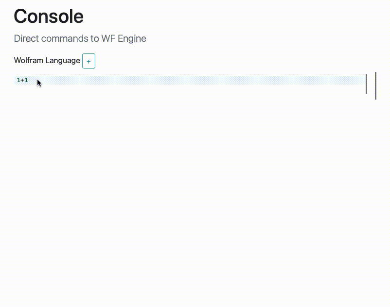

## Wolfram Engine JS Frontend

_An alternative way of operation in REPL mode of the freeware Wolfram Engine bringing similar experience as Mathematica Notebook._



### Important note
- this is a preliminary working example
- only `Graphics3D` is supported by now
- js part of the source code may look terrible
- feel free to contribute

### How it works
A web server and the half of logic runs on freeware Wolfram Engine as a __backend__
- serves the static page via library [TinyWeb & WSP](https://github.com/JerryI/tinyweb-mathematica) (hypertext preprocessor)
- stores the whole structure of the notebook
- communicates with a JS __frontend__ via websockets

CodeMirror 6 library was used to operate notebook cells inside the page, when you press `Shift-Enter` it sends the content and a command to Wolfram Engine via websockets. 

#### Evaluation process
On the backend, it evaluates the result and sends it back via websockets. However, if there is a `Graphics3D` object (in future can be extended to many) it replaces it with a  special symbol `FrontEndExecutable["uid"]`, which tells to frontend, that the content can be executed in a browser. Also, web server sends a JSON representation of the content behind `FrontEndExecutable` to be parsed by JS. 

Once it arrived CodeMirror uses `Decorations` structure to detect these objects inside the code and executes the content of it via a written very primitive JS Mathematica interpretator. CodeMirror treats it as an `AtomicRange`, i.e. a single symbol containing a complex DOM element. Of course, once it was sent back to the backend the `FrontEndExecutable` will be replaced by the original function.

#### Primitive JS Intepretator
Originally it was done for the [utility](https://github.com/JerryI/Mathematica-ThreeJS-graphics-engine) to convert Graphics3D objects to ThreeJS, because one needs to parse the internal structure, which includes almost all features of a Wolfram Language. 

By default JS script interprets everything that arrives via websockets using `interpretate(json, env)`, therefore for the creation of notebook cells it uses the Wolfram-like function `FrontEndCreateCell[]`. To define your own function, you can write it as
```js
core.List = function(args, env) {
  var copy, e, i, len, list;
  copy = Object.assign({}, env);
  list = [];
  for (i = 0, len = args.length; i < len; i++) {
    e = args[i];
    list.push(interpretate(e, copy));
  }
  return list;
};
```
The set of `Graphics3D` objects is loaded from [this](https://github.com/JerryI/Mathematica-ThreeJS-graphics-engine) repository and extends `core` functions.

In general, it is possible to insert inside `FrontEndExecutable` anything you want to execute at a frontend side.

## How to install/test
This is quite simple. All that you need is
- Freeware WolframEngine
the rest will be downloaded via the internet. Then `cd` to the project folder and
```shell
wolframscript -f server.wls
```
Open your browser with `http://127.0.0.1:8090`

## Development
type
```shell
npm i
```
then
```
wolframscript -f server.wls dev
```
The filewatcher will rebuild the js bundle everytime you change something in `src` folder.

### Plans
- create and write a module for `Graphics` (2D) objects using possibly d3.js
- make alternative functions (user will choose) for the `Plot[]` using ploty.js
- improve cell operations and UI
- make it possible to embed it into Obsidian (as a plugin) or other complex notes editor
- webserver bug fixes (or move it to node.js and connect wolfram engine to it) and performance
