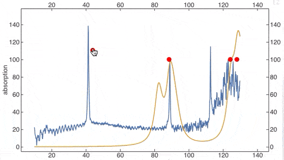

# Freeware Wolfram Language Notebook


*written for the freeware Wolfram Engine using webstack with vanilla Javascript*

__[Documentation & Tutorials](https://jerryi.github.io/wljs-docs/)__

__[Telegram support chat](https://t.me/+PBotB9UJw-hiZDEy)__

**Recommended Wolfram Engine: 13.0.1**

__Special thanks to [@KirillBelovTest](https://github.com/KirillBelovTest) (Wolfram Language HTTP Server developer)__

To help maintain this project
- [GitHub Sponsors](https://github.com/sponsors/JerryI)
- [__PayPal__](https://www.paypal.com/donate/?hosted_button_id=BN9LWUUUJGW54)
Thank you 🍺 

## Highlights

- No more static graphics! Each primitive of `Graphics`/`Graphics3D` was recreated from scratch using `d3.js` and `THREE.js` libraries. Most native plotting function of Mathematica are supported

- 

- Autocomplete for user's defined symbols

- 


- __Math in code__, equation support, various decorations, syntax sugar for dates, colors...

- 

- 

- __Full dynamics evaluation support__. GUI building blocks are also included

- 

- 


- __Native integration of HTML, Markdown, Javascript, OpenAI GPT assistant__ ... cells. Possibillity of usage multiple languages within one notebook
- __Export to a standalone `.html` file__ feature (keeps some part of interactivity still possible)
- Extensibility using external JS libraries, WL plugins

- __Markdown-based__ data-driven slides
- 

- WLJS Notebook __runs locally__ and belongs to You (no cloud-based stuff involved). __No internet connection is needed__.


## Motivation
The idea is to implement a minimalistic, but easily extendable, opensource lightweight notebook interface with syntax sugar, interactive objects for freeware Wolfram Engine.

__There is no aim to copy Mathematica__ (it will never be possible), however, there is a few things, which can be improved

- __stabillity__ and speed
- independency from WRI
- portabillity (not PDF) - easy to share you work with someone outside the ecosystem __keeping you graphics interactive__ or embeb on a website
- event-based approach to dynamics - allow user to __build complex dynamic notebooks__ and to have a clear control over all moving parts
- natural bridge between other languages - use HTML as a markup, WL for computations, and JS for stunning visuals


## How to run
This is quite simple. All that you need is

- [Freeware WolframEngine](https://www.wolfram.com/engine/)

the rest will be downloaded via the internet. 

### Desktop app
Use __[prebuilt binaries](https://github.com/JerryI/wolfram-js-frontend/releases) from `Releases` section__ 

### Standalone server
Clone this repository and run

```shell
wolframscript -f Scripts/run.wls
```
A message with a local address `http://xxxx:xxxx` will appear in the console. Open this address in your browser

## Package system
Frontend uses its own package/plugin system. It doent require any software installed except *wolframscript*. Precompiled plugins are downloaded using `URLFetch` from github repositories and imported to the system. They can extend core or UI or standard library. The following packages are available (__already included as default plugins__ and will be downloaded automatically)

- [wljs-interpreter](https://github.com/JerryI/wljs-interpreter) - WL interpreter written in JS is a core component, that controls UI, draw graphics, manage states (bridges WL and WEB). Can be used as a standalone library for building web apps
- [wljs-editor](https://github.com/JerryI/wljs-editor) - cells editor based on CodeMirror 6
- [wljs-inputs](https://github.com/JerryI/wljs-inputs) - io library that provides sliders, textboxes for buuilding simple GUI in the notebook
- [wljs-graphics3d-threejs](https://github.com/JerryI/Mathematica-ThreeJS-graphics-engine) - library for `Graphics3D` based on Three.js. Can also be used as a standalone plugin together with `wljs-interpreter`
- [wljs-graphics-d3](https://github.com/JerryI/wljs-graphics-d3) implementation of `Graphics` function and primitives based on `d3.js` and `plotly.js`. Can be used separately
- [wljs-mermaid-support](https://github.com/JerryI/wljs-mermaid-support) support for Mermaid.js diagrams language
- [wljs-markdown-support](https://github.com/JerryI/wljs-markdown-support) support for markdown language
- [wljs-magic-support](https://github.com/JerryI/wljs-magic-support) misc useful features for the editor
- [wljs-js-support](https://github.com/JerryI/wljs-js-support) support for JS cells in the editor with data-binding between WL and JS
- [wljs-html-support](https://github.com/JerryI/wljs-html-support) support for HTML language in the cells with a template engine [WSP](https://github.com/JerryI/tinyweb-mathematica/tree/master/Tinyweb)
- 

# Sponsors 
- [@MitsuhaMiyamizu](https://github.com/MitsuhaMiyamizu) 🤍

# Technology stack
## Backend
- Wolfram Engine
*as HTTP Server, IO operator, DB manager and etc*
## Frontend
- WLJS interpreter *for graphics, internal commands, events handing, lightweight calculations*
- CodeMirror 6 *as a cell's editor*
- d3.js, plotly.js *for 2D Graphics*
- three.js *for 3D Graphics*
- mermaid.js *for diagrams*
- reveal.js *for slides*
- marked.js *for markdown *
- katex.js *as $\LaTeX$ renderer*
- layout is a rip off from Notion
- ...


## Inspired by
- *Wolfram Mathematica*
- [Observable](http://observablehq.com/@jerryi)
- [Wolfram Language Notebook VSCode](https://github.com/njpipeorgan/wolfram-language-notebook)
- [Mathics](https://mathics.org)

## License
GNU GPLv3


