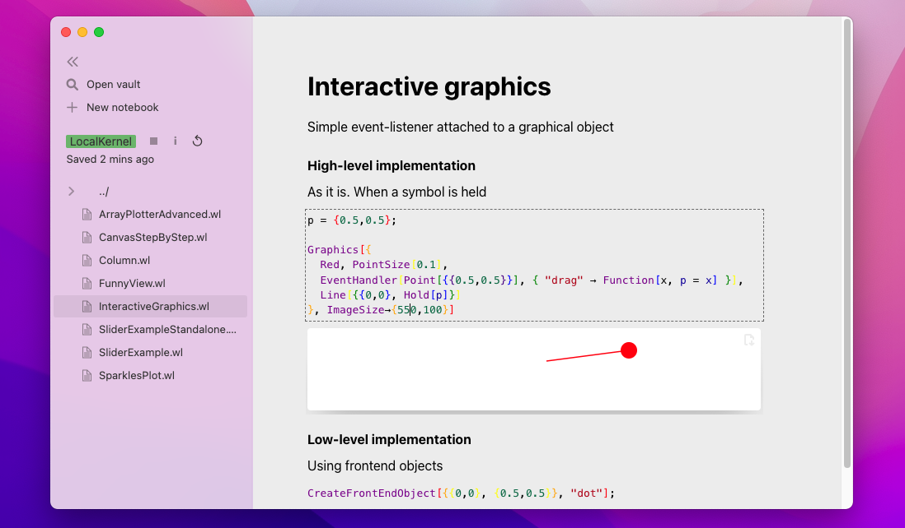

# Wolfram Language Javascript Frontend



*written for the freeware Wolfram Engine using Javascript*

*web-based, fully customizable and freeware*

__[See Docs](https://jerryi.github.io/wljs-docs/)__

__[Telegram support chat](https://t.me/+PBotB9UJw-hiZDEy)__

**Recommended Wolfram Engine 13.0 or above**


The heart of the project is [WLJS](https://github.com/JerryI/wljs-interpreter) (Wolfram Language interpreter written in Javascript)

__Special thanks to [@KirillBelovTest](https://github.com/KirillBelovTest) (Wolfram Server developer & a nice guy 🧡)__

To help maintain this project. 
- [GitHub Sponsors](https://github.com/sponsors/JerryI)
- [__PayPal__](https://www.paypal.com/donate/?hosted_button_id=BN9LWUUUJGW54)
Thank you 🍺 

## Short demos
- [dynamic plots example](https://youtu.be/e6B1LKES_Og?si=kxg0wgbEj7F1uVW-)
- [dynamic plots example 2](https://youtu.be/9ON7BseR0Jw?si=zPPAXh_rnMDGc3KQ)
- [ocr xml APP example](https://youtu.be/4ERM46btUHc)
- [parametric curve animation](https://youtu.be/Q7GBqxpn3Is?si=_S_AVwNIADNk7aH8)
- [webGl example](https://youtu.be/eM86NDaXV3g?si=p9Hp_swtqQaW3UbH)
- [voxel automata](https://youtu.be/ka3FFy3X_W8?si=ixyIgo0fZyroYuoT)
- [javascript cells](https://youtu.be/894fye8hZEw?si=iJEz3Anl2Uvuwa4V)
- [opencl demo](https://youtu.be/3-am2UOJgqc?si=0Ikziehpj--3q1Ss)
- [math in code](https://youtu.be/zRv1qhMtCms?si=iVWxfXTRPFI55sQq)
- [interactive curve fitting](https://youtu.be/HueV9Aag05s?si=BLwzCnr2qmh11Lt8)
- [making slides](https://youtu.be/7cEYJG7nk7U?si=5IztrSO4cAzjGtod)


## Highlights


- __true 100% Wolfram Language__
- better than typical REPL system
- No __SVG__ - like static graphs. Each Graphics2D/3D primitives were recreated from scratch using d3.js and THREE.js libraries. Most native plotting function of Mathematica are supported.

- autocomplete for user's defined symbols


- __math-in-code__, syntax sugar for date, colors and etc


- dynamics, GUI building blocks


- native integration of HTML, Markdown, Javascript, LLM, Wolfram Language XML... cell types
- notebooks export to a standalone `.html` file feature (keeps some part of interactivity still possible)
- infinite extensibility via external libraries, plugins even within the notebook 
- runs locally or on a server and belongs to You (no cloud-based stuff involved)
- autocomplete (for all languages used) and snippets
- tools for making in-code slides (presentations)

*The learning curve is quite steep to master all features listed above compared to Mathematica*

## Motivation
The idea is to implement a minimalistic, opensource, portable and lightweight notebook interface with syntax sugar, interactive objects for freeware Wolfram Engine.

__There is no aim to copy Mathematica__ (it will never be possible), but make the notebook interface in a different and unique taking advantage of the web-technology stack.

The target community can probably divided by two groups
- who like and can write in Javascript and Mathematica
- who uses Jypiter with free Wolfram Language Kernel and needs *much more* features
- who wants to share their research notebook to some collegues or people on the web with no access to Wolfram Mathematica/Player

Web technologies nowadays are aimed to be extremely efficient in order to compete with a native desktop applications. Therfore we are using classical HTML5 + JS stack to brind life to UI and all graphical objects by __recreating some of Mathematica's function__ using `plotly.js`, `d3.js` and `Three.js` (add your own one! this is easy) libraries. 


## How to run
This is quite simple. All that you need is

- [Freeware WolframEngine](https://www.wolfram.com/engine/)

the rest will be downloaded via the internet. 

### As a desktop app (Electron wrapper)
Use __[prebuilt binaries](https://github.com/JerryI/wolfram-js-frontend/releases) from `Releases` section__ 

### From a console (as a secondary option)
Using GIT

```shell
git clone https://github.com/JerryI/wolfram-js-frontend
cd wolfram-js-frontend
wolframscript -f Scripts/run.wls
```
and open your browser with `http://127.0.0.1:XXXX`


## Package system
Frontend uses its own package/plugin system. It doent require any software installed except *wolframscript*. Precompiled plugins are downloaded via `URLFetch` from github repositories and imported to the system. They can extend core WL, autocomplete, JS and UI. The following packages are available (already included as a default plugins)

- [wljs-interpreter](https://github.com/JerryI/wljs-interpreter) - WL interpreter written in JS is a core component, that controls UI, draw graphics, manage states (bridges WL and WEB). Can be used as a standalone library for building web apps
- [wljs-editor](https://github.com/JerryI/wljs-editor) - cells editor based on CodeMirror 6
- [wljs-inputs](https://github.com/JerryI/wljs-inputs) - io library that provides sliders, textboxes for buuilding simple GUI in the notebook
- [wljs-graphics3d-threejs](https://github.com/JerryI/Mathematica-ThreeJS-graphics-engine) - library for `Graphics3D` based on Three.js. Can also be used as a standalone plugin together with `wljs-interpreter`
- [wljs-graphics-d3](https://github.com/JerryI/wljs-graphics-d3) implementation of `Graphics` function and primitives based on `d3.js` and `plotly.js`. Can be used separately
- [wljs-svgbob-support](https://github.com/JerryI/wljs-svgbob-support) adds support of SVGBob diagrams language to `wljs-editor`
- [wljs-mermaid-support](https://github.com/JerryI/wljs-mermaid-support) support for Mermaid.js diagrams language
- [wljs-markdown-support](https://github.com/JerryI/wljs-markdown-support) support for markdown language
- [wljs-magic-support](https://github.com/JerryI/wljs-magic-support) misc useful features for the editor
- [wljs-js-support](https://github.com/JerryI/wljs-js-support) support for JS cells in the editor with data-binding between WL and JS
- [wljs-html-support](https://github.com/JerryI/wljs-html-support) support for HTML language in the cells with a template engine [WSP](https://github.com/JerryI/tinyweb-mathematica/tree/master/Tinyweb)
- and some of yours plugins should be here!

# Sponsors 
- [@MitsuhaMiyamizu](https://github.com/MitsuhaMiyamizu) 🤍

# Technology stack
## Backend
- Wolfram Engine
*as HTTP Server, IO operator, DB manager and etc*
## Frontend
- WLJS interpreter *for graphics, internal commands, events handing, lightweight calculations*
- CodeMirror 6 *as a cell's editor*
- d3.js, plotly.js *for 2D Graphics*
- three.js *for 3D Graphics*
- mermaid.js, svgbob *for diagrams*
- reveal.js *for slides*
- svgbob.js *for svg drawings*
- marked.js *for markdown exprs. processing*
- katex.js *as $\LaTeX$ renderer*
- styles and layout from Notion
- many more...


## Inspired by
- *Wolfram Mathematica*
- [Observable](http://observablehq.com/@jerryi)
- [Wolfram Language Notebook VSCode](https://github.com/njpipeorgan/wolfram-language-notebook)
- [Mathics](https://mathics.org)
- [Markdown Decoration extension](https://github.com/fuermosi777) 

## License
GNU GPLv3

__NON-COMMERCIAL__


