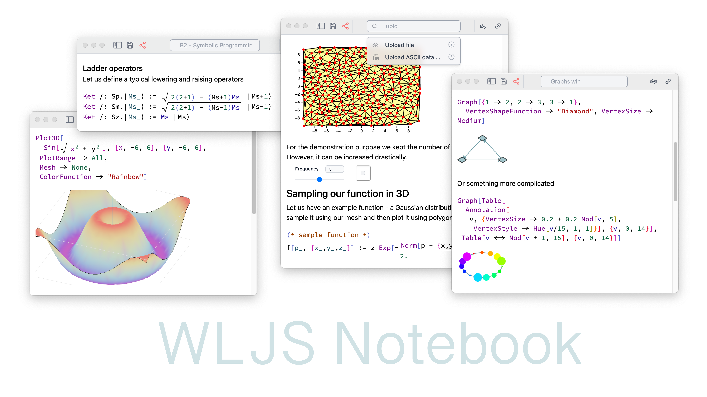

# Dynamic Notebook Environment for Wolfram Language



__Made for scientists by scientists__ ⚗️

*written with love using freeware Wolfram Engine, JavaScript and [WLX](https://jerryi.github.io/wlx-docs/)*

__[Documentation & Tutorials](https://jerryi.github.io/wljs-docs/)__ 📚

__[Telegram support chat](https://t.me/+PBotB9UJw-hiZDEy)__ 💬

**Recommended [Wolfram Engine](https://www.wolfram.com/engine/): 13.3 or higher**

__Special thanks to our co-developer [@KirillBelovTest](https://github.com/KirillBelovTest) (Wolfram Language Web Server developer)__

To help maintain this project ❤️
- [GitHub Sponsors](https://github.com/sponsors/JerryI)
- [__PayPal__](https://www.paypal.com/donate/?hosted_button_id=BN9LWUUUJGW54)

## Media
- YTS 📽️ [You don't need to program your figures manually](https://youtube.com/shorts/Z76dMHK8POM?feature=share)
- YTS 📽️ [How to do Dynamics in Computation Notebook](https://youtube.com/shorts/T-ryDA1Sb3g?feature=share)
- YTS 📽️ [We made AI Copilot in your Notebook 🤖](https://youtube.com/shorts/6s9m5ZGPkdE?feature=share)
- YTS 📽️ [AI Copilot in your Notebook. Part 2 🤖](https://youtube.com/shorts/B_ZVjN9cvQM?feature=share)

## Publications 📢
- *Medium* May 2024: [Reinventing dynamic and portable notebooks with Javascript and Wolfram Language](https://medium.com/@krikus.ms/reinventing-dynamic-and-portable-notebooks-with-javascript-and-wolfram-language-22701d38d651)
- *Yandex Open Source Jam* April 2024: [Dynamic notebook interface + Wolfram Language](https://www.youtube.com/watch?v=tmAY_5Wto-E) (Russian language only)
- *DPG2024 Berlin March 2024*:  [Computational Notebook as a Modern Multitool for Scientists](https://www.dpg-verhandlungen.de/year/2024/conference/berlin/part/agi/session/4/contribution/4), [Slides](https://www.dpg-physik.de/vereinigungen/fachuebergreifend/ag/agi/veranstaltungen/tagungen-und-workshops/berlin_2024/agi-4_4-kirill-vasin.pdf)
- *Habrahabr* October 2023 [Open-source блокнот Wolfram Language или как воссоздать минимальное ядро Mathematica на Javascript и не только](https://habr.com/ru/articles/767490/) (Russian language only)
- *Habrahabr* October 2023 [Wolfram Language JavaScript Frontend](https://habr.com/ru/articles/766360/) (Russian language only)


## Highlights


### Not a typical Jupyter-like notebook environment 🧨

It supports dynamics, GUI building blocks, and powerful Mathematica syntax out of the box.


No more static graphics! Each primitive of `Graphics`/`Graphics3D` was recreated from scratch using `d3.js` and `THREE.js` libraries. Most native plotting functions of Mathematica are supported.

#### AI Assistant 🤖
We deeply integrated ChatGPT, so that AI can have a read/write acccess to your notebook


### Command Palette and GUI-in-Code Emulation 🎨
#### Inline Dynamic Tool for Tuning 2D/3D Positions


### Native Math Input in the Code Editor 🧮
Write beautiful equations between lines of normal Wolfram Language expressions.


### Compress to HTML 🗜️
An entire notebook can be exported to a standalone `.html` file keeping all data inside. __No internet dependency, no additional software__ is required for viewing a notebook


Later, once opened using WLJS Notebook application, it is unpacked back to a normal editable format.

### Data-Driven Slides 🛝
Make a presentation right from the notebook.


### Real-Time Interactivity ⏱️
Follows the mouse pointer and performs complex calculations.


### Many More
#### Autocomplete
#### JavaScript Cells and Integration with WL
#### HTML Cells
#### Markdown Cells
#### Mermaid Diagrams

#### Offline documentation 🩺

WLJS Notebook __runs locally__ and belongs to you (no cloud-based stuff involved). __No internet connection is needed__.

# Installation 🛠️
[The freeware Wolfram Engine](https://www.wolfram.com/engine/) is required (Version 13.3 is preferable). Activation can be done later using WLJS Notebook App.

*On macOS, if you have [Homebrew](https://brew.sh/) installed, you can install it through [Homebrew Cask](https://github.com/Homebrew/homebrew-cask):*

```shell
brew install --cask wolfram-engine
```

*a side note for Linux users*
If you face any issues, try to install avahi daemon.

## Desktop App ✨
Download from the __[releases](https://github.com/JerryI/wolfram-js-frontend/releases)__ section.

Again, if you have [Homebrew](https://brew.sh/) installed, you can install this app using:

```shell
brew install --cask wljs-notebook
```

## Standalone Server
Clone this repository and run:

```shell
wolframscript -f Scripts/start.wls
```

or on a specific hostname

```shell
wolframscript -f Scripts/start.wls host 0.0.0.0 http 8080 ws 8081 ws2 8082 docs 8085
```

that will open __an HTTP server__ on `8080` port with `8081`, `8082` __used for realtime communication__ and __docs pages__ at `8085`

### Extra arguments

- set the home folder (overrides settings)
```
wolframscript -f Scripts/start.wls folder "Demos"
```

- disable autolaunch of the evaluation kernel
```
wolframscript -f Scripts/start.wls noautolaunch True
```

- disable autotest
```
wolframscript -f Scripts/start.wls bypasstest True
```

### A side note for servers with no desktop interface
You might need to install the following (for `Image` and some other graphics to work properly) [libraries](https://support.wolfram.com/59044).


## Shortcuts 🎬
*working in both: browser and desktop application*

### UI
- `Ctrl+S`, `Cmd+S` save notebook
- `Alt+.`, `Cmd+.` abort evaluation
- `Ctrl+P`, `Cmd+P` open command palette
- `Shift+Enter` evaluate current cell

### Cells
- `Ctrl+W`, `Cmd+2` hide/show input cell
- `Ctrl+/` make fraction on selected
- `Ctrl+6` make superscript on selected
- `Ctrl+2` make square root on selected
- `Ctrl+-` make subscript on selected

## Package System

The frontend uses its own package/plugin system. It doesn't require any software installed except wolframscript. Precompiled plugins are downloaded using URLFetch from GitHub repositories and imported to the system.

## Sponsors
@MitsuhaMiyamizu 🤍

## Technology Stack
Wolfram Language, JavaScript

## Inspired By

- Wolfram Mathematica
- Jupyter Notebook
- Observable
- Wolfram Language Notebook VSCode
- Mathics

# License
GNU GPLv3


