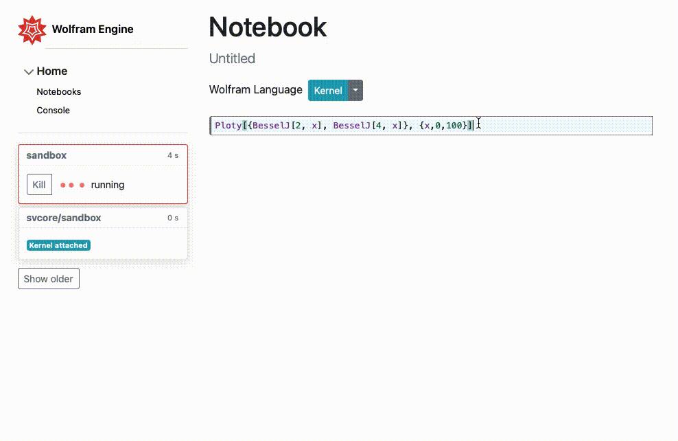
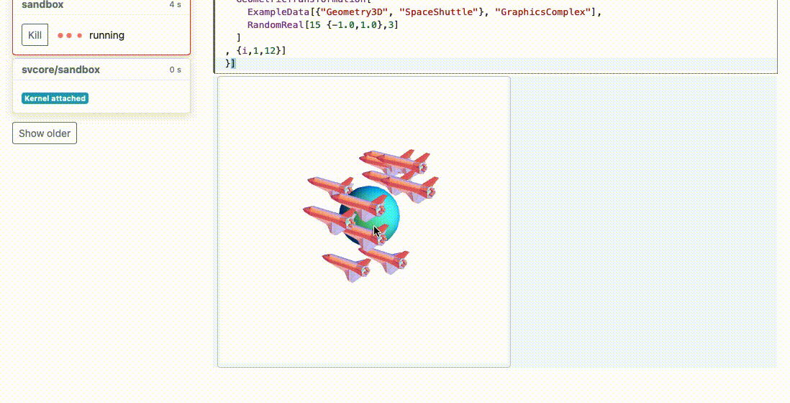
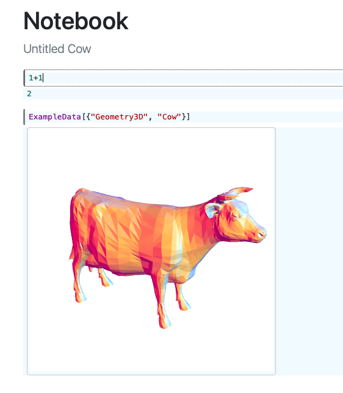
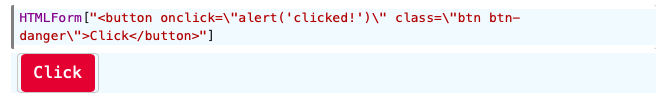
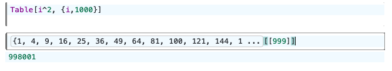
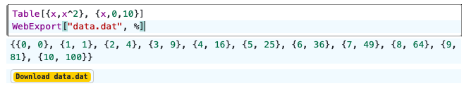

## Wolfram Engine JS Frontend implementation

_An alternative way of operating in REPL mode of the freeware Wolfram Engine bringing similar experience as Mathematica Notebook._



This is one of the possible implementations of the frontend, the built JS/Wolfram framework and general concept behind it doest limit the environment (let say `wrapper application`), where it will be embedded. All frontend parts for the developers are located in `src` folder.

The project is in __alpha stage__ (or may be even lower), some features might be changed.

> PS: please, do not use master kernel for the evaluation, it exposes all internal scope of the webserver to the user. Spawn a separate process from the menu

### Supported
- syntax check
- `\n` multiline expressions
- `%` symbol
- `Abort` button
- `Print` function
- paradigm, where all frontend objects are powerful syntax sugar 
- `Graphics3D` (partial) as a interactive frontend `three.js` object. see [repo](https://github.com/JerryI/Mathematica-ThreeJS-graphics-engine)



- `Ploty` (partial support)  as an interactive 2D plot using `ploty.js`, simillar to `Plot` or `ListLinePlot`


- __exporting notebooks__ as `.html` interactive page



### Extra cool stuff
- `HTMLForm[String]` embeds `String` as a dom innerHTML at the given output cell



- iconize the output if it is too large. There is no actual data transfer to the frontend, everything works if it was a memory pointer



- `WebExport[name, expr, Popup->False]` export your data by a link. Works as a combination of `Export` and `HTMLForm`. The created file stores in `public/trashcan` forever. `Popup` means to open a tab with the given object.



### others

- `SVGForm[anything]` exports the object as `svg` to the fronted cell. Try to eval `Plot[x,{x,0,1}]//SVGForm`
- `JSRun[String]` executes JS script inside the cell
- `WebOpen[url]` popup a window at the given url (no output to the cell)
- `FrontendXXX[]` a family of functions allow to control the frontend (used by the kernel), see `src/frontend.js`.
- spawn a separate process for the cell executions (the frontend will never fail)
- automatic backups every 30 mins
- easily expandable functionality

## How to install/test
This is quite simple. All that you need is
- Freeware WolframEngine
the rest will be downloaded via the internet. Then `cd` to the project folder and
```shell
git clone https://github.com/JerryI/wolfram-js-frontend
cd wolfram-js-frontend
wolframscript start.wls
```
Open your browser with `http://127.0.0.1:8090`


or to define ip address
```shell
wolframscript start.wls ip 127.0.0.1 port 8090
```

There is a `Demo` notebook, which covers the most functions.

## [Tutorials](docs/README.md)

## TODO
- [ ] Documentation
- [ ] Markdown support
- [ ] floating menu at cells to change their properties
- [ ] export any cell as `.html` interactive page
- [ ] indicator or a progress bar of the evaluation process 
- [x] non-destructive abortion (full evaluation control)
- [ ] `TableForm`, `MatrixForm` as a `FrontendExecutable`
- [ ] `Dynamic` or `Manipulate` using websokets; event system `EventBind[]`, `DynamicControl[]` and etc
- [ ] export notebook as a file
- [ ] server-side rendering
- [ ] asynchronous functions like `await` and event-loop
- [ ] simple HTML and JS constructors like `CreateDiv[]`, `Apply[, style->CSS[]]` or similar
- [x] export function (as interactive `.html` doc)
- [x] `JSRun` run custom js from Wolfram Kernel
- [x] truncate the output, prevent the large data to come to the frontend
- [x] `HTMLForm[]`
- [x] `Ploty` as a temporary replacement for 2D plots
- [x] `WebExport` acts as `Export`, but provide the link to download the exported file
- [x] `FrontEndExecutable[]` as a reference to the programs to be executed on the frontend side


## How it works
A web server and the half of logic runs on freeware Wolfram Engine as a __backend__
- serves the static page via library [TinyWeb & WSP](https://github.com/JerryI/tinyweb-mathematica) (hypertext preprocessor)
- stores the whole structure of the notebook
- communicates with a JS __frontend__ via websockets

CodeMirror 6 library was used to operate notebook cells inside the page, when you press `Shift-Enter` it sends the content and a command to Wolfram Engine via websockets. 

#### Evaluation process
On the backend, it evaluates the result and sends it back via websockets. However, if there is a `Graphics3D` object (in future can be extended to many) it replaces it with a  special symbol `FrontEndExecutable["uid"]`, which tells to frontend, that the content can be executed in a browser. Also, web server sends a JSON representation of the content behind `FrontEndExecutable` to be parsed by JS. 

Once it arrived CodeMirror uses `Decorations` structure to detect these objects inside the code and executes the content of it via a written very primitive JS Mathematica interpreter. CodeMirror treats it as an `AtomicRange`, i.e. a single symbol containing a complex DOM element. Of course, once it was sent back to the backend the `FrontEndExecutable` will be replaced by the original function.

#### Primitive JS Interpreter
Originally it was done for the [utility](https://github.com/JerryI/Mathematica-ThreeJS-graphics-engine) to convert Graphics3D objects to ThreeJS, because one needs to parse the internal structure, which includes almost all features of a Wolfram Language. 

By default JS script interprets everything that arrives via websockets using `interpretate(json, env)`, therefore for the creation of notebook cells it uses the Wolfram-like function `FrontEndCreateCell[]`. To define your own function, you can write it as
```js
core.List = function(args, env) {
  var copy, e, i, len, list;
  copy = Object.assign({}, env);
  list = [];
  for (i = 0, len = args.length; i < len; i++) {
    e = args[i];
    list.push(interpretate(e, copy));
  }
  return list;
};
```
The set of `Graphics3D` objects is loaded from [this](https://github.com/JerryI/Mathematica-ThreeJS-graphics-engine) repository and extends `core` functions.

In general, it is possible to insert inside `FrontEndExecutable` anything you want to execute at a frontend side.


## Development
type
```shell
git clone https://github.com/JerryI/wolfram-js-frontend
cd wolfram-js-frontend
npm i
```
then
```
wolframscript start.wls dev
```
The filewatcher will rebuild the js bundle every time you change something in `src` folder and copy the rest to the `modules` (reimporting the lib into Wolfram Engine).

## Tech notes
Apart from the frontend parts located in `src`, the rest can be threated as a "wrapping application", which starts child processes (usually 1, since Wolfram Licensing limitations), stores notebooks, provides api and etc etc boring stuff, which is necessary to support the core of the frontend.

The building procedure is stored in `config.prior.wls` file, as well as in `rollup.config.mjs`. Using just one `rollup` is a pain, since the building procedure is quite complicated.

To add a new feature, check the following files
- `src/converter.wls` - converts registered types of functions to the objects, which can be executed using frontend's JS interpreter
- `src/webobjects.wls` - defines supporting functions for the graphics and other things
- `sr/core.js` - simplified JS interpreter, can be called from anywhere as `interpretate(json object, environment)`
- `src/frontend.js` - the cells creating functions of the frontend, expands `core.js`
- `src/misc.js` - everything else, which expands `core.js` functions

To define your own function, define anywhere you want (inside `<script>` or in `.js` files)
```js
core.MyFunction = function(args, env) {
  console.log(interpretate(args[0]));
}
```
To call it from the Wolfram kernel, use (more about it one can find [there](https://github.com/JerryI/tinyweb-mathematica))
```mathematica
WebSocketBroadcast[server, MyFunction["Hey!"]];
```
for all connected clients. As simple as it was shown.

To communicate with Wolfram Engine directly use
```js
socket.send('Print["Hi from the frontend"]')
```


### Reused code
- [Mathics](https://github.com/Mathics3)
- [Wolfram Notebook (VS Code)](https://github.com/njpipeorgan/wolfram-language-notebook)
- [Observable](https://github.com/observablehq)

