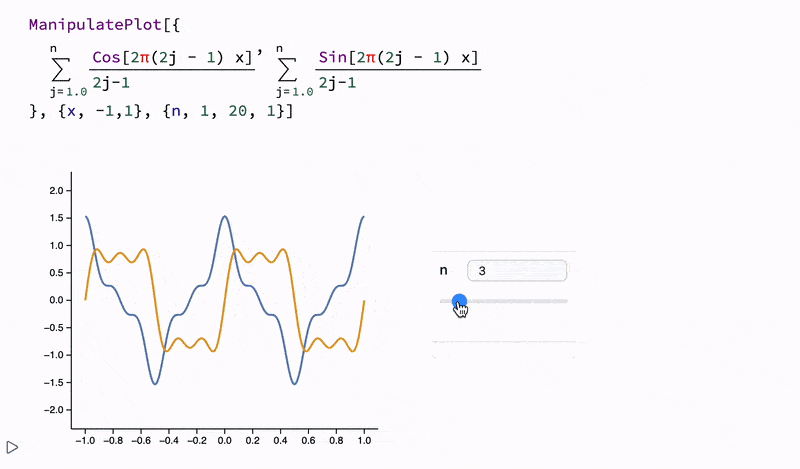

<h1 align="center">Open-Source Notebook Interface for Wolfram Language</h1>
<h2 align="center">Your Next-Gen Digital Notebook for Physics, Math, and Data Science</h2>


<div align="center">
  <b style="color: var(--ifm-link-color);">
    A lightweight, cross-platform alternative to Mathematica, built using open-source tools and the free Wolfram Engine.
  </b>
</div>

<h3 align="center">
  <a href="https://wljs.io/frontend/Overview">Overview 🚀</a> &nbsp;&nbsp; 
  <a href="https://wljs.io/wljs-demo">Demo 📺</a>
</h3>

<div class="note">
  <p>
    WLJS Notebook is <b>free software</b> based on the Wolfram Engine.
  </p>
  <p>
    You don’t need Mathematica installed to use WLJS Notebook. <b>No subscription required</b>—just a one-time registration at <em>wolfram.com</em> for personal use.
  </p>
  <p>
    See the <a href="https://www.wolfram.com/legal/terms/wolfram-engine.html">license agreement</a> for details.
  </p>
</div>

__Developed through the collaboration of physicists and programmers. Designed for real-world applications in science ⚗️, math 🧮, and education 📚.__  

## Resources

- **[WLJS Notebook Demonstration Project](https://wljs.io/wljs-demo)** 🎉 A collection of notebooks demonstrating Wolfram Language and the dynamic features of our frontend.
- **[Documentation & Tutorials](https://wljs.io/)** 📔
- **[Wolfram Language Introduction](https://www.wolfram.com/language/elementary-introduction/3rd-ed/01-starting-out-elementary-arithmetic.html)** 🐺
- **[Freeware Wolfram Language](https://www.wolfram.com/engine/)**
- **[Github Discussions](https://github.com/JerryI/wolfram-js-frontend/discussions)** 💬
- **[Telegram Support Chat](https://t.me/wljs_support)** 🐴

**Recommended [Wolfram Engine](https://www.wolfram.com/engine/): Version 13.3 or higher**

> The algorithms, functions, and other components of the Wolfram Language provided by the Wolfram Engine are the intellectual property of Wolfram Research, Inc.

## Showcase

### **[Blog Posts](https://wljs.io/blog)** 🔗
Pages featuring real-world problems solved using WLJS Notebook, published as interactive notebooks running in your browser.

### **[WLJS Notebook Demonstration Project](https://wljs.io/wljs-demo)** 🔗
Notebooks presented as static web pages showcasing various examples demonstrating the power of Wolfram Language and our frontend.

## Highlights

### Not Just Another Jupyter-Like Notebook 🧨
Blazing-fast dynamics, GUI components, and powerful Mathematica syntax enhancements out of the box.


- No more static pre-rendered graphics! Most native Mathematica plotting functions are supported.
- Optimized for real-time dynamics and interactivity.




> The entire scene above is generated on the Wolfram Kernel and streamed to WebGL buffers via low-latency binary sockets.

[🔗 Interactive Fluid Simulation](https://wljs.io/blog/2024/08/18/fluid-1)


### Command Palette & GUI-in-Code Emulation 🎨
### Native Math Input/Output in the Code Editor 🧮
Write beautiful equations directly within normal Wolfram Language expressions.


🎹 __No need to lift your fingers from the keyboard__


### Editable Output Cells & Advanced Shortcuts
- `Alt+2`, `Cmd+2`: Toggle input cell visibility
- `Ctrl+/`: Create a fraction from selection
- `Ctrl+6`: Create superscript from selection
- `Ctrl+2`: Create square root from selection
- `Ctrl+-`: Create subscript from selection

Or use toolboxes for complex structures like integrals, summations, and Greek letters.

#### Rich Command Palette


### Integrate Your Favorite JavaScript Libraries
Extend your data visualization capabilities with JavaScript integrations.


### Share Interactive Notes Effortlessly
- __Write once, use forever__
- No breaking changes upon updates
- Keep all dependencies within your notebook
- No CDNs, no external libraries, no WRI services

#### Export to HTML/Markdown/MDX 🗜️
Export entire notebooks as standalone `.html` files, retaining all embedded data—no internet required for viewing.


## Installation 🛠️

### **Wolfram Engine**
[Download Wolfram Engine](https://www.wolfram.com/engine/) (Version 13.3+ recommended). Activation is required after installation.

#### Tested
- Wolfram Engine 13.1 (no copilot)
- Wolfram Engine 13.2 (no copilot)
- Wolfram Engine 13.3 (no copilot)
- Wolfram Engine 13.4 (no copilot)
- Wolfram Engine 14.0
- Wolfram Engine 14.1
- Wolfram Engine 14.2

**macOS Installation via Homebrew:**
```shell
brew install --cask wolfram-engine
```

### **WLJS Notebook App ✨**
Download from the **[releases](https://github.com/JerryI/wolfram-js-frontend/releases)** section.

#### CLI Installation
WLJS Notebook provides a CLI tool. You can open a folder in WLJS Notebook with:
```bash
wljs .
```

#### URL Protocol Registration
WLJS Notebook registers the `wljs-message` URL protocol, allowing you to open published notebooks directly from web pages.

### **Windows Installation**
Use the `.exe` installer from the releases page.

### **GNU/Linux Installation**
#### Using `deb` Package
```bash
sudo apt install ./wljs-notebook.deb
```
For Ubuntu 24.04, disable AppArmor restrictions:
```bash
sudo sysctl -w kernel.apparmor_restrict_unprivileged_userns=0
```

### **Running on a server**
Clone this repository

```bash
git clone https://github.com/JerryI/wolfram-js-frontend
cd wolfram-js-frontend
wolframscript -f Scripts/start.wls
```

#### Docker Image
*contributed by [@yloose](https://github.com/yloose)*

See [instructions here](./container/README.md)

```bash
docker run -it \
  -v wljs_data:/wljs \
  -v ~/wljs:"/home/wljs/WLJS Notebooks" \
  -v ~/wljs/Licensing:/home/wljs/.WolframEngine/Licensing \
  -e PUID=$(id -u) \
  -e PGID=$(id -g) \
  -p 8000:3000 \
  --name wljs \
  ghcr.io/jerryi/wolfram-js-frontend:main
```

Then open `http://127.0.0.1:8000`


## **Technology Stack**
**Languages:** Wolfram Language, HTML, CSS, JavaScript, C

## **License**
GNU GPLv3
