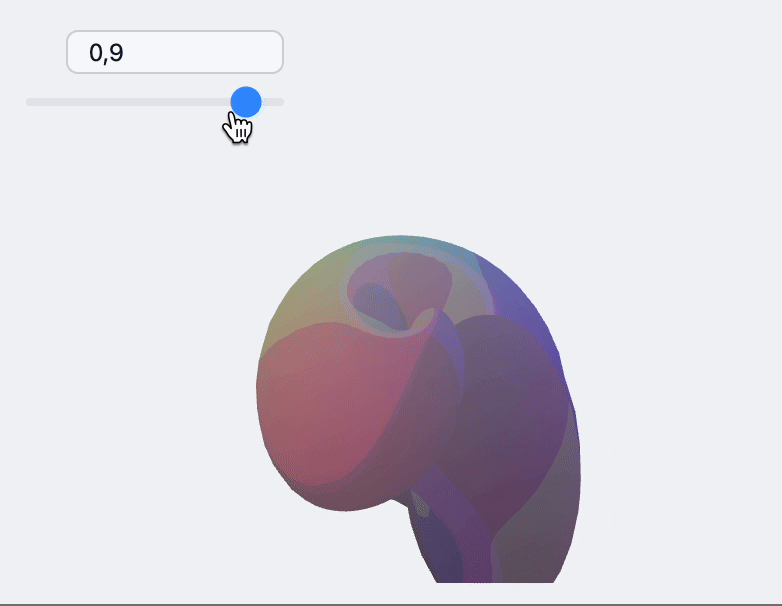

# Freeware Notebook Environment for Wolfram Language


__Made by the cooperation of physicists and programmers. Driven by solving real-life cases in science ⚗️, math 🧮 and teaching 📚__  

*written with love using freeware Wolfram Engine, JavaScript and [WLX](https://jerryi.github.io/wlx-docs/)*

__[WLJS Notebook Demonstration Project](https://jerryi.github.io/wljs-docs/wljs-demo)__  🎉 A collection of various notebooks showcasing examples of how to use the Wolfram Language and the dynamic features of our frontend

__[Documentation & Tutorials](https://jerryi.github.io/wljs-docs/)__ 📔

__[Wolfram Language Introduction](https://www.wolfram.com/language/elementary-introduction/3rd-ed/01-starting-out-elementary-arithmetic.html)__ 🐺

__[Freeware implementation](https://www.wolfram.com/engine/) of Wolfram Language__

__[Telegram support chat](https://t.me/+PBotB9UJw-hiZDEy)__ 💬

**Recommended [Wolfram Engine](https://www.wolfram.com/engine/): 13.3 or higher**

> All algorithms, functions, and other components of the Wolfram Language provided by the Wolfram Engine are the intellectual property of Wolfram Research, Inc.

> *To help maintain this open-source project* ❤️
> - [__GitHub Sponsors__](https://github.com/sponsors/JerryI)
> - [__PayPal__](https://www.paypal.com/donate/?hosted_button_id=BN9LWUUUJGW54)

> Any amount (one-time or monthly) is appreciated, and your profile will be permanently displayed on this page. Thank you for helping us!

## Showcase

**[Blog posts](https://jerryi.github.io/wljs-docs/blog)**

[🔗 Link](https://jerryi.github.io/wljs-docs/blog) Pages of real-life problems solved using WLJS Notebook and published as interactive notebooks runnning in your browser. Try it out


**[WLJS Notebook Demonstration Project](https://jerryi.github.io/wljs-docs/wljs-demo)**

[🔗 Link](https://jerryi.github.io/wljs-docs/wljs-demo)
Notebooks posted as static web pages showcase various examples that demonstrate how to use the Wolfram Language and the dynamic features of our frontend. 


### Contributing
See [here](CONTRIBUTING.md)


## Media
- Wolfram R&D 📽️ [WL Javascript Notebook](https://www.youtube.com/watch?v=Hen5qWfm6P0) 
- YTS 📽️ [You don't need to program your figures manually](https://youtube.com/shorts/vxEaryg8Hxg?feature=share)
- YTS 📽️ [How to do Dynamics in Computation Notebook](https://youtube.com/shorts/ItXbjNtGlew?feature=share)
- YTS 📽️ [We made AI Copilot in your Notebook 🤖](https://youtube.com/shorts/wenBdDRpD4g?feature=share)
- YTS 📽️ [AI Copilot in your Notebook. Part 2 🤖](https://youtube.com/shorts/pXe1mSir47Q?feature=share)

## Publications 📢
- *Habrahabr* October 2024: [Динамическая презентация или как закодить слайд с помощью Markdown и WL](https://habr.com/ru/articles/853496/) (Russian language only)
- *Habrahabr* Septempber 2024: [Обзор изменений в WLJS Notebook](https://habr.com/ru/articles/839140/) (Russian language only)
- *Medium* May 2024: [Reinventing dynamic and portable notebooks with Javascript and Wolfram Language](https://medium.com/@krikus.ms/reinventing-dynamic-and-portable-notebooks-with-javascript-and-wolfram-language-22701d38d651)
- *Yandex Open Source Jam* April 2024: [Dynamic notebook interface + Wolfram Language](https://www.youtube.com/watch?v=tmAY_5Wto-E) (Russian language only)
- *DPG2024 Berlin March 2024*:  [Computational Notebook as a Modern Multitool for Scientists](https://www.dpg-verhandlungen.de/year/2024/conference/berlin/part/agi/session/4/contribution/4), [Slides](https://www.dpg-physik.de/vereinigungen/fachuebergreifend/ag/agi/veranstaltungen/tagungen-und-workshops/berlin_2024/agi-4_4-kirill-vasin.pdf)
- *Habrahabr* October 2023 [Open-source блокнот Wolfram Language или как воссоздать минимальное ядро Mathematica на Javascript и не только](https://habr.com/ru/articles/767490/) (Russian language only)
- *Habrahabr* October 2023 [Wolfram Language JavaScript Frontend](https://habr.com/ru/articles/766360/) (Russian language only)


## Highlights


### Not a typical Jupyter-like notebook environment 🧨

It supports dynamics, GUI building blocks, and powerful Mathematica syntax out of the box.





No more static graphics! Each primitive of `Graphics`/`Graphics3D` was recreated from scratch using `d3.js` and `THREE.js` libraries. Most native plotting functions of Mathematica are supported.


### Command Palette and GUI-in-Code Emulation 🎨

### Native Math Input in the Code Editor 🧮
Write beautiful equations between lines of normal Wolfram Language expressions.


There is __no need to lift your fingers from the keyboard__ 🎹


### Shortcuts
- `Alt+2`, `Cmd+2` hide/show input cell
- `Ctrl+/` make fraction on selected
- `Ctrl+6` make superscript on selected
- `Ctrl+2` make square root on selected
- `Ctrl+-` make subscript on selected

Or use toolboxes for complex structures such as integrals, sum, Greek letters

#### Inline Dynamic Tool for Tuning 2D/3D Positions


### Export to HTML / Markdown / MDX 🗜️
An entire notebook can be exported to a standalone `.html` file keeping all data inside. __No internet dependency, no additional software__ is required for viewing a notebook


#### No more static pictures with code
Even if you embed it to your blog page


### Deploy as a web-page
*still experimental feature*

See some interactive examples from __our blog page__
- [THz Time Domain modelling in 10 lines](https://jerryi.github.io/wljs-docs/blog/2024/05/20/thz-model) 
- [FDTD Method of Solving Maxwell's Equations](https://jerryi.github.io/wljs-docs/blog/2024/07/12/maxwell)

Later, once opened using WLJS Notebook application, it is unpacked back to a normal editable format.

### AI Assistant 🤖
We deeply integrated ChatGPT, so that AI can have a read/write acccess to your notebook


### Data-Driven Slides 🛝
Make a presentation right from the notebook.


### Real-Time Interactivity ⏱️
Follows the mouse pointer and performs complex calculations


You do not need to target *60FPS*, Javascript will interpolate the transitions smoothly


[A toy-like fluid simulation](https://jerryi.github.io/wljs-docs/blog/2024/08/18/fluid-1) is also possible


### Many More
- Autocomplete (no LSP support for now)
- JavaScript cells deeply integrated with Wolfram Language
- HTML cells
- Markdown, KaTeX, Excalidraw
- Command palette with built-in widgets for assisting you in typing equations, capturing images and others
- Mermaid diagrams

#### Offline documentation 🩺

WLJS Notebook __runs locally__ and belongs to you (no cloud-based stuff involved). __No internet connection is needed__.

## Sponsors (one-time or monthly) ☺️
- @VadimBim, ???
- Gani Ganapathi, USA
- Jon L. Woodard, USA
- @MitsuhaMiyamizu, Mars

# Installation 🛠️

## Wolfram Engine
[The freeware Wolfram Engine](https://www.wolfram.com/engine/) is required (Version >13.3 is preferable). Activation after installation or later using WLJS Notebook App.

*On macOS, if you have [Homebrew](https://brew.sh/) installed, you can install it through [Homebrew Cask](https://github.com/Homebrew/homebrew-cask):*

```shell
brew install --cask wolfram-engine
```

*a side note for OSX/Linux users*
If you face any issues, try to install avahi daemon and `libuv`.

## WLJS Notebook App ✨
Download from the __[releases](https://github.com/JerryI/wolfram-js-frontend/releases)__ section.

#### Normal vs offline version
Binaries are given in two formats. An offline version does contain the fixed versions of all necessary modules, documentation and examples, while a normal one will download the most recent ones from Github during the installation and will keep them to work fully offline.

#### CLI
You will be prompted to install cli binary. If you agree, it will make a symlink available from the terminal like VSCode. It will allow you to open a folder in WLJS Notebook by the command

```bash
wljs .
```

#### URL Protocol
App will automatically register `wljs-message` url protocol, so you can open any published notebooks from web-pages. 

### Installation on Windows
Use x64 binaries `.exe` from the releases.

### Installation on GNU/Linux

#### Using `deb` package
You might need to install `libuv` dependency, then install the executable.

*A note for Ubuntu users*
There might be a problem with starting related to a new [AppArmor issue](https://github.com/electron/electron/issues/42510#issuecomment-2171583086) om Ubuntu 24.04. A temporal fix will be to lift the restrictions

```bash
sudo sysctl -w kernel.apparmor_restrict_unprivileged_userns=0
```

and then start an app from the terminal `wljs-notebook`

#### Using `zip` archive
Open an extracted folder and run an executable directly.


### Installation on MacOS

#### Using `dmg`
If you have Apple Silicon, please, download and run `-arm64.dmg` binary from the releases page, otherwise use just `.dmg` version.

#### Using `homebrew`
If you have [Homebrew](https://brew.sh/) installed, you can install this app using:
```shell
brew install --cask wljs-notebook
```


## Standalone Server
Desktop application is just a wrapper with a built-in Chromium browser, context menu bindings and file associations. WLJS Notebook itself __is a web-based application and can run using just `wolframscript` with no external services or any other programs__.

### Docker Container
*contributed by [@yloose](https://github.com/yloose)*

See [here](container/README.md)

### Local run
Clone this repository and run:

```shell
wolframscript -f Scripts/start.wls
```

or on a specific hostname

```shell
wolframscript -f Scripts/start.wls host 0.0.0.0 http 8080 ws 8081 ws2 8082 docs 8085
```

that will open __an HTTP server__ on `8080` port with `8081`, `8082` __used for realtime communication__ and __docs pages__ at `8085`

#### Extra arguments

- set the home folder (overrides settings)
```
wolframscript -f Scripts/start.wls folder "Demos"
```

- disable autolaunch of the evaluation kernel
```
wolframscript -f Scripts/start.wls noautolaunch True
```

### A side note for servers with no desktop interface
You might need to install the following (for `Image` and some other graphics to work properly) [libraries](https://support.wolfram.com/59044).


## Shortcuts 🎬
*working in both: browser and desktop application*

### UI
- `Ctrl+S`, `Cmd+S` save notebook
- `Alt+.`, `Cmd+.` abort evaluation
- `Ctrl+P`, `Cmd+P` open command palette
- `Shift+Enter` evaluate current cell
- `Ctrl+F`, `Cmd+F` search/replace inside a cell

### Cells
- `Alt+2`, `Cmd+2` hide/show input cell
- `Ctrl+/` make fraction on selected
- `Ctrl+6` make superscript on selected
- `Ctrl+2` make square root on selected
- `Ctrl+-` make subscript on selected

## Package System
WLJS Notebook fully supports the native Wolfram Language paclets/packages system and cna be installed from the command palette (paste there a Github url to a package). It means most packages will work like in Mathematica with some limitations on dynamics (`DynamicModule`, `Opener` and etc).


## Technology Stack
Wolfram Language, WLX, HTML, CSS, JavaScript, C

### Frameworks & Libraries
- ~~Vanilla JS~~
- TailwindCSS
- Electron (only for the desktop app, used as a wrapper)
- THREE.js, D3.js (graphics libraries)
- Tone.js (sound library)
- CodeMirror 6 (core cell editor)
- Reveal.js (library for slides), Marked.js (markdown cells), KaTeX.js (math equations), Mermaid (diagram cells), Excalidraw (drawings inside cells), Plotly.js (alternative library for plotting)
- XTerm.js (internal terminal)

## Inspired By

- Wolfram Mathematica
- Jupyter Notebook
- Observable.io
- Wolfram Language Notebook VSCode
- Mathics

# License
GNU GPLv3


