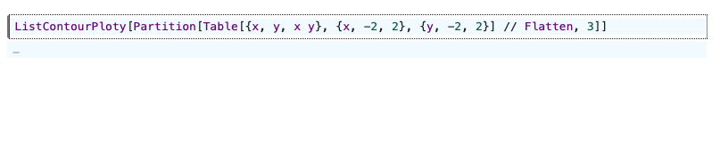
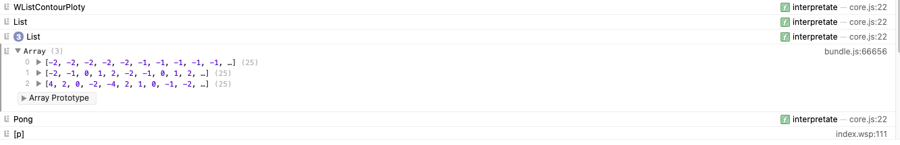
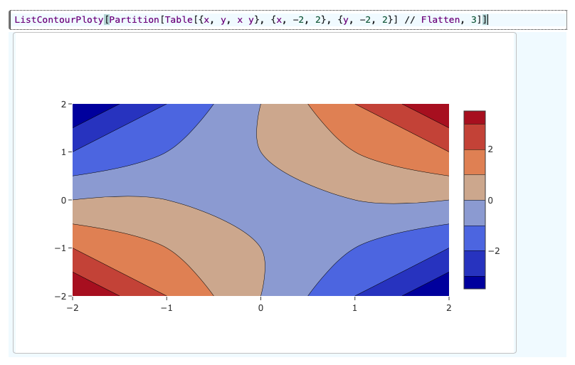

## How to add a new function to the frontend

Let us start with a fancy one - `ListContourPlot`. 


**Note 1 :** _The quote formatting below_

>like  this

_is used to refer to side remarks._  

**Note 2 :** _A shorter version of this tutorial is given at [TL;DR](#tldr)._ 

**Outline**

- Preliminary steps
- Adding a new function to the kernel
- Writing the JS representation of the function
  - Testing
  - Making DOM objects
- TL;DR

### Preliminary steps

The simplest approach will be to take an existing `.js` library and fetch for a given function. The one I found was [ploty.js](https://plotly.com/javascript/contour-plots/). The example below pertains to the basic utilization of `ListContourPlot`. It is borrowed from the official page.

We are mainly interested in the plotting part of the code below (the last lines below `//Plotting`). That part will be used in the frontend to render the plot later.


```js
//Data generation
var size = 100, x = new Array(size), y = new Array(size), z = new Array(size), i, j;

for(var i = 0; i < size; i++) {
	x[i] = y[i] = -2 * Math.PI + 4 * Math.PI * i / size;
  	z[i] = new Array(size);
}

for(var i = 0; i < size; i++) {
  	for(j = 0; j < size; j++) {
    	var r2 = x[i]*x[i] + y[j]*y[j];
    	z[i][j] = Math.sin(x[i]) * Math.cos(y[j]) * Math.sin(r2) / Math.log(r2+1);
 	}
}

//Plotting
var data = [ {
		z: z,
		x: x,
		y: y,
		type: 'contour'
	}
];

Plotly.newPlot('myDiv', data);
```

### Adding a new function to the kernel

Since we wish to keep the original function from the Wolfram Engine untouched[^1], let us create a new one.


[^1]: one can still use them using `//SVGForm` (click the arrow to return to the previous position in the text)


__all new graphical or interactive objects are stored in `src/webobjects.wls`__

The definitions in that file are visible to the `master` kernel and any wolfram engine `processes` spawned by the core.

> In present implementations, the `webobjects.wls` syncs with `shared/webobjects.wls`. `shared/webobjects.wls` is the first folder loaded by `master.wls` and by a child process, located in `svcore/run.wls`.

Let's start with the basic functionality of `ListContourPlot`.

```mathematica
ListContourPlot[
 Catenate@Table[{x, y, x y}, {x, -2, 2}, {y, -2, 2}]
]
```
One should consider the input form of the data passed to `ploty.js`, here it is actually transposed, compared to the default input form for the `ListContourPlot` function

```js
var data = [ {
		z: z,
		x: x,
		y: y,
		type: 'contour'
	}
];
```

Therefore, there are two possibilities:
- Transpose the table on the client's side using JS tools.
- Write a wrapped function (let us call it `WListContourPloty`) for mathematica, which will do the job.

Since our web browser is already suffering from drawing stuff etc. Here is the implementation of the last option

***src/webobjects.wls*** (added a line)
```mathematica
...
ListContourPloty[s_List] := WListContourPloty[Transpose[s//N]];
...
```

Using a wrapper-function `WListContourPloty` might look unnecessary, but it can help to prepare the data in more complicated cases. This is just an example.

Now we need to register this one in `src/converter.wls`, so that the system will know that this has to be executed on the frontend and not just returned as a string.

add the function `WListContourPloty` to the list

***src/converter.wls*** (added an entity to the list)
```mathematica
$SupportedGraphicsObjectList = {WListContourPloty, Graphics3D, HTMLForm, WListPloty, TableForm};
...
...
```

>May be one can generalize all those calls to a single `WListPloty[data, typeofdiagram, settings]` with a couple of parameters, which will tell how to display the given data, instead of writing the same code all over again.

Now the entire function with its data will be automatically replaced after the cell's evaluation with `FrontEndExecutable["id"]` - a reference to a JSON object - where the function `WListContourPloty[data]` will be presented. 

>Actually `src/converter.wls` does a simple 
>```mathematica
>ExportString[WListContourPloty[data], "ExpressionJSON"]
>``` 
>and saves it as the a cell's property, which will arrive to the browser as well.

>On the browser's side CodeMirror replaces all strings, which match the pattern of `FrontEndExecutable["id"]` with the output generated by JS Wolfram Language interpreter acting on the JSON object received with the cell's data. 

>Every time, when such an object is received by wolfram kernel, the reference is replaced by the original function and evaluation continues as if nothing was changed.

### Writing the JS representation of the function

Go to `src/misc.js`. This is a good place to start. Let us write the name and the body of a JS representation of the function

***src/misc.js*** (added a few lines)
```js
...

core.WListContourPloty = function(args, env) {
  //interprete an argument
  const data = interpretate(args[0], env); 
  console.log(data);

} 

...
```

If the arguments may have rational numbers and other symbolic stuff, you can specify, that the output has to be numerical by setting `env.numberical = true` or better,

```js
const data = interpretate(args[0], {...env, numerical:true});
```

That will force all functions `core.Rational`, `core.Times` etc to return a numerical result.

However, since there is no point in overloading the browser with the data processing in a such a particular case, one can pre-convert it to the numerical form using `data//N` (what we've done already in the section [Adding a new function to the kernel](# Adding a new function to the kernel)).

#### Testing
Save our modified files
- *src/webobjects.wls*
- *src/converter.wls*
- *src/misc.js*

open the folder in the terminal and run

```bash
wolframscript start.wls dev
```

or if you use it for the first time, please, install `nodejs` (used for the bundling js files) and then

```bash
npm i
wolframscript start.wls dev
```

Open the browser and write in a new notebook's cell

```mathematica
ListContourPloty[Catenate@Table[{x, y, x y}, {x, -2, 2}, {y, -2, 2}]]
```



That is correct, there is nothing to display. In the browser's developer console (press F12), we will see the arrays received by the browser from the Wolfram Kernel.



#### Making DOM objects

The DOM element in the cell created for each interactive object is accessible from the argument `env.element`

>This is rather simple, whenever the `FrontEndExecutable` runs, it creates a `<span>` element and puts it's `id` into the `env` variable.
>
>*src/frontend.js* (corresponding fragment of the code)
>```js
>let elt = document.createElement("span");
>interpretate(JSON.parse($objetsstorage[this.name]), { element: elt });
>```
>and runs the evaluation using written wolfram JS interpreter (see src/core.js)

Just a bit more.

***src/misc.js*** (added a few lines)
```js
...

core.WListContourPloty = function(args, env) {
  //interprete an argument
  const data = interpretate(args[0], env); 
  console.log(data);
  
  //plot the result
  Plotly.newPlot(env.element, [{z:data[2], x:data[0], y:data[1], type: 'contour'}]); 
} 

...
```

Easy, ha? Save the modified files and wait until the wolfram script finish rebuilding procedure.
- *src/misc.js*

Refresh the page and see the result



Fully interactive; zooming, panning are there. If you have troubles with cache, please, force your browser to flush it.

## TL;DR

Modify the following files

***src/webobjects.wls*** (added one line)
```mathematica
...
ListContourPloty[s_List] := WListContourPloty[Transpose[s//N]];
...
```

***src/converter.wls*** (added one entity to the list)
```mathematica
$SupportedGraphicsObjectList = {WListContourPloty, ...};
...
...
```

***src/misc.js*** (added a few lines)
```js
...

core.WListContourPloty = function(args, env) {
  const data = interpretate(args[0], env);
  console.log(data);

  Plotly.newPlot(env.element, [{z:data[2], x:data[0], y:data[1], type: 'contour'}]);
} 

...
```

run the commands
__make sure that Node.js is installed__

```bash
npm i
wolframscript start.wls dev
```

open the web browser at `http://127.0.0.1:8090` find an empty notebook and write to a cell

```mathematica
ListContourPloty[Catenate@Table[{x, y, x y}, {x, -2, 2}, {y, -2, 2}]]
```

see the result after pressing `Shift-Enter`
